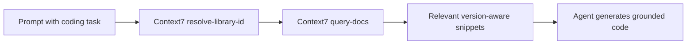

# Context7 Tutorial: Live Documentation Context for Coding Agents

> Learn how to use `upstash/context7` to inject up-to-date, version-aware library docs into Claude Code, Cursor, and other MCP-capable coding agents.

## Why This Track Matters

Context7 solves a core coding-agent failure mode: stale or hallucinated API usage from outdated model memory.

This track focuses on:

- installing Context7 MCP in coding clients quickly
- using library-resolution and docs-query tools effectively
- integrating Context7 into agent rules and workflows
- running Context7 in local, remote, and production team settings

## Current Snapshot (auto-updated)

- repository: [`upstash/context7`](https://github.com/upstash/context7)
- stars: about **45.5k**
- latest release: [`ctx7@0.2.4`](https://github.com/upstash/context7/releases/tag/ctx7%400.2.4)
- recent activity: updates on **February 11, 2026**
- project positioning: MCP + API service for current, version-specific code docs in AI coding workflows

## Mental Model

## Chapter Guide

| Chapter | Key Question | Outcome |
|:--------|:-------------|:--------|
| [01 - Getting Started](01-getting-started.md) | How do I install Context7 with my coding client? | Working baseline |
| [02 - Architecture and Tooling Model](02-architecture-and-tooling-model.md) | How does Context7 integrate into coding-agent loops? | Strong mental model |
| [03 - Client Integrations and Setup Patterns](03-client-integrations-and-setup-patterns.md) | How do I configure Context7 across Cursor/Claude Code and others? | Reliable multi-client setup |
| [04 - Prompting Strategies and Rules](04-prompting-strategies-and-rules.md) | How do I consistently trigger high-quality doc retrieval? | Better prompting discipline |
| [05 - API Workflows and SDK Patterns](05-api-workflows-and-sdk-patterns.md) | How do I use Context7's API directly in custom tools? | Programmatic integration baseline |
| [06 - Library Onboarding and Documentation Quality](06-library-onboarding-and-documentation-quality.md) | How do maintainers add and tune libraries for Context7? | Better docs coverage strategy |
| [07 - Troubleshooting and Local Development](07-troubleshooting-and-local-development.md) | How do I debug connection/runtime issues and run locally? | Operator confidence |
| [08 - Production Operations and Governance](08-production-operations-and-governance.md) | How do teams standardize Context7 usage securely? | Team rollout runbook |

## What You Will Learn

- how to wire Context7 into daily coding-agent sessions
- how to force version-accurate documentation retrieval for code generation
- how to extend Context7 with direct API workflows and library onboarding
- how to run Context7 safely and consistently in team environments

## Source References

- [Context7 Repository](https://github.com/upstash/context7)
- [Context7 README](https://github.com/upstash/context7/blob/master/README.md)
- [Context7 Docs](https://context7.com/docs)
- [All client setup docs](https://context7.com/docs/resources/all-clients)
- [API guide](https://context7.com/docs/api-guide)

## Related Tutorials

- [MCP Servers Tutorial](../mcp-servers-tutorial/)
- [OpenCode Tutorial](../opencode-tutorial/)
- [Goose Tutorial](../goose-tutorial/)
- [Cherry Studio Tutorial](../cherry-studio-tutorial/)

---

Start with [Chapter 1: Getting Started](01-getting-started.md).

## Navigation & Backlinks

- [Start Here: Chapter 1: Getting Started](01-getting-started.md)
- [Back to Main Catalog](../../README.md#-tutorial-catalog)
- [Browse A-Z Tutorial Directory](../../discoverability/tutorial-directory.md)
- [Search by Intent](../../discoverability/query-hub.md)
- [Explore Category Hubs](../../README.md#category-hubs)

## Full Chapter Map

1. [Chapter 1: Getting Started](01-getting-started.md)
2. [Chapter 2: Architecture and Tooling Model](02-architecture-and-tooling-model.md)
3. [Chapter 3: Client Integrations and Setup Patterns](03-client-integrations-and-setup-patterns.md)
4. [Chapter 4: Prompting Strategies and Rules](04-prompting-strategies-and-rules.md)
5. [Chapter 5: API Workflows and SDK Patterns](05-api-workflows-and-sdk-patterns.md)
6. [Chapter 6: Library Onboarding and Documentation Quality](06-library-onboarding-and-documentation-quality.md)
7. [Chapter 7: Troubleshooting and Local Development](07-troubleshooting-and-local-development.md)
8. [Chapter 8: Production Operations and Governance](08-production-operations-and-governance.md)

*Generated by [AI Codebase Knowledge Builder](https://github.com/The-Pocket/Tutorial-Codebase-Knowledge)*
