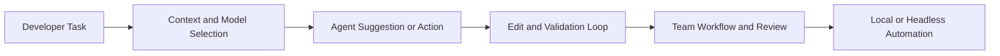

# Continue Tutorial: Open-Source AI Coding Agents for IDE and CLI

> A practical guide to `continuedev/continue`, covering IDE usage, headless/CLI workflows, model configuration, team collaboration, and enterprise operations.

## Why This Track Matters

Continue has evolved into a full agent platform spanning IDE agents, CLI/TUI workflows, and headless cloud automation. Teams need operating patterns, not just setup instructions.

This track focuses on:

- deterministic code-completion and agent workflows
- safer refactor/debug/test loops
- practical model and config governance
- team and enterprise scaling patterns

## Current Snapshot (Verified February 11, 2026)

- repository: [`continuedev/continue`](https://github.com/continuedev/continue)
- stars: about **31.3k**
- latest VS Code release tag: [`v1.3.31-vscode`](https://github.com/continuedev/continue/releases/tag/v1.3.31-vscode) (published February 4, 2026)
- VS Code extension version in source: `1.3.31`
- active surfaces include Mission Control, CLI headless mode, and CLI TUI mode

## Mental Model

## Chapter Guide

| Chapter | Key Question | Outcome |
|:--------|:-------------|:--------|
| [01 - Getting Started](01-getting-started.md) | How do I install and configure Continue safely? | Stable local setup |
| [02 - Code Completion](02-code-completion.md) | How do I maximize completion quality and speed? | High-signal suggestion workflow |
| [03 - Refactoring and Optimization](03-refactoring-optimization.md) | How do I modernize code with lower risk? | Refactor governance playbook |
| [04 - Documentation and Comments](04-documentation-comments.md) | How do I automate docs without losing quality? | Structured documentation patterns |
| [05 - Debugging and Testing](05-debugging-testing.md) | How do I close the loop from error to validated fix? | Deterministic debug/test workflows |
| [06 - Custom Models](06-custom-models.md) | How do I configure providers and models effectively? | Config and model policy baselines |
| [07 - Team Collaboration](07-team-collaboration.md) | How do teams share consistent agent behavior? | Collaborative standards and rollout |
| [08 - Advanced Enterprise](08-advanced-enterprise.md) | How do we scale Continue safely across orgs? | Enterprise controls and governance |

## What You Will Learn

- how to operate Continue in IDE and CLI/headless modes
- how to improve quality through scoped tasks and validation loops
- how to standardize models/configuration for teams
- how to prepare Continue workflows for enterprise-grade controls

## Source References

- [Continue Repository](https://github.com/continuedev/continue)
- [Continue Docs](https://docs.continue.dev)
- [Continue Releases](https://github.com/continuedev/continue/releases)

## Related Tutorials

- [Cline Tutorial](../cline-tutorial/)
- [Roo Code Tutorial](../roo-code-tutorial/)
- [OpenHands Tutorial](../openhands-tutorial/)
- [Aider Tutorial](../aider-tutorial/)

---

Start with [Chapter 1: Getting Started](01-getting-started.md).
