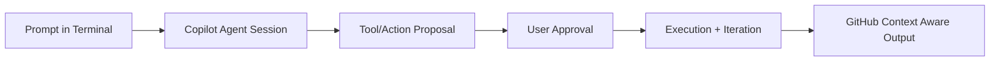

# GitHub Copilot CLI Tutorial: Copilot Agent Workflows in the Terminal

> Learn how to use `github/copilot-cli` to run Copilot's coding agent directly from the terminal with GitHub-native context, approval controls, and extensibility through MCP and LSP.

## Why This Track Matters

Copilot CLI gives teams a first-party terminal agent path with native GitHub integration, strong approval controls, and fast update cadence.

This track focuses on:

- terminal-first setup and authentication
- interactive agent workflow and approval model
- model selection, experimental features, and task orchestration
- extensibility via MCP and LSP integrations

## Current Snapshot (Verified February 12, 2026)

- repository: [`github/copilot-cli`](https://github.com/github/copilot-cli)
- stars: about **8.3k**
- latest release: [`v0.0.407`](https://github.com/github/copilot-cli/releases/tag/v0.0.407)
- recent activity: updates on **February 11, 2026**
- project positioning: public-preview Copilot coding agent for terminal workflows

## Mental Model

## Chapter Guide

| Chapter | Key Question | Outcome |
|:--------|:-------------|:--------|
| [01 - Getting Started](01-getting-started.md) | How do I install and launch Copilot CLI quickly? | Working baseline |
| [02 - Authentication and Access Policies](02-authentication-and-access-policies.md) | How do auth flows and org policies affect usage? | Secure login setup |
| [03 - Interactive Workflow and Approval Model](03-interactive-workflow-and-approval-model.md) | How does Copilot CLI keep user control over actions? | Safer execution model |
| [04 - Models, Experimental Features, and Autopilot](04-models-experimental-features-and-autopilot.md) | How do I tune model and feature behavior? | Better task-fit configuration |
| [05 - MCP and LSP Extension Points](05-mcp-and-lsp-extension-points.md) | How can I extend capabilities for docs/tools/code intelligence? | Extensibility strategy |
| [06 - GitHub-Native Context Workflows](06-github-native-context-workflows.md) | How does terminal work stay aligned with repos/issues/PRs? | Stronger workflow integration |
| [07 - Installation and Update Channels](07-installation-and-update-channels.md) | Which install/update paths are best for teams? | Repeatable rollout path |
| [08 - Production Governance and Team Rollout](08-production-governance-and-team-rollout.md) | How do teams standardize Copilot CLI operations? | Operational baseline |

## What You Will Learn

- how to run Copilot agent sessions effectively in terminal loops
- how to balance approvals, speed, and safety in agent execution
- how to wire MCP and LSP capabilities into Copilot CLI workflows
- how to deploy and govern Copilot CLI across teams and environments

## Source References

- [Copilot CLI Repository](https://github.com/github/copilot-cli)
- [Copilot CLI README](https://github.com/github/copilot-cli/blob/main/README.md)
- [Copilot CLI Changelog](https://github.com/github/copilot-cli/blob/main/changelog.md)
- [Official Copilot CLI docs](https://docs.github.com/copilot/concepts/agents/about-copilot-cli)
- [Install script](https://github.com/github/copilot-cli/blob/main/install.sh)

## Related Tutorials

- [Claude Code Tutorial](../claude-code-tutorial/)
- [OpenCode Tutorial](../opencode-tutorial/)
- [Cline Tutorial](../cline-tutorial/)
- [Kimi CLI Tutorial](../kimi-cli-tutorial/)

---

Start with [Chapter 1: Getting Started](01-getting-started.md).
