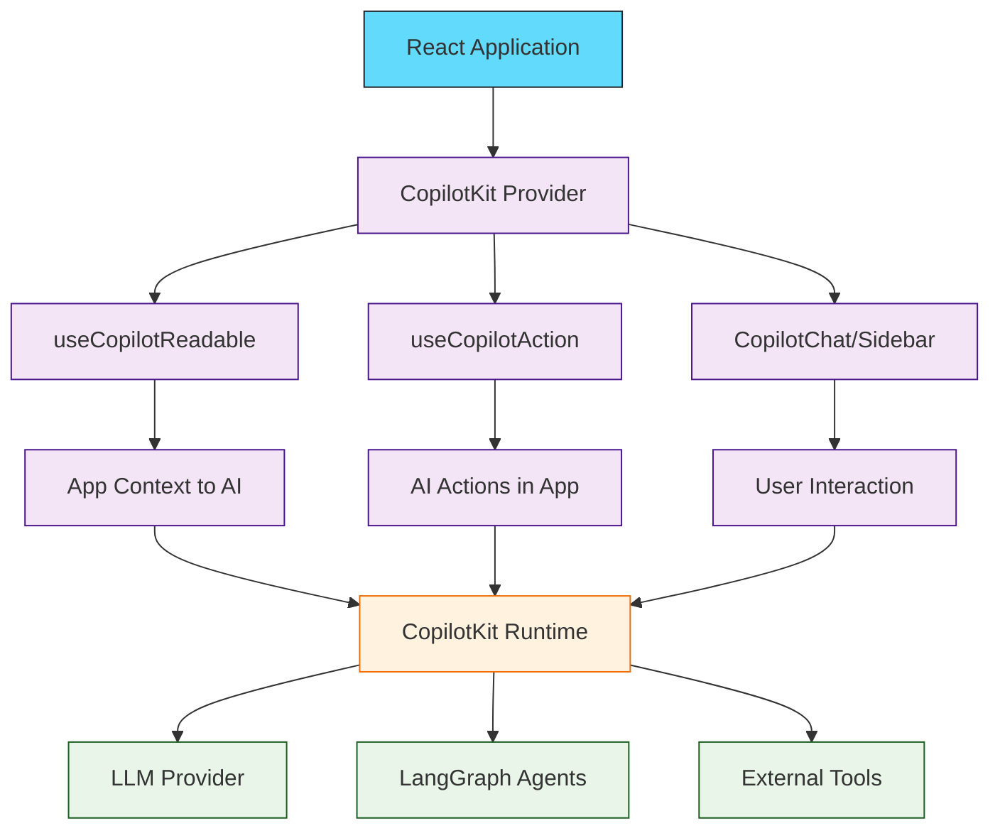

# CopilotKit Tutorial: Building AI Copilots for React Applications

> Create in-app AI assistants, chatbots, and agentic UIs with the open-source CopilotKit framework.

<div align="center">

**🤖 Add AI Superpowers to Your React Apps**

[](https://github.com/CopilotKit/CopilotKit)

</div>

---

## 🎯 What is CopilotKit?

**CopilotKit**<sup>[View Repo](https://github.com/CopilotKit/CopilotKit)</sup> is an open-source framework for building AI copilots, chatbots, and in-app AI agents in React applications. It provides a complete toolkit for creating user-facing agentic applications with features like:

- **In-App AI Chat** - Contextual AI assistants that understand your app
- **Generative UI** - AI-generated React components
- **CoAgents** - LangGraph-powered agentic workflows
- **Human-in-the-Loop** - User approval for AI actions
- **Shared State** - Real-time sync between UI and AI agents



## What's New in 2025

> **v1.10.0+**: Complete headless UI overhaul with agentic features including Generative UI, Suggestions, Agentic Generative UI, and Interrupts.

> **CrewAI Integration**: Build agentic UIs for CrewAI Crews with human-in-the-loop interactions.

> **LangGraph Execution**: Configurable LangGraph execution with user-defined configurations.

## Tutorial Chapters

1. **[Chapter 1: Getting Started](01-getting-started.md)** - Installation, setup, and your first AI copilot
2. **[Chapter 2: Reading App Context](02-app-context.md)** - Making your app state visible to AI with useCopilotReadable
3. **[Chapter 3: Copilot Actions](03-copilot-actions.md)** - Enabling AI to take actions in your app
4. **[Chapter 4: Chat Components](04-chat-components.md)** - Building chat interfaces with CopilotChat and CopilotSidebar
5. **[Chapter 5: Generative UI](05-generative-ui.md)** - AI-generated React components
6. **[Chapter 6: CoAgents & LangGraph](06-coagents.md)** - Building agentic workflows with LangGraph integration
7. **[Chapter 7: Human-in-the-Loop](07-human-in-loop.md)** - User approval flows and interrupts
8. **[Chapter 8: Production Deployment](08-production.md)** - Scaling, security, and best practices

## What You'll Learn

- **Create In-App AI Assistants** that understand your application context
- **Implement AI Actions** that can modify your app state
- **Build Generative UIs** with AI-created React components
- **Integrate LangGraph Agents** for complex agentic workflows
- **Handle Human-in-the-Loop** scenarios with user approvals
- **Connect Multiple LLM Providers** (OpenAI, Anthropic, etc.)
- **Deploy Production Copilots** with proper security and scaling

## Prerequisites

- React 18+ and Next.js 13+ (App Router recommended)
- TypeScript knowledge
- Basic understanding of LLMs and AI concepts
- Node.js 18+

## Quick Start

```bash
# Initialize CopilotKit in your project
npx copilotkit@latest init

# Or install manually
npm install @copilotkit/react-core @copilotkit/react-ui
```

```tsx
// app/layout.tsx
import { CopilotKit } from "@copilotkit/react-core";
import "@copilotkit/react-ui/styles.css";

export default function RootLayout({ children }) {
  return (
    <CopilotKit runtimeUrl="/api/copilotkit">
      {children}
    </CopilotKit>
  );
}
```

```tsx
// app/page.tsx
import { CopilotSidebar } from "@copilotkit/react-ui";
import { useCopilotReadable, useCopilotAction } from "@copilotkit/react-core";

export default function Page() {
  const [todos, setTodos] = useState([]);

  // Make state visible to AI
  useCopilotReadable({
    description: "The current todo list",
    value: todos,
  });

  // Enable AI to add todos
  useCopilotAction({
    name: "addTodo",
    description: "Add a new todo item",
    parameters: [
      { name: "title", type: "string", description: "The todo title" }
    ],
    handler: async ({ title }) => {
      setTodos([...todos, { id: Date.now(), title, done: false }]);
    },
  });

  return (
    <CopilotSidebar>
      <TodoList todos={todos} />
    </CopilotSidebar>
  );
}
```

## Key Integrations

| Integration | Description | Version |
|:------------|:------------|:--------|
| **CrewAI** | Build UIs for CrewAI agent teams | v1.7.0+ |
| **LangGraph** | Configurable agent execution | v1.6.0+ |
| **OpenAI** | GPT-4, GPT-4o models | Supported |
| **Anthropic** | Claude models | Supported |
| **Groq** | Fast inference | Supported |

## Learning Path

### 🟢 Beginner Track
1. Chapters 1-3: Setup, app context, and basic actions
2. Build a simple AI-powered app

### 🟡 Intermediate Track
1. Chapters 4-6: Chat UI, Generative UI, and CoAgents
2. Create sophisticated agentic applications

### 🔴 Advanced Track
1. Chapters 7-8: Human-in-the-loop and production deployment
2. Master enterprise-grade AI copilots

---

**Ready to add AI to your React app? Let's begin with [Chapter 1: Getting Started](01-getting-started.md)!**

*Generated for [Awesome Code Docs](https://github.com/johnxie/awesome-code-docs)*
