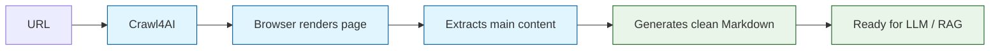

# Chapter 1: Getting Started with Crawl4AI

Welcome to Crawl4AI — the open-source web crawler built specifically for feeding clean data into Large Language Models. In this chapter you will install the library, run your first crawl, and understand every field in the result object that comes back.

## What Makes Crawl4AI Different?

Traditional web scrapers return raw HTML that requires extensive post-processing before an LLM can use it. Crawl4AI takes a fundamentally different approach:



Key advantages over generic scrapers:

- **Real browser rendering** — JavaScript-heavy sites work out of the box
- **Automatic boilerplate removal** — strips navigation, ads, footers
- **Markdown-first output** — headings, lists, links preserved with structure
- **Async-native** — built on `asyncio` for high-throughput crawling
- **Zero configuration** — sensible defaults get you started in three lines

## Installation

### Basic Install

```bash
# Install Crawl4AI from PyPI
pip install crawl4ai

# After install, set up the browser engine (downloads Chromium)
crawl4ai-setup
```

The `crawl4ai-setup` command downloads a Chromium binary via Playwright. This is a one-time step (~150 MB download).

### Install with All Extras

```bash
# Install with LLM integration, PDF support, and all optional deps
pip install "crawl4ai[all]"

# Run setup
crawl4ai-setup
```

### Verify Installation

```python
import crawl4ai
print(crawl4ai.__version__)
```

### Docker (Alternative)

```bash
# Pull the official image
docker pull unclecode/crawl4ai

# Run with default settings
docker run -p 11235:11235 unclecode/crawl4ai
```

See [Chapter 8: Production Deployment](08-production-deployment.md) for full Docker configuration.

## Your First Crawl

Crawl4AI uses an async context manager pattern. Here is the simplest possible crawl:

```python
import asyncio
from crawl4ai import AsyncWebCrawler

async def main():
    async with AsyncWebCrawler() as crawler:
        result = await crawler.arun(url="https://example.com")

        # Check if the crawl succeeded
        if result.success:
            print(result.markdown[:500])
        else:
            print(f"Crawl failed: {result.error_message}")

asyncio.run(main())
```

What happens under the hood:

1. `AsyncWebCrawler()` launches a headless Chromium browser
2. `arun()` navigates to the URL and waits for the page to load
3. The engine extracts the main content area
4. Content is converted to clean markdown
5. The browser stays alive for the next crawl (connection reuse)
6. Exiting the context manager closes the browser

## Understanding the CrawlResult Object

Every call to `arun()` returns a `CrawlResult` with these key fields:

```python
async with AsyncWebCrawler() as crawler:
    result = await crawler.arun(url="https://example.com")

    # --- Status ---
    print(result.success)          # bool: did the crawl succeed?
    print(result.status_code)      # int: HTTP status code (200, 404, etc.)
    print(result.error_message)    # str: error details if success is False

    # --- Content ---
    print(result.markdown)         # str: clean markdown of main content
    print(result.html)             # str: raw HTML of the full page
    print(result.cleaned_html)     # str: HTML with boilerplate removed
    print(result.text)             # str: plain text, no formatting

    # --- Metadata ---
    print(result.url)              # str: final URL (after redirects)
    print(result.title)            # str: page <title>
    print(result.links)            # dict: internal and external links found
    print(result.media)            # dict: images, videos, audio found

    # --- Extracted Data ---
    print(result.extracted_content) # str: output from extraction strategy
```

### Inspecting Links and Media

```python
async with AsyncWebCrawler() as crawler:
    result = await crawler.arun(url="https://example.com")

    # Links are categorized
    for link in result.links.get("internal", []):
        print(f"Internal: {link['href']} - {link['text']}")

    for link in result.links.get("external", []):
        print(f"External: {link['href']} - {link['text']}")

    # Media assets are also extracted
    for img in result.media.get("images", []):
        print(f"Image: {img['src']} alt='{img.get('alt', '')}'")
```

## Crawling Multiple Pages

You can reuse the same crawler instance for multiple URLs. The browser stays warm between calls, making subsequent crawls faster:

```python
import asyncio
from crawl4ai import AsyncWebCrawler

async def crawl_multiple():
    urls = [
        "https://docs.python.org/3/tutorial/index.html",
        "https://docs.python.org/3/tutorial/introduction.html",
        "https://docs.python.org/3/tutorial/controlflow.html",
    ]

    async with AsyncWebCrawler() as crawler:
        for url in urls:
            result = await crawler.arun(url=url)
            if result.success:
                print(f"[OK] {result.title} — {len(result.markdown)} chars")
            else:
                print(f"[FAIL] {url}: {result.error_message}")

asyncio.run(crawl_multiple())
```

For true parallel crawling (running many pages concurrently), see [Chapter 7: Async & Parallel Crawling](07-async-parallel.md).

## Basic Configuration with CrawlerRunConfig

While defaults work for simple cases, you can tune behavior with `CrawlerRunConfig`:

```python
from crawl4ai import AsyncWebCrawler, CrawlerRunConfig

config = CrawlerRunConfig(
    # Content control
    word_count_threshold=10,       # skip blocks with fewer words
    exclude_external_links=True,   # strip external links from markdown
    remove_overlay_elements=True,  # remove popups and modals

    # Performance
    page_timeout=30000,            # max ms to wait for page load
    verbose=True,                  # enable detailed logging
)

async with AsyncWebCrawler() as crawler:
    result = await crawler.arun(url="https://example.com", config=config)
    print(result.markdown[:500])
```

We will explore browser-level configuration in [Chapter 2](02-browser-engine.md) and extraction strategies in [Chapter 3](03-content-extraction.md).

## Error Handling

Always check `result.success` before using the content:

```python
async with AsyncWebCrawler() as crawler:
    result = await crawler.arun(url="https://nonexistent.example.com")

    if not result.success:
        print(f"Status: {result.status_code}")
        print(f"Error: {result.error_message}")
        # Decide: retry, skip, or raise
    else:
        # Safe to use result.markdown, result.html, etc.
        process_content(result.markdown)
```

Common failure modes:

| Scenario | `status_code` | `error_message` |
|---|---|---|
| DNS failure | None | Connection error details |
| HTTP 404 | 404 | Page not found |
| Timeout | None | Navigation timeout exceeded |
| JS error on page | 200 | Success (page still renders) |

## Quick Reference

```python
# Minimal crawl
from crawl4ai import AsyncWebCrawler
import asyncio

async def quick():
    async with AsyncWebCrawler() as crawler:
        r = await crawler.arun(url="https://example.com")
        return r.markdown if r.success else r.error_message

print(asyncio.run(quick()))
```

## Summary

You now know how to install Crawl4AI, run a basic crawl, and interpret every field in the result object. The library handles browser management, JavaScript execution, and content extraction behind a simple async API.

**Key takeaways:**
- Crawl4AI is async-first — use `async with` and `await`
- The `CrawlResult` object gives you markdown, HTML, text, links, and media
- Browser instances are reused across crawls within a context manager
- Always check `result.success` before processing content

**Next up:** [Chapter 2: Browser Engine & Crawling](02-browser-engine.md) — learn how to configure the browser, execute JavaScript, handle authentication, and interact with dynamic pages.

---

[Back to Tutorial Home](README.md) | [Next: Chapter 2: Browser Engine & Crawling](02-browser-engine.md)
