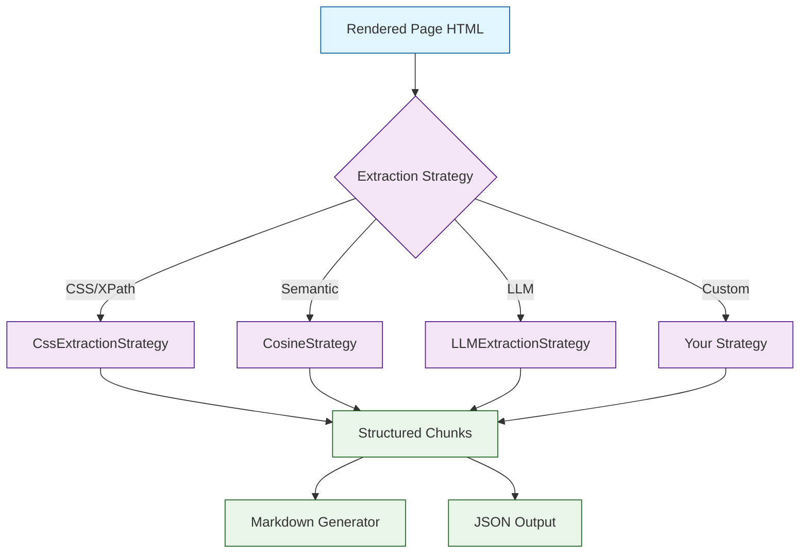
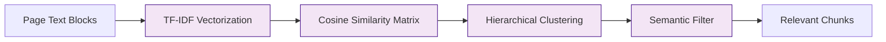

# Chapter 3: Content Extraction

Crawl4AI provides multiple extraction strategies for pulling specific content out of web pages. This chapter covers CSS-based extraction, XPath queries, cosine-similarity chunking, and how to build custom extraction strategies.

## Extraction Strategy Architecture



Extraction strategies are passed to `CrawlerRunConfig` and operate on the rendered HTML after JavaScript execution and wait strategies have completed (see [Chapter 2](02-browser-engine.md)).

## CSS-Based Extraction

The `CssExtractionStrategy` lets you define a schema of CSS selectors to pull structured data from pages:

```python
from crawl4ai import AsyncWebCrawler, CrawlerRunConfig
from crawl4ai.extraction_strategy import CssExtractionStrategy

schema = {
    "name": "Articles",
    "baseSelector": "article.post",   # repeated element
    "fields": [
        {"name": "title", "selector": "h2.title", "type": "text"},
        {"name": "url", "selector": "a.read-more", "type": "attribute", "attribute": "href"},
        {"name": "summary", "selector": "p.excerpt", "type": "text"},
        {"name": "date", "selector": "time.published", "type": "attribute", "attribute": "datetime"},
        {"name": "thumbnail", "selector": "img.thumb", "type": "attribute", "attribute": "src"},
    ],
}

strategy = CssExtractionStrategy(schema=schema)

config = CrawlerRunConfig(
    extraction_strategy=strategy,
)

async with AsyncWebCrawler() as crawler:
    result = await crawler.arun(url="https://example.com/blog", config=config)

    # extracted_content is a JSON string
    import json
    articles = json.loads(result.extracted_content)
    for article in articles:
        print(f"{article['title']} — {article['date']}")
```

### Field Types

| Type | Description | Example |
|---|---|---|
| `text` | Inner text content | `"Hello World"` |
| `html` | Inner HTML | `"<b>Hello</b> World"` |
| `attribute` | Element attribute value | `href`, `src`, `data-id` |
| `nested` | Nested sub-schema | Child elements with their own fields |

### Nested Extraction

For complex page structures, nest schemas inside each other:

```python
schema = {
    "name": "Products",
    "baseSelector": "div.product-card",
    "fields": [
        {"name": "name", "selector": "h3", "type": "text"},
        {"name": "price", "selector": ".price", "type": "text"},
        {
            "name": "reviews",
            "selector": "div.review",
            "type": "nested",
            "fields": [
                {"name": "author", "selector": ".reviewer", "type": "text"},
                {"name": "rating", "selector": ".stars", "type": "attribute", "attribute": "data-rating"},
                {"name": "text", "selector": ".review-body", "type": "text"},
            ],
        },
    ],
}
```

## Content Filtering with CSS

Even without a full extraction strategy, you can target specific page regions:

```python
config = CrawlerRunConfig(
    css_selector="main.content",   # only extract from this container
    excluded_tags=["nav", "footer", "aside", "script", "style"],
    remove_overlay_elements=True,
)

async with AsyncWebCrawler() as crawler:
    result = await crawler.arun(url="https://example.com", config=config)
    # result.markdown only contains content from main.content
```

### Excluding Specific Elements

```python
config = CrawlerRunConfig(
    css_selector="article",
    excluded_selector=".ad-banner, .newsletter-signup, .related-posts",
)
```

## Cosine Similarity Strategy

The `CosineStrategy` groups text blocks by semantic similarity, which is useful for pages where the content structure is unpredictable:

```python
from crawl4ai.extraction_strategy import CosineStrategy

strategy = CosineStrategy(
    semantic_filter="machine learning tutorials",  # topic to focus on
    word_count_threshold=20,                        # minimum words per block
    max_dist=0.3,                                   # max distance between clusters
    sim_threshold=0.5,                              # similarity threshold
)

config = CrawlerRunConfig(
    extraction_strategy=strategy,
)

async with AsyncWebCrawler() as crawler:
    result = await crawler.arun(url="https://example.com/ml-guide", config=config)

    import json
    chunks = json.loads(result.extracted_content)
    for chunk in chunks:
        print(f"Cluster {chunk.get('index')}: {chunk.get('content')[:100]}...")
```



### When to Use Cosine Strategy

- Pages with mixed content (blog + sidebar + comments)
- When you need topic-filtered extraction without knowing CSS structure
- Research and content aggregation tasks
- Preprocessing for RAG where you need semantically coherent chunks

## XPath-Based Selection

For pages where CSS selectors are not specific enough, use XPath:

```python
config = CrawlerRunConfig(
    css_selector="xpath://div[@class='article-body']//p[position() > 1]",
)

async with AsyncWebCrawler() as crawler:
    result = await crawler.arun(url="https://example.com/article", config=config)
```

## Combining Strategies

You can combine content filtering with extraction strategies:

```python
strategy = CssExtractionStrategy(schema={
    "name": "Comments",
    "baseSelector": ".comment",
    "fields": [
        {"name": "author", "selector": ".author", "type": "text"},
        {"name": "body", "selector": ".body", "type": "text"},
        {"name": "timestamp", "selector": "time", "type": "attribute", "attribute": "datetime"},
    ],
})

config = CrawlerRunConfig(
    css_selector="#comments-section",     # first narrow to this container
    extraction_strategy=strategy,          # then extract structured data
)
```

## Building a Custom Extraction Strategy

You can create your own strategy by extending the base class:

```python
from crawl4ai.extraction_strategy import ExtractionStrategy
from typing import Optional
import json

class TableExtractionStrategy(ExtractionStrategy):
    """Extract all HTML tables as structured JSON."""

    def __init__(self, **kwargs):
        super().__init__(**kwargs)

    def extract(self, url: str, html: str, *args, **kwargs) -> str:
        from bs4 import BeautifulSoup

        soup = BeautifulSoup(html, "html.parser")
        tables = []

        for table in soup.find_all("table"):
            headers = [th.get_text(strip=True) for th in table.find_all("th")]
            rows = []
            for tr in table.find_all("tr"):
                cells = [td.get_text(strip=True) for td in tr.find_all("td")]
                if cells:
                    if headers:
                        rows.append(dict(zip(headers, cells)))
                    else:
                        rows.append(cells)
            tables.append({"headers": headers, "rows": rows})

        return json.dumps(tables)

# Use it like any other strategy
config = CrawlerRunConfig(
    extraction_strategy=TableExtractionStrategy(),
)
```

## Practical Example: Extracting a Product Catalog

Here is a complete example that extracts a product listing page:

```python
import asyncio
import json
from crawl4ai import AsyncWebCrawler, CrawlerRunConfig
from crawl4ai.extraction_strategy import CssExtractionStrategy

async def extract_products():
    schema = {
        "name": "ProductCatalog",
        "baseSelector": "div.product-item",
        "fields": [
            {"name": "name", "selector": "h2.product-name", "type": "text"},
            {"name": "price", "selector": "span.price", "type": "text"},
            {"name": "image", "selector": "img", "type": "attribute", "attribute": "src"},
            {"name": "link", "selector": "a", "type": "attribute", "attribute": "href"},
            {"name": "in_stock", "selector": ".stock-status", "type": "text"},
        ],
    }

    config = CrawlerRunConfig(
        extraction_strategy=CssExtractionStrategy(schema=schema),
        css_selector="main.catalog",
        wait_for="css:.product-item",
    )

    async with AsyncWebCrawler() as crawler:
        result = await crawler.arun(
            url="https://example.com/products",
            config=config,
        )

        if result.success:
            products = json.loads(result.extracted_content)
            print(f"Found {len(products)} products")
            for p in products[:5]:
                print(f"  {p['name']}: {p['price']}")
            return products
        else:
            print(f"Failed: {result.error_message}")
            return []

asyncio.run(extract_products())
```

## Summary

Crawl4AI provides a layered extraction system:

- **CSS selectors** (`css_selector`) for narrowing to page regions
- **CssExtractionStrategy** for structured, repeatable data extraction
- **CosineStrategy** for semantic grouping and topic filtering
- **Custom strategies** for domain-specific needs
- **LLM-based extraction** (covered in [Chapter 5](05-llm-integration.md) and [Chapter 6](06-structured-extraction.md))

**Key takeaway:** Start with `css_selector` for simple cases, graduate to `CssExtractionStrategy` for structured data, and use `CosineStrategy` when page structure is unknown.

**Next up:** [Chapter 4: Markdown Generation](04-markdown-generation.md) — control how extracted content is converted into clean, RAG-ready markdown.

---

[Previous: Chapter 2: Browser Engine & Crawling](02-browser-engine.md) | [Back to Tutorial Home](README.md) | [Next: Chapter 4: Markdown Generation](04-markdown-generation.md)
