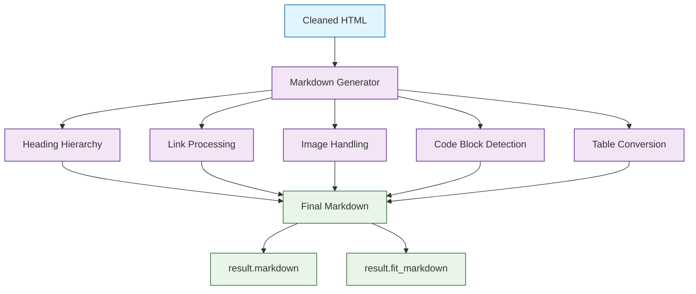

# Chapter 4: Markdown Generation

Crawl4AI's core value proposition is converting web pages into clean markdown that LLMs can consume efficiently. This chapter covers how the markdown generator works, how to control its output, and how to optimize markdown for RAG chunking and embedding.

## The Markdown Pipeline



## Default Markdown Output

By default, `result.markdown` contains the full page content converted to markdown:

```python
from crawl4ai import AsyncWebCrawler

async with AsyncWebCrawler() as crawler:
    result = await crawler.arun(url="https://docs.python.org/3/tutorial/")

    # Full markdown with all content
    print(result.markdown[:1000])
```

Typical output structure:

```markdown
# The Python Tutorial

Python is an easy to learn, powerful programming language...

## Whetting Your Appetite

If you do much work on computers, eventually you find...

### Using the Interpreter

The Python interpreter is usually installed as...

- [An Informal Introduction](introduction.html)
- [More Control Flow Tools](controlflow.html)

| Feature | Python | Java |
|---------|--------|------|
| Typing  | Dynamic| Static|
```

## Markdown Generator Configuration

Use `DefaultMarkdownGenerator` with options to customize output:

```python
from crawl4ai import AsyncWebCrawler, CrawlerRunConfig
from crawl4ai.markdown_generation_strategy import DefaultMarkdownGenerator

md_generator = DefaultMarkdownGenerator(
    options={
        "heading_style": "atx",         # # style headings (vs setext)
        "body_width": 0,                 # no line wrapping (0 = unlimited)
        "skip_internal_links": False,    # keep internal page links
        "include_links_in_text": True,   # inline links vs reference-style
    }
)

config = CrawlerRunConfig(
    markdown_generator=md_generator,
)

async with AsyncWebCrawler() as crawler:
    result = await crawler.arun(url="https://example.com", config=config)
    print(result.markdown)
```

## Fit Markdown: Content-Focused Output

`result.fit_markdown` is a filtered version that attempts to include only the "main content" of the page, stripping navigation, sidebars, and other boilerplate:

```python
async with AsyncWebCrawler() as crawler:
    result = await crawler.arun(url="https://example.com/blog/post-1")

    print(f"Full markdown:  {len(result.markdown)} chars")
    print(f"Fit markdown:   {len(result.fit_markdown)} chars")

    # fit_markdown is typically 30-60% shorter
    # Use it when you want just the article/main content
```

### When to Use Which

| Field | Use Case |
|---|---|
| `result.markdown` | Full page content, site documentation, need all links |
| `result.fit_markdown` | Blog posts, articles, news — main content only |
| `result.text` | Plain text, no formatting needed |
| `result.cleaned_html` | Need HTML but without boilerplate |

## Controlling Link Output

Links are often the noisiest part of web-to-markdown conversion. Crawl4AI gives you control:

```python
config = CrawlerRunConfig(
    exclude_external_links=True,    # remove links to other domains
    exclude_internal_links=False,   # keep same-domain links
    exclude_social_media_links=True, # remove Twitter, Facebook, etc.
)
```

### Link Density Filtering

Pages with heavy navigation have high link density. You can filter these regions:

```python
config = CrawlerRunConfig(
    word_count_threshold=15,   # blocks with fewer words are dropped
    # This effectively removes nav bars, footer link lists, etc.
)
```

## Image Handling in Markdown

By default, images are included as markdown image syntax:

```markdown

```

Control image inclusion:

```python
from crawl4ai import BrowserConfig, CrawlerRunConfig

# Option 1: Skip image loading entirely (fastest)
browser_config = BrowserConfig(text_mode=True)

# Option 2: Load images but exclude from markdown
config = CrawlerRunConfig(
    excluded_tags=["img"],
)

# Option 3: Keep images with metadata
# Default behavior — images included with alt text and src
```

## Code Block Preservation

Crawl4AI preserves code blocks with language hints when available:

```python
async with AsyncWebCrawler() as crawler:
    result = await crawler.arun(
        url="https://docs.python.org/3/tutorial/introduction.html"
    )
    # Code blocks appear as fenced markdown:
    # ```python
    # x = 42
    # print(x)
    # ```
```

## Table Conversion

HTML tables are converted to markdown table syntax:

```python
async with AsyncWebCrawler() as crawler:
    result = await crawler.arun(url="https://example.com/data-table")
    # Tables appear as:
    # | Column A | Column B | Column C |
    # |----------|----------|----------|
    # | value 1  | value 2  | value 3  |
```

## Optimizing Markdown for RAG Pipelines

When the goal is to chunk and embed markdown into a vector store, follow these practices:

### 1. Use Fit Markdown for Clean Content

```python
async with AsyncWebCrawler() as crawler:
    result = await crawler.arun(url=url)
    content = result.fit_markdown  # less noise = better embeddings
```

### 2. Strip Links to Reduce Token Waste

```python
config = CrawlerRunConfig(
    exclude_external_links=True,
    exclude_internal_links=True,
    # Links become just their anchor text
)
```

### 3. Chunk by Headings

Crawl4AI preserves heading hierarchy, which makes it easy to split by sections:

```python
import re

def chunk_by_headings(markdown: str, level: int = 2) -> list[dict]:
    """Split markdown into chunks at heading boundaries."""
    pattern = rf'^({"#" * level}\s+.+)$'
    parts = re.split(pattern, markdown, flags=re.MULTILINE)

    chunks = []
    current_heading = "Introduction"
    current_body = []

    for part in parts:
        if re.match(pattern, part):
            if current_body:
                chunks.append({
                    "heading": current_heading,
                    "content": "\n".join(current_body).strip(),
                })
            current_heading = part.strip("# ").strip()
            current_body = []
        else:
            current_body.append(part)

    if current_body:
        chunks.append({
            "heading": current_heading,
            "content": "\n".join(current_body).strip(),
        })

    return chunks

# Usage
async with AsyncWebCrawler() as crawler:
    result = await crawler.arun(url="https://example.com/docs/guide")
    chunks = chunk_by_headings(result.fit_markdown)
    for chunk in chunks:
        print(f"## {chunk['heading']} ({len(chunk['content'])} chars)")
```

### 4. Add Metadata for Retrieval

```python
async def crawl_for_rag(crawler, url: str) -> list[dict]:
    """Crawl a page and return chunks with metadata for RAG."""
    result = await crawler.arun(url=url)
    if not result.success:
        return []

    chunks = chunk_by_headings(result.fit_markdown)
    enriched = []
    for i, chunk in enumerate(chunks):
        enriched.append({
            "text": chunk["content"],
            "metadata": {
                "source_url": result.url,
                "page_title": result.title,
                "section_heading": chunk["heading"],
                "chunk_index": i,
            },
        })
    return enriched
```

This pairs well with vector stores like those covered in [RAGFlow Tutorial](../ragflow-tutorial/) and [LlamaIndex Tutorial](../llamaindex-tutorial/).

## Comparing Output Formats

```python
import asyncio
from crawl4ai import AsyncWebCrawler

async def compare_formats():
    async with AsyncWebCrawler() as crawler:
        result = await crawler.arun(url="https://example.com")

        formats = {
            "markdown": result.markdown,
            "fit_markdown": result.fit_markdown,
            "text": result.text,
            "html": result.html,
            "cleaned_html": result.cleaned_html,
        }

        for name, content in formats.items():
            print(f"{name:15s}: {len(content):>8,} chars")

asyncio.run(compare_formats())
```

## Summary

Markdown generation is what makes Crawl4AI special compared to generic scrapers. You now know how to:

- Use `result.markdown` for full content and `result.fit_markdown` for main content only
- Configure the markdown generator for heading style, link handling, and wrapping
- Control link inclusion, image handling, and code block formatting
- Chunk markdown by headings for RAG pipelines
- Enrich chunks with metadata for retrieval

**Next up:** [Chapter 5: LLM Integration](05-llm-integration.md) — use OpenAI, Anthropic, or local models to intelligently extract and summarize content during the crawl.

---

[Previous: Chapter 3: Content Extraction](03-content-extraction.md) | [Back to Tutorial Home](README.md) | [Next: Chapter 5: LLM Integration](05-llm-integration.md)
