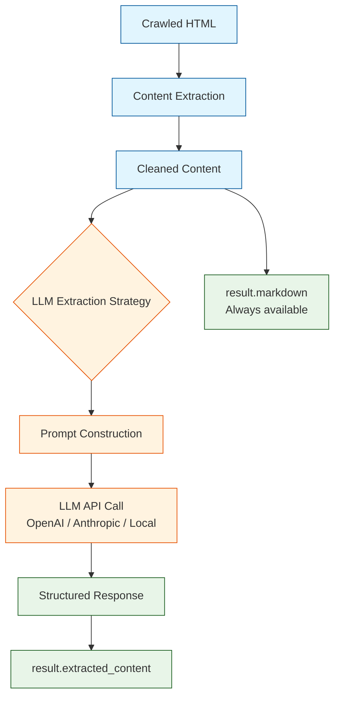
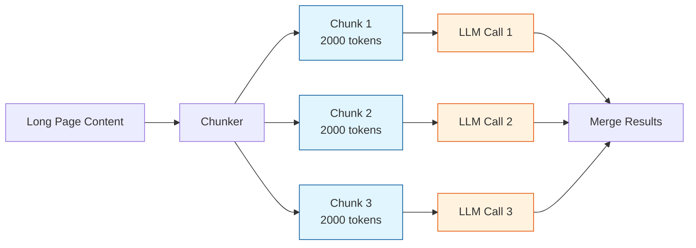

# Chapter 5: LLM Integration

Crawl4AI can call LLMs during the crawl to understand, summarize, and extract meaning from pages. This chapter covers how to connect OpenAI, Anthropic, and local models, and how to use them for intelligent content processing.

## How LLM Integration Works



The LLM is called *after* the page is rendered and content is extracted. You still get `result.markdown` regardless — the LLM adds a layer of intelligent processing on top.

## Setting Up LLM Providers

### OpenAI

```python
import os
os.environ["OPENAI_API_KEY"] = "sk-..."

from crawl4ai.extraction_strategy import LLMExtractionStrategy

strategy = LLMExtractionStrategy(
    provider="openai/gpt-4o-mini",
    instruction="Extract the main points from this article as a bullet list.",
)
```

### Anthropic

```python
import os
os.environ["ANTHROPIC_API_KEY"] = "sk-ant-..."

strategy = LLMExtractionStrategy(
    provider="anthropic/claude-sonnet-4-20250514",
    instruction="Summarize this page in 3 sentences.",
)
```

### Local Models (Ollama)

```python
# Ensure Ollama is running: ollama serve
strategy = LLMExtractionStrategy(
    provider="ollama/llama3",
    api_base="http://localhost:11434",
    instruction="Extract key facts from this page.",
)
```

### Any OpenAI-Compatible API

```python
strategy = LLMExtractionStrategy(
    provider="openai/my-model",
    api_base="http://my-server:8000/v1",
    api_token="my-token",
    instruction="Summarize the content.",
)
```

## Basic LLM Extraction

The simplest use case: ask the LLM to process page content with a natural language instruction:

```python
import asyncio
from crawl4ai import AsyncWebCrawler, CrawlerRunConfig
from crawl4ai.extraction_strategy import LLMExtractionStrategy

async def summarize_page():
    strategy = LLMExtractionStrategy(
        provider="openai/gpt-4o-mini",
        instruction="""
        Read this article and return:
        1. A one-sentence summary
        2. The three most important points
        3. Any mentioned dates or deadlines
        """,
    )

    config = CrawlerRunConfig(
        extraction_strategy=strategy,
    )

    async with AsyncWebCrawler() as crawler:
        result = await crawler.arun(
            url="https://example.com/blog/important-update",
            config=config,
        )

        if result.success:
            print("Markdown:", result.markdown[:200])
            print("LLM Output:", result.extracted_content)

asyncio.run(summarize_page())
```

## Controlling the LLM Prompt

### Custom System Prompts

```python
strategy = LLMExtractionStrategy(
    provider="openai/gpt-4o-mini",
    instruction="Extract all technical specifications mentioned.",
    system_prompt="""You are a technical documentation analyst.
    Always respond in valid JSON format.
    Focus on numerical specs, versions, and compatibility info.""",
)
```

### Chunked Processing for Long Pages

When a page exceeds the LLM's context window, Crawl4AI splits it into chunks and processes each one:

```python
strategy = LLMExtractionStrategy(
    provider="openai/gpt-4o-mini",
    instruction="Extract key facts from this section.",
    chunk_token_threshold=2000,   # max tokens per chunk
    overlap_rate=0.1,             # 10% overlap between chunks
)
```



### Token Budget Control

```python
strategy = LLMExtractionStrategy(
    provider="openai/gpt-4o-mini",
    instruction="Summarize the key points.",
    chunk_token_threshold=4000,
    # Controls cost — fewer chunks = fewer API calls
)
```

## Content Summarization Pipeline

Build a reusable summarization pipeline:

```python
import asyncio
import json
from crawl4ai import AsyncWebCrawler, CrawlerRunConfig
from crawl4ai.extraction_strategy import LLMExtractionStrategy

async def summarize_urls(urls: list[str]) -> list[dict]:
    strategy = LLMExtractionStrategy(
        provider="openai/gpt-4o-mini",
        instruction="""Return a JSON object with:
        - "title": the article title
        - "summary": 2-3 sentence summary
        - "topics": list of main topics
        - "sentiment": "positive", "negative", or "neutral"
        """,
    )

    config = CrawlerRunConfig(extraction_strategy=strategy)
    results = []

    async with AsyncWebCrawler() as crawler:
        for url in urls:
            result = await crawler.arun(url=url, config=config)
            if result.success and result.extracted_content:
                try:
                    data = json.loads(result.extracted_content)
                    data["source_url"] = url
                    results.append(data)
                except json.JSONDecodeError:
                    results.append({
                        "source_url": url,
                        "raw_output": result.extracted_content,
                    })

    return results

urls = [
    "https://example.com/article-1",
    "https://example.com/article-2",
]
summaries = asyncio.run(summarize_urls(urls))
for s in summaries:
    print(json.dumps(s, indent=2))
```

## Combining LLM with CSS Extraction

Use CSS extraction first, then run LLM on the results for deeper understanding:

```python
from crawl4ai.extraction_strategy import CssExtractionStrategy

# Step 1: CSS extraction to get raw data
css_strategy = CssExtractionStrategy(schema={
    "name": "JobListings",
    "baseSelector": ".job-card",
    "fields": [
        {"name": "title", "selector": "h3", "type": "text"},
        {"name": "company", "selector": ".company", "type": "text"},
        {"name": "description", "selector": ".description", "type": "text"},
    ],
})

async with AsyncWebCrawler() as crawler:
    # First pass: structured extraction
    config1 = CrawlerRunConfig(extraction_strategy=css_strategy)
    result = await crawler.arun(url="https://example.com/jobs", config=config1)
    jobs = json.loads(result.extracted_content)

    # Second pass: LLM enrichment on the markdown
    llm_strategy = LLMExtractionStrategy(
        provider="openai/gpt-4o-mini",
        instruction="""Analyze these job listings and return JSON with:
        - required_skills: list of technical skills across all jobs
        - salary_range: estimated range if mentioned
        - remote_friendly: true/false for each listing
        """,
    )
    config2 = CrawlerRunConfig(extraction_strategy=llm_strategy)
    enriched = await crawler.arun(url="https://example.com/jobs", config=config2)
```

## Error Handling for LLM Calls

LLM API calls can fail due to rate limits, timeouts, or invalid responses:

```python
async def safe_llm_crawl(crawler, url, strategy, retries=3):
    config = CrawlerRunConfig(extraction_strategy=strategy)

    for attempt in range(retries):
        result = await crawler.arun(url=url, config=config)

        if result.success and result.extracted_content:
            try:
                return json.loads(result.extracted_content)
            except json.JSONDecodeError:
                return {"raw": result.extracted_content}

        if attempt < retries - 1:
            await asyncio.sleep(2 ** attempt)  # exponential backoff

    return None
```

## Cost Optimization Tips

LLM extraction adds API costs to each crawl. Minimize spend by:

1. **Use `css_selector` to narrow content** before it hits the LLM:
   ```python
   config = CrawlerRunConfig(
       css_selector="article.main-content",
       extraction_strategy=strategy,
   )
   ```

2. **Use smaller models** for simple tasks:
   ```python
   strategy = LLMExtractionStrategy(
       provider="openai/gpt-4o-mini",  # cheaper than gpt-4o
       instruction="...",
   )
   ```

3. **Increase chunk size** for fewer API calls:
   ```python
   strategy = LLMExtractionStrategy(
       chunk_token_threshold=8000,
       instruction="...",
   )
   ```

4. **Use local models** for high-volume work (see Ollama setup above)

## Summary

LLM integration transforms Crawl4AI from a scraper into an intelligent content processing pipeline. You now know how to:

- Connect OpenAI, Anthropic, Ollama, or any OpenAI-compatible API
- Write extraction instructions in natural language
- Handle long pages with chunked processing
- Build summarization pipelines across multiple URLs
- Combine CSS extraction with LLM enrichment
- Control costs through model selection, content narrowing, and chunking

For structured JSON output with Pydantic schemas, see [Chapter 6: Structured Data Extraction](06-structured-extraction.md).

**Next up:** [Chapter 6: Structured Data Extraction](06-structured-extraction.md) — define schemas and let the LLM fill them automatically.

---

[Previous: Chapter 4: Markdown Generation](04-markdown-generation.md) | [Back to Tutorial Home](README.md) | [Next: Chapter 6: Structured Data Extraction](06-structured-extraction.md)
