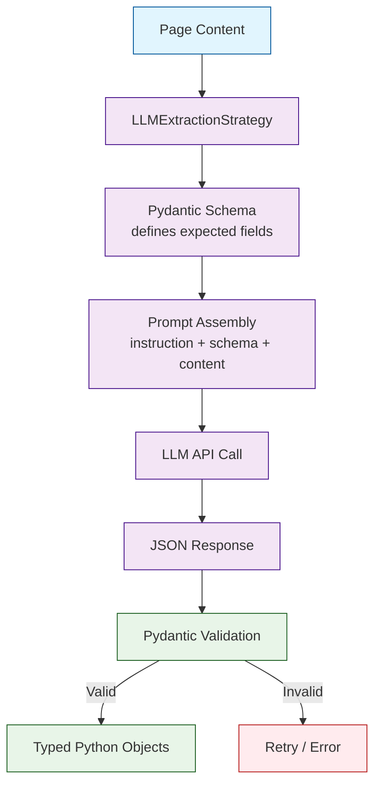
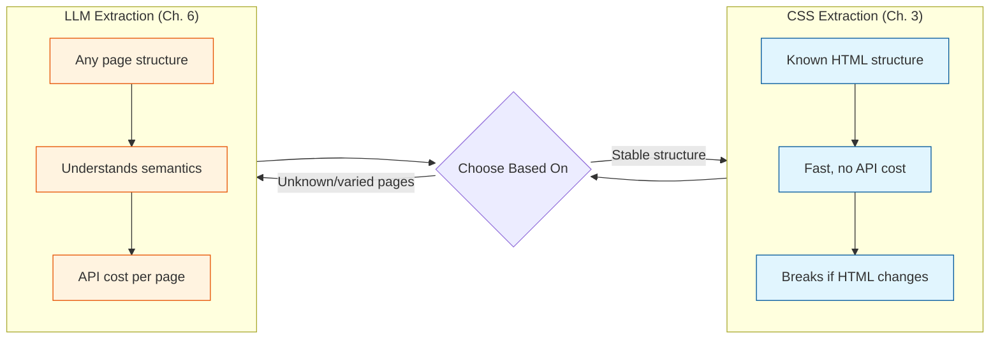

# Chapter 6: Structured Data Extraction

This chapter shows how to extract typed, validated JSON from web pages using Pydantic schemas and LLMs. Instead of writing fragile CSS selectors for every site, you define what you want and let the LLM figure out where it is on the page.

## Schema-Driven Extraction Flow



## Defining Schemas with Pydantic

Pydantic models define the structure, types, and descriptions of the data you want to extract:

```python
from pydantic import BaseModel, Field
from typing import Optional

class Article(BaseModel):
    title: str = Field(description="The headline of the article")
    author: str = Field(description="Author name")
    published_date: Optional[str] = Field(
        None, description="Publication date in ISO format"
    )
    summary: str = Field(description="2-3 sentence summary of the article")
    topics: list[str] = Field(description="Main topics covered")
    word_count: Optional[int] = Field(
        None, description="Approximate word count"
    )
```

## Basic Schema Extraction

Pass the Pydantic model to `LLMExtractionStrategy`:

```python
import asyncio
import json
from crawl4ai import AsyncWebCrawler, CrawlerRunConfig
from crawl4ai.extraction_strategy import LLMExtractionStrategy
from pydantic import BaseModel, Field
from typing import Optional

class Article(BaseModel):
    title: str = Field(description="The headline of the article")
    author: str = Field(description="Author name")
    published_date: Optional[str] = Field(None, description="Publication date")
    summary: str = Field(description="Brief summary")
    topics: list[str] = Field(description="Main topics")

async def extract_article():
    strategy = LLMExtractionStrategy(
        provider="openai/gpt-4o-mini",
        schema=Article.model_json_schema(),
        instruction="Extract the article information according to the schema.",
    )

    config = CrawlerRunConfig(
        extraction_strategy=strategy,
        css_selector="article",  # narrow to article content
    )

    async with AsyncWebCrawler() as crawler:
        result = await crawler.arun(
            url="https://example.com/blog/my-article",
            config=config,
        )

        if result.success and result.extracted_content:
            data = json.loads(result.extracted_content)
            article = Article(**data)
            print(f"Title: {article.title}")
            print(f"Author: {article.author}")
            print(f"Topics: {', '.join(article.topics)}")
            return article

asyncio.run(extract_article())
```

## Extracting Lists of Items

For pages with multiple items (product listings, search results, feeds), define the item schema and tell the LLM to extract a list:

```python
from pydantic import BaseModel, Field
from typing import Optional

class Product(BaseModel):
    name: str = Field(description="Product name")
    price: str = Field(description="Price with currency symbol")
    rating: Optional[float] = Field(None, description="Rating out of 5")
    num_reviews: Optional[int] = Field(None, description="Number of reviews")
    in_stock: bool = Field(description="Whether the item is available")
    features: list[str] = Field(
        default_factory=list,
        description="Key product features",
    )

class ProductList(BaseModel):
    products: list[Product] = Field(description="All products on the page")

async def extract_products():
    strategy = LLMExtractionStrategy(
        provider="openai/gpt-4o-mini",
        schema=ProductList.model_json_schema(),
        instruction="Extract all product listings from this page.",
    )

    config = CrawlerRunConfig(
        extraction_strategy=strategy,
        css_selector="main.product-grid",
    )

    async with AsyncWebCrawler() as crawler:
        result = await crawler.arun(
            url="https://example.com/products",
            config=config,
        )

        if result.success:
            data = json.loads(result.extracted_content)
            products = ProductList(**data)
            for p in products.products:
                stock = "In stock" if p.in_stock else "Out of stock"
                print(f"{p.name}: {p.price} ({stock})")

asyncio.run(extract_products())
```

## Nested and Complex Schemas

Pydantic supports nested models for hierarchical data:

```python
from pydantic import BaseModel, Field
from typing import Optional

class Address(BaseModel):
    street: str
    city: str
    state: Optional[str] = None
    country: str
    postal_code: Optional[str] = None

class ContactInfo(BaseModel):
    email: Optional[str] = None
    phone: Optional[str] = None
    address: Optional[Address] = None

class Company(BaseModel):
    name: str = Field(description="Company name")
    description: str = Field(description="What the company does")
    founded_year: Optional[int] = Field(None, description="Year founded")
    employees: Optional[str] = Field(None, description="Employee count or range")
    contact: Optional[ContactInfo] = None
    technologies: list[str] = Field(
        default_factory=list,
        description="Technologies or products mentioned",
    )

strategy = LLMExtractionStrategy(
    provider="openai/gpt-4o-mini",
    schema=Company.model_json_schema(),
    instruction="Extract company information from this About page.",
)
```

## Enum Fields for Constrained Values

Use Python enums to constrain extracted values:

```python
from enum import Enum
from pydantic import BaseModel, Field
from typing import Optional

class Sentiment(str, Enum):
    POSITIVE = "positive"
    NEGATIVE = "negative"
    NEUTRAL = "neutral"
    MIXED = "mixed"

class Priority(str, Enum):
    LOW = "low"
    MEDIUM = "medium"
    HIGH = "high"
    CRITICAL = "critical"

class BugReport(BaseModel):
    title: str = Field(description="Bug report title")
    component: str = Field(description="Affected component or module")
    priority: Priority = Field(description="Severity level")
    sentiment: Sentiment = Field(description="Reporter's tone")
    steps_to_reproduce: list[str] = Field(description="Reproduction steps")
    expected_behavior: str
    actual_behavior: str
    workaround: Optional[str] = None
```

## Comparing CSS vs LLM Extraction



| Factor | CSS Extraction | LLM Extraction |
|---|---|---|
| Speed | Fast (no API call) | Slower (LLM latency) |
| Cost | Free | Per-token API cost |
| Robustness | Breaks if HTML changes | Works across layouts |
| Flexibility | Rigid selectors | Natural language |
| Complex reasoning | No | Yes |
| Best for | Consistent, known sites | Varied, unknown sites |

## Validation and Error Handling

Always validate LLM output against your schema:

```python
from pydantic import ValidationError

async def safe_extract(crawler, url, schema_class, strategy, config):
    result = await crawler.arun(url=url, config=config)

    if not result.success:
        return None, f"Crawl failed: {result.error_message}"

    if not result.extracted_content:
        return None, "No content extracted"

    try:
        data = json.loads(result.extracted_content)
        # Handle both single objects and lists
        if isinstance(data, list):
            validated = [schema_class(**item) for item in data]
        else:
            validated = schema_class(**data)
        return validated, None
    except json.JSONDecodeError as e:
        return None, f"Invalid JSON: {e}"
    except ValidationError as e:
        return None, f"Schema validation failed: {e}"
```

## Practical Example: Research Paper Extraction

```python
import asyncio
import json
from pydantic import BaseModel, Field
from typing import Optional
from crawl4ai import AsyncWebCrawler, CrawlerRunConfig
from crawl4ai.extraction_strategy import LLMExtractionStrategy

class Author(BaseModel):
    name: str
    affiliation: Optional[str] = None

class Paper(BaseModel):
    title: str = Field(description="Paper title")
    authors: list[Author] = Field(description="Paper authors")
    abstract: str = Field(description="Paper abstract")
    year: Optional[int] = None
    keywords: list[str] = Field(default_factory=list)
    doi: Optional[str] = None
    citation_count: Optional[int] = None

async def extract_paper(url: str) -> Optional[Paper]:
    strategy = LLMExtractionStrategy(
        provider="openai/gpt-4o-mini",
        schema=Paper.model_json_schema(),
        instruction="Extract the research paper metadata from this page.",
    )

    config = CrawlerRunConfig(
        extraction_strategy=strategy,
        css_selector="main, article, .paper-detail",
    )

    async with AsyncWebCrawler() as crawler:
        result = await crawler.arun(url=url, config=config)
        if result.success and result.extracted_content:
            data = json.loads(result.extracted_content)
            return Paper(**data)
    return None

paper = asyncio.run(extract_paper("https://arxiv.org/abs/2301.00001"))
if paper:
    print(f"{paper.title}")
    print(f"Authors: {', '.join(a.name for a in paper.authors)}")
    print(f"Keywords: {', '.join(paper.keywords)}")
```

## Summary

Schema-driven extraction with Pydantic models is the most powerful way to get structured data from arbitrary web pages. You now know how to:

- Define Pydantic schemas with types, descriptions, and constraints
- Extract single objects and lists of items
- Build nested schemas for complex data
- Use enums for constrained fields
- Validate LLM output and handle errors
- Choose between CSS and LLM extraction based on your use case

**Next up:** [Chapter 7: Async & Parallel Crawling](07-async-parallel.md) — scale from single pages to hundreds of concurrent crawls.

---

[Previous: Chapter 5: LLM Integration](05-llm-integration.md) | [Back to Tutorial Home](README.md) | [Next: Chapter 7: Async & Parallel Crawling](07-async-parallel.md)
