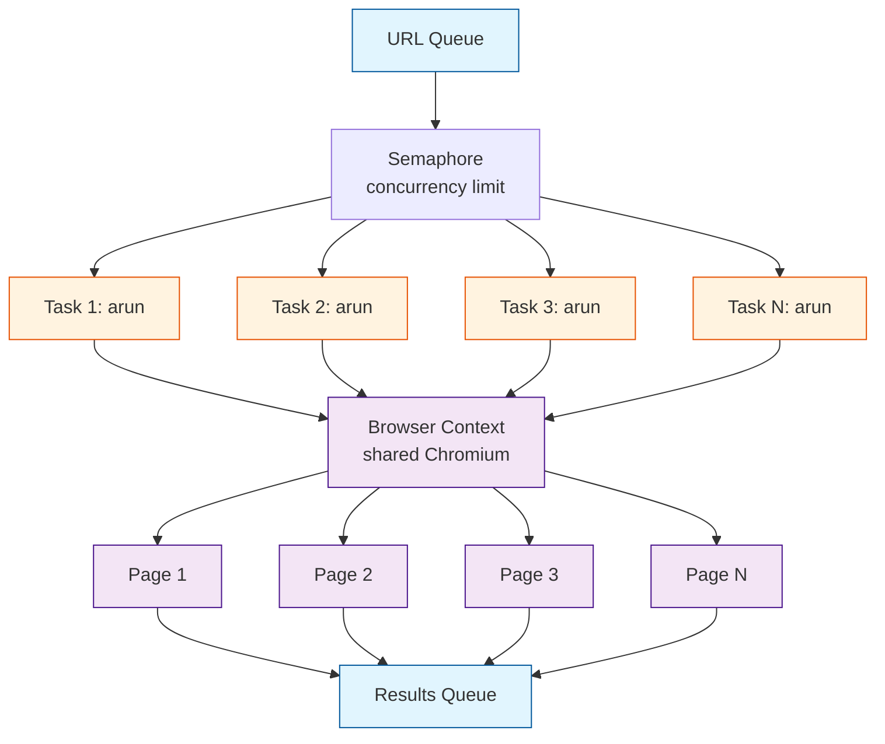
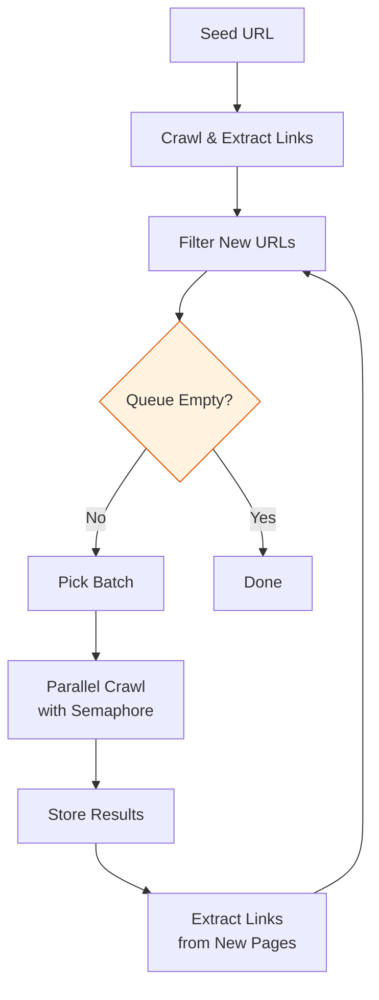

# Chapter 7: Async & Parallel Crawling

Crawl4AI is async-native, built on Python's `asyncio`. This chapter covers how to crawl many pages concurrently, manage browser sessions, control memory, handle rate limiting, and build efficient crawling pipelines.

## Concurrency Architecture



All concurrent crawls share a single browser process. Crawl4AI opens separate pages (tabs) within the same browser context, keeping memory usage manageable.

## Basic Parallel Crawling with asyncio.gather

The simplest way to crawl multiple URLs concurrently:

```python
import asyncio
from crawl4ai import AsyncWebCrawler

async def crawl_parallel(urls: list[str]):
    async with AsyncWebCrawler() as crawler:
        tasks = [crawler.arun(url=url) for url in urls]
        results = await asyncio.gather(*tasks, return_exceptions=True)

        for url, result in zip(urls, results):
            if isinstance(result, Exception):
                print(f"[ERROR] {url}: {result}")
            elif result.success:
                print(f"[OK]    {url}: {len(result.markdown)} chars")
            else:
                print(f"[FAIL]  {url}: {result.error_message}")

        return results

urls = [
    "https://example.com/page-1",
    "https://example.com/page-2",
    "https://example.com/page-3",
    "https://example.com/page-4",
    "https://example.com/page-5",
]

asyncio.run(crawl_parallel(urls))
```

**Warning:** Launching too many tasks at once can overwhelm the browser. Use a semaphore to limit concurrency.

## Controlling Concurrency with Semaphores

```python
import asyncio
from crawl4ai import AsyncWebCrawler, CrawlerRunConfig

async def crawl_with_limit(urls: list[str], max_concurrent: int = 5):
    semaphore = asyncio.Semaphore(max_concurrent)

    async def crawl_one(crawler, url):
        async with semaphore:
            result = await crawler.arun(url=url)
            return url, result

    async with AsyncWebCrawler() as crawler:
        tasks = [crawl_one(crawler, url) for url in urls]
        results = await asyncio.gather(*tasks, return_exceptions=True)

        successful = []
        for item in results:
            if isinstance(item, Exception):
                print(f"Exception: {item}")
            else:
                url, result = item
                if result.success:
                    successful.append(result)
                    print(f"[OK] {url}")
                else:
                    print(f"[FAIL] {url}: {result.error_message}")

        return successful

# Crawl 50 URLs, 5 at a time
urls = [f"https://example.com/page-{i}" for i in range(50)]
asyncio.run(crawl_with_limit(urls, max_concurrent=5))
```

## Session Management

Sessions let you maintain state (cookies, localStorage) across crawls. This is critical for sites that require login or have anti-bot measures:

```python
from crawl4ai import AsyncWebCrawler, CrawlerRunConfig

async def crawl_with_session():
    async with AsyncWebCrawler() as crawler:
        # First request: login and establish session
        login_config = CrawlerRunConfig(
            session_id="my_session",
            js_code="""
            document.querySelector('#user').value = 'myuser';
            document.querySelector('#pass').value = 'mypass';
            document.querySelector('form').submit();
            """,
            wait_for="css:.dashboard",
        )
        await crawler.arun(url="https://example.com/login", config=login_config)

        # Subsequent requests reuse the session (cookies persist)
        pages_config = CrawlerRunConfig(session_id="my_session")

        for page_num in range(1, 11):
            result = await crawler.arun(
                url=f"https://example.com/data?page={page_num}",
                config=pages_config,
            )
            if result.success:
                print(f"Page {page_num}: {len(result.markdown)} chars")
```

### Multiple Independent Sessions

```python
async def multi_session():
    async with AsyncWebCrawler() as crawler:
        # Each session has its own cookies and state
        config_a = CrawlerRunConfig(session_id="session_a")
        config_b = CrawlerRunConfig(session_id="session_b")

        # These run independently — session_a cookies don't leak to session_b
        result_a = await crawler.arun(
            url="https://site-a.com", config=config_a
        )
        result_b = await crawler.arun(
            url="https://site-b.com", config=config_b
        )
```

## Rate Limiting

Respect target sites by adding delays between requests:

```python
import asyncio
import time
from crawl4ai import AsyncWebCrawler

class RateLimiter:
    """Token bucket rate limiter for async crawling."""

    def __init__(self, requests_per_second: float):
        self.min_interval = 1.0 / requests_per_second
        self.last_request = 0.0
        self.lock = asyncio.Lock()

    async def acquire(self):
        async with self.lock:
            now = time.monotonic()
            wait = self.min_interval - (now - self.last_request)
            if wait > 0:
                await asyncio.sleep(wait)
            self.last_request = time.monotonic()

async def crawl_rate_limited(urls: list[str], rps: float = 2.0):
    limiter = RateLimiter(requests_per_second=rps)
    semaphore = asyncio.Semaphore(5)

    async def crawl_one(crawler, url):
        async with semaphore:
            await limiter.acquire()
            return url, await crawler.arun(url=url)

    async with AsyncWebCrawler() as crawler:
        tasks = [crawl_one(crawler, url) for url in urls]
        return await asyncio.gather(*tasks)
```

## Crawling with Pagination

Many sites spread content across numbered pages:

```python
import asyncio
from crawl4ai import AsyncWebCrawler, CrawlerRunConfig

async def crawl_paginated(base_url: str, max_pages: int = 20):
    all_content = []

    async with AsyncWebCrawler() as crawler:
        for page in range(1, max_pages + 1):
            url = f"{base_url}?page={page}"
            result = await crawler.arun(url=url)

            if not result.success:
                print(f"Stopping at page {page}: {result.error_message}")
                break

            if not result.markdown.strip():
                print(f"Empty page {page}, stopping.")
                break

            all_content.append({
                "page": page,
                "url": url,
                "markdown": result.markdown,
            })
            print(f"Page {page}: {len(result.markdown)} chars")

    return all_content

asyncio.run(crawl_paginated("https://example.com/articles"))
```

### Parallel Pagination Across Multiple Sites

```python
async def crawl_sites_parallel(
    sites: dict[str, str],  # name -> base_url
    pages_per_site: int = 10,
    max_concurrent: int = 3,
):
    semaphore = asyncio.Semaphore(max_concurrent)

    async def crawl_site(crawler, name, base_url):
        async with semaphore:
            pages = []
            for p in range(1, pages_per_site + 1):
                result = await crawler.arun(url=f"{base_url}?page={p}")
                if result.success and result.markdown.strip():
                    pages.append(result.markdown)
                else:
                    break
            return name, pages

    async with AsyncWebCrawler() as crawler:
        tasks = [
            crawl_site(crawler, name, url)
            for name, url in sites.items()
        ]
        results = await asyncio.gather(*tasks)
        return dict(results)
```

## Memory Management

Large crawls can consume significant memory. Strategies to control it:

```python
import asyncio
from crawl4ai import AsyncWebCrawler, CrawlerRunConfig, BrowserConfig

async def memory_efficient_crawl(urls: list[str]):
    # Text mode: skip image loading
    browser_config = BrowserConfig(text_mode=True)

    config = CrawlerRunConfig(
        word_count_threshold=20,       # drop trivial blocks
        exclude_external_links=True,   # less data in result
    )

    async with AsyncWebCrawler(config=browser_config) as crawler:
        batch_size = 20
        all_results = []

        for i in range(0, len(urls), batch_size):
            batch = urls[i:i + batch_size]
            tasks = [crawler.arun(url=url, config=config) for url in batch]
            results = await asyncio.gather(*tasks, return_exceptions=True)

            for url, result in zip(batch, results):
                if not isinstance(result, Exception) and result.success:
                    # Store only what you need — don't keep full result objects
                    all_results.append({
                        "url": url,
                        "title": result.title,
                        "markdown": result.fit_markdown,  # smaller than full
                    })

            print(f"Batch {i // batch_size + 1}: "
                  f"{len(all_results)} total results")

        return all_results
```

## Progress Tracking

```python
import asyncio
from crawl4ai import AsyncWebCrawler

async def crawl_with_progress(urls: list[str], max_concurrent: int = 5):
    semaphore = asyncio.Semaphore(max_concurrent)
    completed = 0
    total = len(urls)
    failed = 0

    async def crawl_one(crawler, url):
        nonlocal completed, failed
        async with semaphore:
            result = await crawler.arun(url=url)
            completed += 1
            if not result.success:
                failed += 1
            pct = (completed / total) * 100
            print(f"[{pct:5.1f}%] {completed}/{total} "
                  f"(failed: {failed}) — {url}")
            return url, result

    async with AsyncWebCrawler() as crawler:
        tasks = [crawl_one(crawler, url) for url in urls]
        return await asyncio.gather(*tasks)
```

## Full Pipeline Example: Site-Wide Crawl



```python
import asyncio
from urllib.parse import urljoin, urlparse
from crawl4ai import AsyncWebCrawler, CrawlerRunConfig

async def crawl_site(
    start_url: str,
    max_pages: int = 100,
    max_concurrent: int = 5,
):
    domain = urlparse(start_url).netloc
    visited = set()
    queue = [start_url]
    results = []
    semaphore = asyncio.Semaphore(max_concurrent)

    async def crawl_one(crawler, url):
        async with semaphore:
            return url, await crawler.arun(url=url)

    async with AsyncWebCrawler() as crawler:
        while queue and len(visited) < max_pages:
            batch = []
            while queue and len(batch) < max_concurrent:
                url = queue.pop(0)
                if url not in visited:
                    visited.add(url)
                    batch.append(url)

            if not batch:
                break

            tasks = [crawl_one(crawler, url) for url in batch]
            batch_results = await asyncio.gather(*tasks, return_exceptions=True)

            for item in batch_results:
                if isinstance(item, Exception):
                    continue
                url, result = item
                if not result.success:
                    continue

                results.append({
                    "url": url,
                    "title": result.title,
                    "markdown": result.fit_markdown,
                })

                # Discover new URLs
                for link in result.links.get("internal", []):
                    href = urljoin(url, link["href"])
                    parsed = urlparse(href)
                    clean = f"{parsed.scheme}://{parsed.netloc}{parsed.path}"
                    if parsed.netloc == domain and clean not in visited:
                        queue.append(clean)

            print(f"Visited: {len(visited)}, Queue: {len(queue)}, "
                  f"Results: {len(results)}")

    return results

pages = asyncio.run(crawl_site("https://example.com", max_pages=50))
print(f"Crawled {len(pages)} pages")
```

## Summary

You now know how to scale Crawl4AI from single-page crawls to site-wide parallel operations:

- Use `asyncio.gather` for concurrent crawling
- Control concurrency with semaphores to avoid overwhelming the browser
- Manage sessions for stateful crawling (login, cookies)
- Implement rate limiting to respect target sites
- Handle pagination and site-wide crawling with link discovery
- Optimize memory by batching and storing only essential data

**Next up:** [Chapter 8: Production Deployment](08-production-deployment.md) — Docker containers, REST APIs, monitoring, and fault tolerance for production crawling.

---

[Previous: Chapter 6: Structured Data Extraction](06-structured-extraction.md) | [Back to Tutorial Home](README.md) | [Next: Chapter 8: Production Deployment](08-production-deployment.md)
