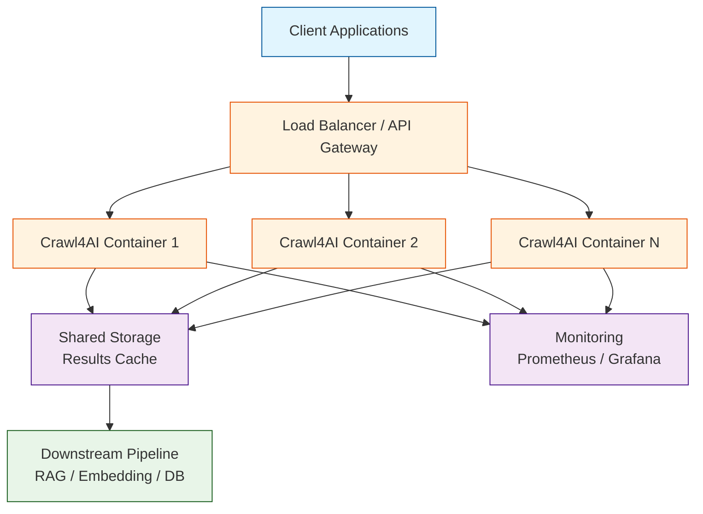
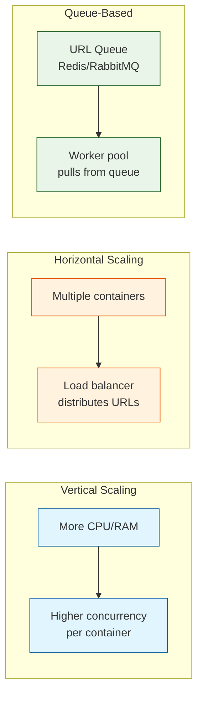

# Chapter 8: Production Deployment

This chapter covers running Crawl4AI in production: Docker containers, the built-in REST API server, monitoring, error handling, retry logic, and scaling strategies.

## Production Architecture



## Docker Deployment

### Using the Official Image

```bash
# Pull the latest image
docker pull unclecode/crawl4ai:latest

# Run with default settings
docker run -d \
  --name crawl4ai \
  -p 11235:11235 \
  -e MAX_CONCURRENT_TASKS=5 \
  unclecode/crawl4ai:latest
```

### Custom Dockerfile

```dockerfile
FROM unclecode/crawl4ai:latest

# Install additional Python packages if needed
RUN pip install --no-cache-dir \
    openai \
    anthropic \
    pydantic

# Set environment variables
ENV MAX_CONCURRENT_TASKS=10
ENV CRAWL4AI_API_TOKEN=your-secret-token

# Expose the API port
EXPOSE 11235

# Default command starts the API server
CMD ["crawl4ai-server"]
```

### Docker Compose for Full Stack

```yaml
version: "3.8"

services:
  crawl4ai:
    image: unclecode/crawl4ai:latest
    ports:
      - "11235:11235"
    environment:
      - MAX_CONCURRENT_TASKS=10
      - CRAWL4AI_API_TOKEN=${CRAWL4AI_API_TOKEN}
      - OPENAI_API_KEY=${OPENAI_API_KEY}
    volumes:
      - crawl4ai-cache:/app/cache
    deploy:
      resources:
        limits:
          memory: 4G
          cpus: "2.0"
    restart: unless-stopped
    healthcheck:
      test: ["CMD", "curl", "-f", "http://localhost:11235/health"]
      interval: 30s
      timeout: 10s
      retries: 3

  redis:
    image: redis:7-alpine
    ports:
      - "6379:6379"
    volumes:
      - redis-data:/data

volumes:
  crawl4ai-cache:
  redis-data:
```

```bash
docker compose up -d
```

## The Crawl4AI REST API

The built-in server exposes a REST API that any language or service can call:

### Starting the Server

```bash
# Standalone
crawl4ai-server --port 11235 --max-concurrent 10

# Or via Docker (starts automatically)
docker run -p 11235:11235 unclecode/crawl4ai:latest
```

### API Endpoints

```python
import requests
import json

BASE_URL = "http://localhost:11235"

# Health check
resp = requests.get(f"{BASE_URL}/health")
print(resp.json())  # {"status": "healthy"}

# Submit a crawl job
payload = {
    "urls": ["https://example.com"],
    "priority": 5,
    "config": {
        "css_selector": "main",
        "word_count_threshold": 10,
    },
}

resp = requests.post(
    f"{BASE_URL}/crawl",
    json=payload,
    headers={"Authorization": "Bearer your-secret-token"},
)
result = resp.json()
print(json.dumps(result, indent=2))
```

### Async Job Submission

For long-running crawls, use the async endpoint:

```python
# Submit async job
resp = requests.post(
    f"{BASE_URL}/crawl/async",
    json={"urls": ["https://example.com/large-page"]},
    headers={"Authorization": "Bearer your-secret-token"},
)
job = resp.json()
job_id = job["job_id"]

# Poll for results
import time
while True:
    status = requests.get(
        f"{BASE_URL}/crawl/{job_id}",
        headers={"Authorization": "Bearer your-secret-token"},
    ).json()

    if status["status"] == "completed":
        print("Done!", status["result"]["markdown"][:200])
        break
    elif status["status"] == "failed":
        print("Failed:", status["error"])
        break

    time.sleep(2)
```

## Robust Error Handling

Production crawls must handle every failure mode gracefully:

```python
import asyncio
import logging
from crawl4ai import AsyncWebCrawler, CrawlerRunConfig, BrowserConfig

logger = logging.getLogger("crawl4ai_prod")

class CrawlError(Exception):
    """Custom exception for crawl failures."""
    def __init__(self, url: str, reason: str):
        self.url = url
        self.reason = reason
        super().__init__(f"Failed to crawl {url}: {reason}")

async def resilient_crawl(
    crawler: AsyncWebCrawler,
    url: str,
    config: CrawlerRunConfig,
    max_retries: int = 3,
    backoff_base: float = 2.0,
) -> dict:
    """Crawl with exponential backoff retry."""
    for attempt in range(max_retries):
        try:
            result = await asyncio.wait_for(
                crawler.arun(url=url, config=config),
                timeout=60.0,  # hard timeout
            )

            if result.success:
                return {
                    "url": result.url,
                    "title": result.title,
                    "markdown": result.fit_markdown,
                    "status_code": result.status_code,
                    "attempts": attempt + 1,
                }

            # Certain status codes should not be retried
            if result.status_code in (404, 403, 410):
                raise CrawlError(url, f"HTTP {result.status_code}")

            logger.warning(
                f"Attempt {attempt + 1} failed for {url}: "
                f"{result.error_message}"
            )

        except asyncio.TimeoutError:
            logger.warning(f"Timeout on attempt {attempt + 1} for {url}")
        except Exception as e:
            if isinstance(e, CrawlError):
                raise
            logger.warning(f"Error on attempt {attempt + 1} for {url}: {e}")

        if attempt < max_retries - 1:
            wait = backoff_base ** attempt
            await asyncio.sleep(wait)

    raise CrawlError(url, f"Failed after {max_retries} attempts")
```

## Caching Strategies

Avoid re-crawling pages unnecessarily:

```python
import hashlib
import json
import os
from pathlib import Path
from datetime import datetime, timedelta

class CrawlCache:
    """File-based cache for crawl results."""

    def __init__(self, cache_dir: str = "./crawl_cache", ttl_hours: int = 24):
        self.cache_dir = Path(cache_dir)
        self.cache_dir.mkdir(parents=True, exist_ok=True)
        self.ttl = timedelta(hours=ttl_hours)

    def _key(self, url: str) -> str:
        return hashlib.sha256(url.encode()).hexdigest()

    def get(self, url: str) -> dict | None:
        path = self.cache_dir / f"{self._key(url)}.json"
        if not path.exists():
            return None
        data = json.loads(path.read_text())
        cached_at = datetime.fromisoformat(data["cached_at"])
        if datetime.now() - cached_at > self.ttl:
            path.unlink()
            return None
        return data

    def put(self, url: str, result: dict):
        result["cached_at"] = datetime.now().isoformat()
        path = self.cache_dir / f"{self._key(url)}.json"
        path.write_text(json.dumps(result))

# Usage
cache = CrawlCache(ttl_hours=12)

async def cached_crawl(crawler, url, config):
    cached = cache.get(url)
    if cached:
        return cached

    result = await resilient_crawl(crawler, url, config)
    cache.put(url, result)
    return result
```

## Monitoring and Logging

### Structured Logging

```python
import logging
import json
import time

class CrawlMetrics:
    """Track crawl performance metrics."""

    def __init__(self):
        self.total = 0
        self.success = 0
        self.failed = 0
        self.total_time = 0.0
        self.total_chars = 0

    def record(self, url: str, success: bool, duration: float, chars: int = 0):
        self.total += 1
        self.total_time += duration
        if success:
            self.success += 1
            self.total_chars += chars
        else:
            self.failed += 1

    def summary(self) -> dict:
        return {
            "total_crawls": self.total,
            "success_rate": (self.success / self.total * 100) if self.total else 0,
            "failed": self.failed,
            "avg_duration_s": self.total_time / self.total if self.total else 0,
            "total_chars": self.total_chars,
        }

# Usage in a crawl pipeline
metrics = CrawlMetrics()

async def monitored_crawl(crawler, url, config):
    start = time.monotonic()
    try:
        result = await crawler.arun(url=url, config=config)
        duration = time.monotonic() - start
        metrics.record(
            url=url,
            success=result.success,
            duration=duration,
            chars=len(result.markdown) if result.success else 0,
        )
        return result
    except Exception as e:
        duration = time.monotonic() - start
        metrics.record(url=url, success=False, duration=duration)
        raise

# After crawling
print(json.dumps(metrics.summary(), indent=2))
```

### Health Check Endpoint (Custom Server)

```python
from fastapi import FastAPI
from crawl4ai import AsyncWebCrawler

app = FastAPI()
crawler = None

@app.on_event("startup")
async def startup():
    global crawler
    crawler = AsyncWebCrawler()
    await crawler.__aenter__()

@app.on_event("shutdown")
async def shutdown():
    global crawler
    if crawler:
        await crawler.__aexit__(None, None, None)

@app.get("/health")
async def health():
    return {"status": "healthy", "metrics": metrics.summary()}

@app.post("/crawl")
async def crawl_endpoint(url: str):
    result = await monitored_crawl(crawler, url, CrawlerRunConfig())
    return {
        "success": result.success,
        "markdown": result.markdown if result.success else None,
        "error": result.error_message if not result.success else None,
    }
```

## Scaling Strategies



### Queue-Based Worker Pattern

```python
import asyncio
import redis.asyncio as redis
from crawl4ai import AsyncWebCrawler, CrawlerRunConfig

async def worker(worker_id: int, redis_client, crawler, config):
    """Pull URLs from Redis queue and crawl them."""
    while True:
        url = await redis_client.lpop("crawl_queue")
        if url is None:
            await asyncio.sleep(1)
            continue

        url = url.decode()
        try:
            result = await resilient_crawl(crawler, url, config)
            await redis_client.hset(
                "crawl_results",
                url,
                json.dumps(result),
            )
            print(f"Worker {worker_id}: crawled {url}")
        except CrawlError as e:
            await redis_client.hset(
                "crawl_errors",
                url,
                str(e),
            )

async def run_workers(num_workers: int = 5):
    redis_client = redis.Redis()
    config = CrawlerRunConfig(
        word_count_threshold=10,
        page_timeout=30000,
    )

    async with AsyncWebCrawler() as crawler:
        workers = [
            asyncio.create_task(
                worker(i, redis_client, crawler, config)
            )
            for i in range(num_workers)
        ]
        await asyncio.gather(*workers)
```

## Resource Limits and Tuning

| Setting | Low Resource | Standard | High Throughput |
|---|---|---|---|
| `MAX_CONCURRENT_TASKS` | 3 | 10 | 25 |
| Container Memory | 1 GB | 4 GB | 8 GB |
| Container CPUs | 1 | 2 | 4 |
| `page_timeout` | 60000 | 30000 | 15000 |
| `text_mode` | True | False | True |
| Browser instances | 1 | 1 | 2-3 |

## Security Considerations

1. **API Authentication** — Always set `CRAWL4AI_API_TOKEN` in production
2. **Rate Limiting** — Respect `robots.txt` and add delays (see [Chapter 7](07-async-parallel.md))
3. **Network Isolation** — Run the browser in a sandboxed network
4. **Input Validation** — Sanitize URLs before crawling
5. **Resource Limits** — Set Docker memory/CPU limits to prevent runaway processes

```python
from urllib.parse import urlparse

ALLOWED_SCHEMES = {"http", "https"}
BLOCKED_DOMAINS = {"localhost", "127.0.0.1", "0.0.0.0"}

def validate_url(url: str) -> bool:
    try:
        parsed = urlparse(url)
        if parsed.scheme not in ALLOWED_SCHEMES:
            return False
        if parsed.hostname in BLOCKED_DOMAINS:
            return False
        return True
    except Exception:
        return False
```

## Summary

You now have everything needed to run Crawl4AI in production:

- Docker deployment with resource limits and health checks
- REST API for language-agnostic access
- Retry logic with exponential backoff
- Caching to avoid redundant crawls
- Metrics collection and monitoring
- Horizontal scaling with queue-based workers
- Security hardening for public-facing deployments

This completes the Crawl4AI tutorial. You have gone from `pip install` to production-grade crawling infrastructure, covering browser management, content extraction, markdown generation, LLM integration, structured data extraction, async parallelism, and deployment.

---

[Previous: Chapter 7: Async & Parallel Crawling](07-async-parallel.md) | [Back to Tutorial Home](README.md)
