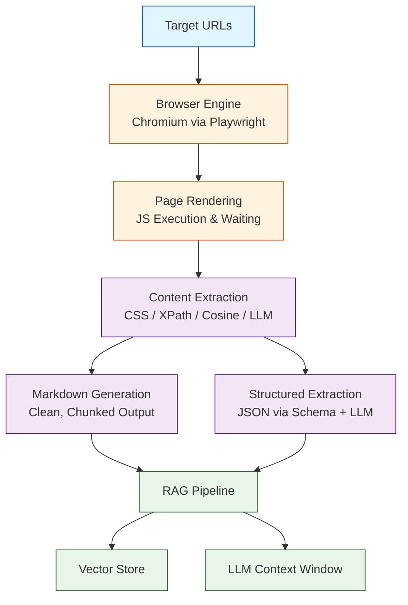

# Crawl4AI Tutorial: LLM-Friendly Web Crawling for RAG Pipelines

Crawl4AI[View Repo](https://github.com/unclecode/crawl4ai) is an open-source, LLM-friendly web crawler that converts entire websites into clean markdown optimized for Retrieval-Augmented Generation (RAG) pipelines. It runs a real browser engine under the hood, extracts meaningful content while stripping boilerplate, and produces structured output that LLMs can consume directly — all with an async-first Python API.

Unlike generic scrapers, Crawl4AI is purpose-built for the AI era: it understands page semantics, generates markdown with proper heading hierarchy, and can even call LLMs inline to extract structured data from unstructured pages.

## Why This Track Matters

Web data is the largest knowledge source available to AI systems, but raw HTML is noisy, unstructured, and hostile to LLM token budgets. Crawl4AI bridges that gap by turning any website into clean, chunked markdown that slots directly into embedding and retrieval workflows. Whether you are building a knowledge base, fine-tuning dataset, or real-time research agent, mastering Crawl4AI lets you feed high-quality web content into your AI stack without writing fragile scraping scripts.

This track focuses on:

- understanding the async crawler lifecycle from browser launch to markdown output
- mastering content extraction strategies — CSS, XPath, cosine similarity, and LLM-based
- generating clean markdown tuned for chunking and embedding
- extracting structured JSON from pages using schemas and LLMs
- scaling crawls with async parallelism and session management
- deploying Crawl4AI as a production service behind Docker and APIs

## Current Snapshot (auto-updated)

- repository: [`unclecode/crawl4ai`](https://github.com/unclecode/crawl4ai)
- stars: about **63.5k**
- latest release: [`v0.8.5`](https://github.com/unclecode/crawl4ai/releases/tag/v0.8.5) (published 2026-03-18)

## Mental Model

## Chapter Guide

This tutorial takes you from zero to production-grade web crawling for AI. Each chapter builds on the previous one, but experienced developers can jump to any chapter that matches their needs.

1. **[Chapter 1: Getting Started](01-getting-started.md)** — Installation, first crawl, and understanding the result object
2. **[Chapter 2: Browser Engine & Crawling](02-browser-engine.md)** — Playwright integration, browser config, JavaScript execution, and page interaction
3. **[Chapter 3: Content Extraction](03-content-extraction.md)** — CSS selectors, XPath, cosine-similarity chunking, and custom extraction strategies
4. **[Chapter 4: Markdown Generation](04-markdown-generation.md)** — Controlling markdown output, heading hierarchy, link handling, and content filtering
5. **[Chapter 5: LLM Integration](05-llm-integration.md)** — Connecting OpenAI, Anthropic, and local models for intelligent extraction
6. **[Chapter 6: Structured Data Extraction](06-structured-extraction.md)** — JSON schemas, Pydantic models, and LLM-powered field extraction
7. **[Chapter 7: Async & Parallel Crawling](07-async-parallel.md)** — Concurrent crawls, session management, rate limiting, and memory control
8. **[Chapter 8: Production Deployment](08-production-deployment.md)** — Docker, REST API, monitoring, error handling, and scaling strategies

## What You Will Learn

By the end of this tutorial, you will be able to:

- **Crawl any website** and convert it to clean, LLM-ready markdown
- **Configure browser behavior** including JavaScript execution, authentication, and proxies
- **Extract content precisely** using CSS, XPath, semantic similarity, and LLM strategies
- **Generate optimized markdown** with proper structure for RAG chunking
- **Integrate LLMs inline** to understand and extract meaning from pages
- **Pull structured JSON** from unstructured web pages using schemas
- **Run hundreds of crawls concurrently** with async patterns and resource controls
- **Deploy production crawling services** with Docker, monitoring, and fault tolerance

## Prerequisites

- Python 3.8+
- Familiarity with `async`/`await` in Python
- Basic understanding of HTML and CSS selectors
- (Optional) An OpenAI or Anthropic API key for LLM-powered extraction chapters

## Learning Path

### Beginner Track
New to web crawling for AI:
1. Chapters 1-2: Get running and understand browser-based crawling
2. Chapter 4: Learn markdown generation basics

### Intermediate Track
Building RAG or data pipelines:
1. Chapters 3-6: Master extraction strategies and structured output
2. Focus on content quality and schema-driven extraction

### Advanced Track
Production crawling at scale:
1. Chapters 7-8: Async parallelism, Docker deployment, monitoring
2. Integrate with your existing infrastructure

---

**Ready to turn the web into LLM-ready knowledge? Start with [Chapter 1: Getting Started](01-getting-started.md)!**

## Related Tutorials

- [Firecrawl Tutorial](../firecrawl-tutorial/) — Commercial web scraping platform for LLMs
- [RAGFlow Tutorial](../ragflow-tutorial/) — End-to-end RAG engine that can consume Crawl4AI output
- [LlamaIndex Tutorial](../llamaindex-tutorial/) — Data framework for LLM applications with web connectors

## Navigation & Backlinks

- [Start Here: Chapter 1: Getting Started](01-getting-started.md)
- [Back to Main Catalog](../../README.md#-tutorial-catalog)
- [Browse A-Z Tutorial Directory](../../discoverability/tutorial-directory.md)
- [Search by Intent](../../discoverability/query-hub.md)
- [Explore Category Hubs](../../README.md#category-hubs)

*Generated by [AI Codebase Knowledge Builder](https://github.com/The-Pocket/Tutorial-Codebase-Knowledge)*

## Full Chapter Map

1. [Chapter 1: Getting Started](01-getting-started.md)
2. [Chapter 2: Browser Engine & Crawling](02-browser-engine.md)
3. [Chapter 3: Content Extraction](03-content-extraction.md)
4. [Chapter 4: Markdown Generation](04-markdown-generation.md)
5. [Chapter 5: LLM Integration](05-llm-integration.md)
6. [Chapter 6: Structured Data Extraction](06-structured-extraction.md)
7. [Chapter 7: Async & Parallel Crawling](07-async-parallel.md)
8. [Chapter 8: Production Deployment](08-production-deployment.md)

## Source References

- [View Repo](https://github.com/unclecode/crawl4ai)
- [Crawl4AI Documentation](https://docs.crawl4ai.com/)
- [PyPI Package](https://pypi.org/project/crawl4ai/)
