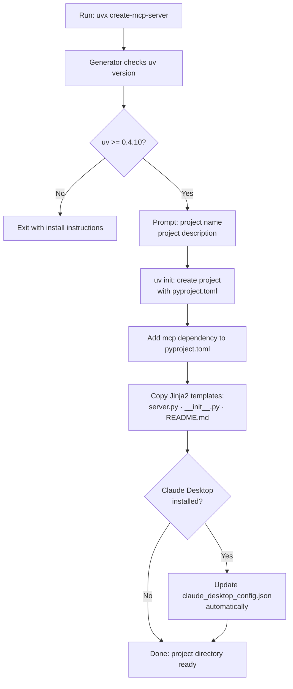

# Chapter 1: Getting Started and Scaffolding Workflow

`create-python-server` is a `uvx`-based scaffolding tool that generates a complete, ready-to-run MCP server project in Python. This chapter covers prerequisites, the generation workflow, and the initial run sequence.

> **Archive notice**: The `modelcontextprotocol/create-python-server` repository is archived. The scaffold it generates remains functional and the generated pattern (FastMCP or low-level Server API) is still the recommended approach, but the generator itself receives no further updates. See Chapter 8 for migration context.

## Learning Goals

- Scaffold a new MCP Python server via `uvx create-mcp-server`
- Understand prerequisites: `uv` toolchain and minimum version check
- Run the generated server locally with minimal setup
- Avoid onboarding drift across team environments

## Prerequisites

The only system requirement is [`uv`](https://github.com/astral-sh/uv) at version 0.4.10 or higher. The generator checks this at startup and exits with a clear error if the version is insufficient.

```bash
# Verify uv is installed at the right version
uv --version    # should be >= 0.4.10

# Install or upgrade uv if needed
curl -LsSf https://astral.sh/uv/install.sh | sh
```

`uvx` is bundled with `uv` — no separate install step is needed.

## Scaffolding Workflow



## Running the Generator

```bash
# Interactive mode — prompts for name and description
uvx create-mcp-server

# Example session:
# Project name: my-notes-server
# Project description: A simple MCP server for managing notes
# Created project at: ./my-notes-server
```

After generation, the project directory contains everything needed to run immediately:

```bash
cd my-notes-server

# Install dependencies (creates .venv, installs mcp and dependencies)
uv sync --dev --all-extras

# Run the server in development mode via MCP Inspector
npx @modelcontextprotocol/inspector uv --directory . run my-notes-server

# Or run directly (stdio mode — for Claude Desktop integration)
uv run my-notes-server
```

## What the Generator Does Internally

The generator entry point lives in `src/create_mcp_server/__main__.py` which calls `main()` from `__init__.py`. The main function:

1. Checks `uv` version via `check_uv_version()` against `MIN_UV_VERSION = "0.4.10"`
2. Prompts for project name and description using `click`
3. Calls `uv init <project-name>` as a subprocess to initialize a standard Python project
4. Modifies the generated `pyproject.toml` to add `mcp>=1.0.0` as a dependency
5. Calls `copy_template()` to render Jinja2 templates into the project
6. Optionally calls `update_claude_config()` to register the server with Claude Desktop

```python
# From src/create_mcp_server/__init__.py
class PyProject:
    def __init__(self, path: Path):
        self.data = toml.load(path)

    @property
    def name(self) -> str:
        return self.data["project"]["name"]

    @property
    def first_binary(self) -> str | None:
        scripts = self.data["project"].get("scripts", {})
        return next(iter(scripts.keys()), None)
```

The `PyProject` class reads the generated `pyproject.toml` to extract the project name and entry-point binary name, which are then used as template variables when rendering `server.py.jinja2`.

## First-Run Verification

After running `uv sync` and launching the server via the Inspector, you should see:

1. The Inspector browser UI at `localhost:5173`
2. One tool registered: `add-note`
3. Zero resources initially (resources are note-URI-based; empty at start)
4. One prompt: `summarize-notes`

```bash
# Verify the generated binary runs without errors
uv run my-notes-server --help     # if --help is supported, or just check process exits cleanly

# Inspect it interactively
npx @modelcontextprotocol/inspector uv --directory /path/to/my-notes-server run my-notes-server
```

## Source References

- [Create Python Server README](https://github.com/modelcontextprotocol/create-python-server/blob/main/README.md)
- [Generator Entry Point: `__main__.py`](https://github.com/modelcontextprotocol/create-python-server/blob/main/src/create_mcp_server/__main__.py)
- [Generator Logic: `__init__.py`](https://github.com/modelcontextprotocol/create-python-server/blob/main/src/create_mcp_server/__init__.py)

## Summary

The `uvx create-mcp-server` command scaffolds a complete MCP server project in seconds. The generator verifies `uv` version, prompts for metadata, runs `uv init`, installs the `mcp` dependency, and renders templates from `src/create_mcp_server/template/`. The result is immediately runnable via `uv run <server-name>` and testable in the MCP Inspector.

Next: [Chapter 2: Generated Project Structure and Conventions](02-generated-project-structure-and-conventions.md)
