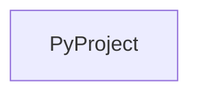

# Chapter 1: Getting Started and Scaffolding Workflow

Welcome to **Chapter 1: Getting Started and Scaffolding Workflow**. In this part of **Create Python Server Tutorial: Scaffold and Ship MCP Servers with uvx**, you will build an intuitive mental model first, then move into concrete implementation details and practical production tradeoffs.


This chapter covers initial project generation and first-run commands.

## Learning Goals

- scaffold a new MCP Python server via `uvx create-mcp-server`
- understand prerequisites (`uv` tooling) and generated output
- run the generated server locally with minimal setup
- avoid onboarding drift across team environments

## Quick Start

```bash
uvx create-mcp-server
```

After generation, run `uv sync --dev --all-extras` and `uv run <server-name>` from the created project directory.

## Source References

- [Create Python Server README](https://github.com/modelcontextprotocol/create-python-server/blob/main/README.md)

## Summary

You now have a reproducible baseline for generating MCP Python server projects.

Next: [Chapter 2: Generated Project Structure and Conventions](02-generated-project-structure-and-conventions.md)

## Source Code Walkthrough

### `src/create_mcp_server/__init__.py`

The `PyProject` class in [`src/create_mcp_server/__init__.py`](https://github.com/modelcontextprotocol/create-python-server/blob/HEAD/src/create_mcp_server/__init__.py) handles a key part of this chapter's functionality:

```py


class PyProject:
    def __init__(self, path: Path):
        self.data = toml.load(path)

    @property
    def name(self) -> str:
        return self.data["project"]["name"]

    @property
    def first_binary(self) -> str | None:
        scripts = self.data["project"].get("scripts", {})
        return next(iter(scripts.keys()), None)


def check_uv_version(required_version: str) -> str | None:
    """Check if uv is installed and has minimum version"""
    try:
        result = subprocess.run(
            ["uv", "--version"], capture_output=True, text=True, check=True
        )
        version = result.stdout.strip()
        match = re.match(r"uv (\d+\.\d+\.\d+)", version)
        if match:
            version_num = match.group(1)
            if parse(version_num) >= parse(required_version):
                return version
        return None
    except subprocess.CalledProcessError:
        click.echo("❌ Error: Failed to check uv version.", err=True)
        sys.exit(1)
```

This class is important because it defines how Create Python Server Tutorial: Scaffold and Ship MCP Servers with uvx implements the patterns covered in this chapter.


## How These Components Connect


