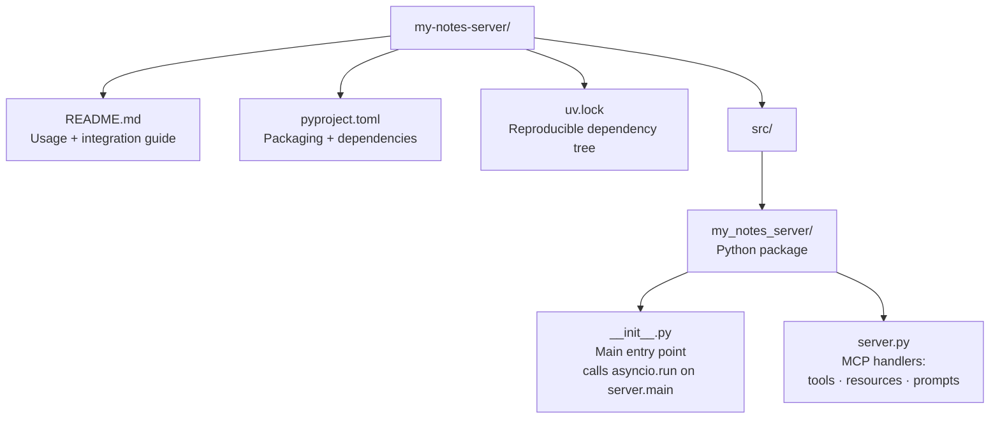
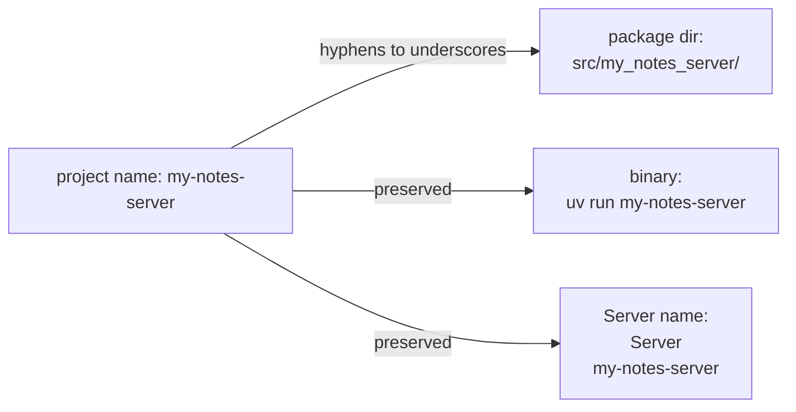
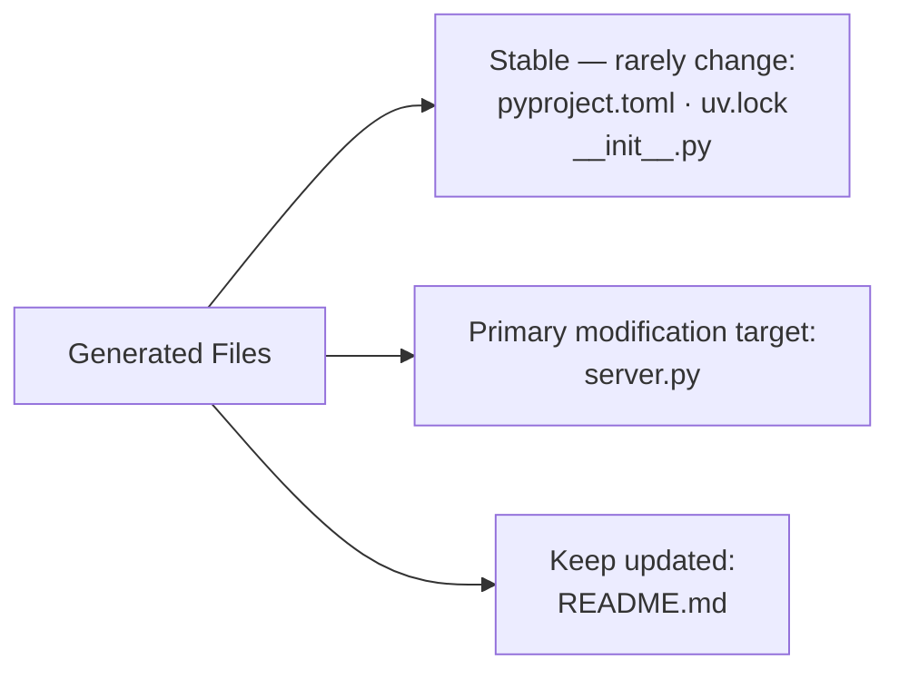

# Chapter 2: Generated Project Structure and Conventions

This chapter maps every file generated by `create-mcp-server`, explains the naming conventions the generator enforces, and shows how each piece supports maintainable server development.

## Learning Goals

- Navigate the scaffolded project structure at every path
- Map template files to runtime behavior and MCP primitive registration
- Understand naming and package conventions used by the generator
- Keep customization changes isolated from generated boilerplate

## Generated Directory Layout

```
my-notes-server/
├── README.md                          # Rendered from README.md.jinja2
├── pyproject.toml                     # uv project config + mcp dependency
├── uv.lock                            # Locked dependency tree
└── src/
    └── my_notes_server/               # Package dir: project name, hyphens → underscores
        ├── __init__.py                # Rendered from __init__.py.jinja2 (entry point)
        └── server.py                  # Rendered from server.py.jinja2 (MCP handlers)
```



## File-by-File Breakdown

### `pyproject.toml`

The generator modifies the `uv init`-generated `pyproject.toml` to add:
- `mcp>=1.0.0` as a runtime dependency
- A `[project.scripts]` entry pointing the binary name at `<package>:main`

```toml
[project]
name = "my-notes-server"
version = "0.1.0"
description = "A simple MCP server for managing notes"
requires-python = ">=3.10"
dependencies = ["mcp>=1.0.0"]

[project.scripts]
my-notes-server = "my_notes_server:main"

[build-system]
requires = ["hatchling"]
build-backend = "hatchling.build"
```

The `[project.scripts]` entry is what makes `uv run my-notes-server` and `uvx my-notes-server` work — it maps the binary name to the `main()` function in `__init__.py`.

### `src/<package>/__init__.py`

Rendered from `__init__.py.jinja2`, this file provides the synchronous entry point:

```python
from . import server
import asyncio

def main():
    asyncio.run(server.main())
```

The generator uses the `first_binary` property of the `PyProject` class to ensure the function name matches the scripts entry. This indirection keeps `server.py` purely async and testable in isolation.

### `src/<package>/server.py`

The core implementation file, rendered from `server.py.jinja2`. This is where all MCP primitive handlers live. It is the primary file developers modify after scaffolding.

### `README.md`

Rendered from `README.md.jinja2`, the README contains:
- Installation instructions (`uv sync --dev --all-extras`)
- Claude Desktop configuration snippet (pre-filled with the project name)
- Development command (`npx @modelcontextprotocol/inspector ...`)
- Build and publish instructions (`uv build`, `uv publish`)

## Naming Conventions

The generator enforces Python package naming from the project name string:

| Input | Converted to |
|:------|:-------------|
| `my-notes-server` | `my_notes_server` (package dir, hyphens → underscores) |
| `my-notes-server` | `my-notes-server` (binary name in scripts, preserved) |
| `my-notes-server` | `"my-notes-server"` (server name in `Server("...")` call) |



**Important**: The Jinja2 templates reference `{{server_name}}` for display name and `{{binary_name}}` for the entry point. These are substituted by `copy_template()` during generation and are not present in the final generated files.

## Template Rendering

The `copy_template()` function in `__init__.py` uses Jinja2 to render all three template files:

```python
template_vars = {
    "binary_name": bin_name,        # from pyproject.toml scripts
    "server_name": name,            # project name as entered
    "server_version": version,      # "0.1.0" default
    "server_description": description,
    "server_directory": str(path.resolve()),
}
```

Files rendered:

| Template | Output Location | Key Variables Used |
|:---------|:----------------|:-------------------|
| `__init__.py.jinja2` | `src/<pkg>/__init__.py` | `binary_name` |
| `server.py.jinja2` | `src/<pkg>/server.py` | `server_name`, `server_version` |
| `README.md.jinja2` | `README.md` | `server_name`, `binary_name`, `server_directory` |

## Post-Generation File Ownership



The convention is: treat `__init__.py` as scaffolding boilerplate (don't modify), and concentrate all MCP logic in `server.py`. When customizing heavily, split `server.py` into multiple modules and import them — but keep the `server.py` file as the handler registration hub.

## Source References

- [Template Server (`server.py.jinja2`)](https://github.com/modelcontextprotocol/create-python-server/blob/main/src/create_mcp_server/template/server.py.jinja2)
- [Template Entry Point (`__init__.py.jinja2`)](https://github.com/modelcontextprotocol/create-python-server/blob/main/src/create_mcp_server/template/__init__.py.jinja2)
- [Template README (`README.md.jinja2`)](https://github.com/modelcontextprotocol/create-python-server/blob/main/src/create_mcp_server/template/README.md.jinja2)
- [Generator Logic (`__init__.py`)](https://github.com/modelcontextprotocol/create-python-server/blob/main/src/create_mcp_server/__init__.py)

## Summary

The generator produces a five-file project: `pyproject.toml`, `uv.lock`, `README.md`, `__init__.py` (entry point shim), and `server.py` (handler implementation). Naming follows Python package conventions (hyphens → underscores for directory, preserved for binary). All customization should focus on `server.py`; treat the rest as scaffolding until deliberate changes are needed.

Next: [Chapter 3: Template Server Architecture: Resources, Prompts, and Tools](03-template-server-architecture-resources-prompts-and-tools.md)
