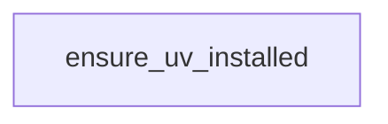

# Chapter 3: Template Server Architecture: Resources, Prompts, and Tools

Welcome to **Chapter 3: Template Server Architecture: Resources, Prompts, and Tools**. In this part of **Create Python Server Tutorial: Scaffold and Ship MCP Servers with uvx**, you will build an intuitive mental model first, then move into concrete implementation details and practical production tradeoffs.


This chapter dives into the generated server template and how it models core MCP primitives.

## Learning Goals

- inspect generated handlers for resource, prompt, and tool endpoints
- understand state management patterns in template code
- map primitive behavior to MCP protocol semantics
- identify extension points for domain-specific logic

## Template Highlights

- `list_resources` and `read_resource` expose note-based URI resources.
- `list_prompts` and `get_prompt` generate argument-aware prompt messages.
- `list_tools` and `call_tool` demonstrate tool registration, validation, and state mutation.

## Source References

- [Template Server Implementation](https://github.com/modelcontextprotocol/create-python-server/blob/main/src/create_mcp_server/template/server.py.jinja2)
- [Template README](https://github.com/modelcontextprotocol/create-python-server/blob/main/src/create_mcp_server/template/README.md.jinja2)

## Summary

You now have a concrete mental model for generated MCP primitive handlers.

Next: [Chapter 4: Runtime, Dependencies, and uv Packaging](04-runtime-dependencies-and-uv-packaging.md)

## Source Code Walkthrough

### `src/create_mcp_server/__init__.py`

The `ensure_uv_installed` function in [`src/create_mcp_server/__init__.py`](https://github.com/modelcontextprotocol/create-python-server/blob/HEAD/src/create_mcp_server/__init__.py) handles a key part of this chapter's functionality:

```py


def ensure_uv_installed() -> None:
    """Ensure uv is installed at minimum version"""
    if check_uv_version(MIN_UV_VERSION) is None:
        click.echo(
            f"❌ Error: uv >= {MIN_UV_VERSION} is required but not installed.", err=True
        )
        click.echo("To install, visit: https://github.com/astral-sh/uv", err=True)
        sys.exit(1)


def get_claude_config_path() -> Path | None:
    """Get the Claude config directory based on platform"""
    if sys.platform == "win32":
        path = Path(Path.home(), "AppData", "Roaming", "Claude")
    elif sys.platform == "darwin":
        path = Path(Path.home(), "Library", "Application Support", "Claude")
    else:
        return None

    if path.exists():
        return path
    return None


def has_claude_app() -> bool:
    return get_claude_config_path() is not None


def update_claude_config(project_name: str, project_path: Path) -> bool:
    """Add the project to the Claude config if possible"""
```

This function is important because it defines how Create Python Server Tutorial: Scaffold and Ship MCP Servers with uvx implements the patterns covered in this chapter.


## How These Components Connect


