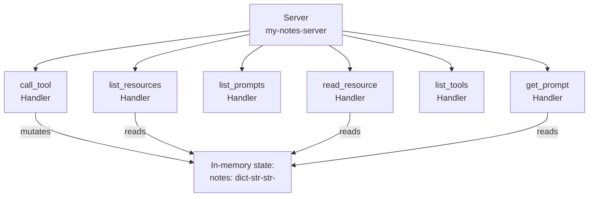
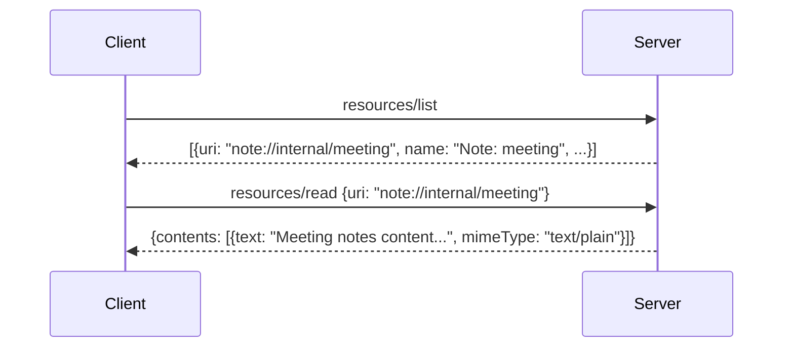
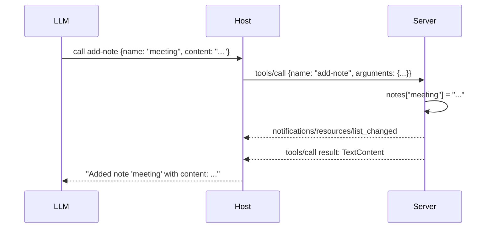

# Chapter 3: Template Server Architecture: Resources, Prompts, and Tools

This chapter dives into `server.py.jinja2` — the generated server template — and explains precisely how it models the three MCP primitives: resources (note URIs), prompts (summarize-notes template), and tools (add-note mutation).

## Learning Goals

- Inspect the generated handlers for resource, prompt, and tool endpoints
- Understand state management patterns in the template code
- Map primitive behavior to MCP protocol semantics
- Identify extension points for domain-specific logic

## Template Overview

The generated `server.py` uses the **low-level `Server` API** from `mcp.server`. It does not use FastMCP decorators — this makes every handler and lifecycle step explicit and educational.



## State Model

The template stores notes in a module-level dictionary:

```python
notes: dict[str, str] = {}
server = Server("{{server_name}}")
```

This in-memory model is intentional — it demonstrates stateful server behavior (tools mutate, resources reflect mutations) without external dependencies. In production servers, replace this dict with your actual data layer.

## Resources: `list_resources` and `read_resource`

Resources expose the current notes as URI-addressed data. Each note is accessible at `note://internal/<name>`.

```python
@server.list_resources()
async def handle_list_resources() -> list[types.Resource]:
    return [
        types.Resource(
            uri=AnyUrl(f"note://internal/{name}"),
            name=f"Note: {name}",
            description=f"A simple note named {name}",
            mimeType="text/plain",
        )
        for name in notes
    ]

@server.read_resource()
async def handle_read_resource(uri: AnyUrl) -> str:
    if uri.scheme != "note":
        raise ValueError(f"Unsupported URI scheme: {uri.scheme}")
    name = uri.path.lstrip("/") if uri.path else None
    return notes[name]
```

Resource design patterns demonstrated here:
- **Custom URI scheme** (`note://`): servers define their own URI namespaces
- **Dynamic list**: `list_resources` reflects live state, not a static catalog
- **Scheme validation**: `read_resource` rejects URIs with unexpected schemes explicitly
- **MimeType declaration**: `"text/plain"` tells clients how to render the content



## Prompts: `list_prompts` and `get_prompt`

The template registers a single prompt `summarize-notes` that generates a message asking for a summary of all current notes.

```python
@server.list_prompts()
async def handle_list_prompts() -> list[types.Prompt]:
    return [
        types.Prompt(
            name="summarize-notes",
            description="Creates a summary of all notes",
            arguments=[
                types.PromptArgument(
                    name="style",
                    description="Style of the summary (brief/detailed)",
                    required=False,
                )
            ],
        )
    ]

@server.get_prompt()
async def handle_get_prompt(name: str, arguments: dict[str, str] | None) -> types.GetPromptResult:
    if name != "summarize-notes":
        raise ValueError(f"Unknown prompt: {name}")
    style = (arguments or {}).get("style", "brief")
    detail_prompt = " Give extensive details." if style == "detailed" else ""
    return types.GetPromptResult(
        description="Summarize the current notes",
        messages=[
            types.PromptMessage(
                role="user",
                content=types.TextContent(
                    type="text",
                    text=f"Here are the current notes to summarize:{detail_prompt}\n\n"
                    + "\n".join(f"- {name}: {content}" for name, content in notes.items()),
                ),
            )
        ],
    )
```

Prompt design patterns demonstrated:
- **Optional arguments with defaults**: `style` defaults to `"brief"` if not provided
- **Dynamic content injection**: the prompt body includes live note content at render time
- **Single `user` message**: the simplest prompt shape — one message asking the LLM to act

## Tools: `list_tools` and `call_tool`

The template exposes one tool, `add-note`, which creates or replaces a note entry and notifies clients of resource list changes.

```python
@server.list_tools()
async def handle_list_tools() -> list[types.Tool]:
    return [
        types.Tool(
            name="add-note",
            description="Add a new note",
            inputSchema={
                "type": "object",
                "properties": {
                    "name": {"type": "string"},
                    "content": {"type": "string"},
                },
                "required": ["name", "content"],
            },
        )
    ]

@server.call_tool()
async def handle_call_tool(name: str, arguments: dict | None) -> list[...]:
    if name != "add-note":
        raise ValueError(f"Unknown tool: {name}")
    note_name = arguments.get("name")
    content = arguments.get("content")
    notes[note_name] = content
    # Notify clients that resource list changed
    await server.request_context.session.send_resource_list_changed()
    return [types.TextContent(type="text", text=f"Added note '{note_name}' with content: {content}")]
```

Tool design patterns demonstrated:
- **JSON Schema input validation**: `required` array and typed `properties`
- **State mutation with notification**: after modifying `notes`, the server sends `notifications/resources/list_changed` so connected clients can refresh
- **Structured response**: returns a `TextContent` list, not a raw string



## The `main()` Async Entry Point

```python
async def main():
    async with mcp.server.stdio.stdio_server() as (read_stream, write_stream):
        await server.run(
            read_stream,
            write_stream,
            InitializationOptions(
                server_name="{{server_name}}",
                server_version="{{server_version}}",
                capabilities=server.get_capabilities(
                    notification_options=NotificationOptions(),
                    experimental_capabilities={},
                ),
            ),
        )
```

This wires the server to stdin/stdout via the `stdio_server()` context manager, which handles the byte-level framing. `InitializationOptions` carries the server's name, version, and capability advertisement to the client during the `initialize` handshake.

## Source References

- [Template Server Implementation](https://github.com/modelcontextprotocol/create-python-server/blob/main/src/create_mcp_server/template/server.py.jinja2)
- [Template README](https://github.com/modelcontextprotocol/create-python-server/blob/main/src/create_mcp_server/template/README.md.jinja2)

## Summary

The generated `server.py` is a complete, working demonstration of all three MCP primitives using the low-level `Server` API. Resources use a custom `note://` URI scheme and reflect live state. The `summarize-notes` prompt injects current note content at render time. The `add-note` tool mutates state and sends `resource_list_changed` notifications. Every handler is an extension point — replace the `notes` dict and the business logic inside each handler to build a domain-specific server.

Next: [Chapter 4: Runtime, Dependencies, and uv Packaging](04-runtime-dependencies-and-uv-packaging.md)
