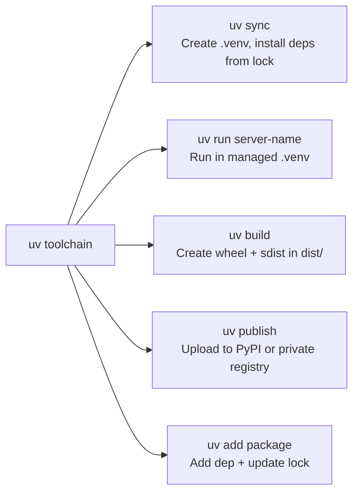
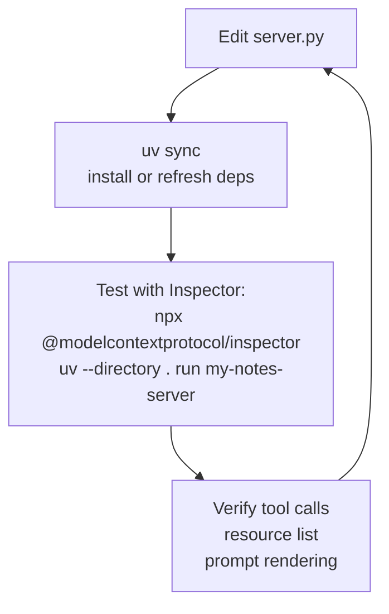
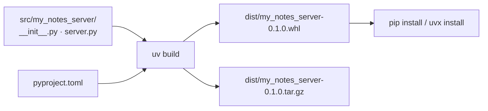

# Chapter 4: Runtime, Dependencies, and uv Packaging

This chapter covers the `uv`-based dependency and packaging model for generated MCP servers: how dependencies are declared, how lockfiles maintain reproducibility, and how to build and publish a server as a standalone Python package.

## Learning Goals

- Manage dependencies with `uv` conventions in generated projects
- Run generated servers in development and published modes
- Keep lockfiles and build artifacts reproducible across environments
- Avoid environment drift across contributors and CI systems

## The uv Packaging Model

Generated MCP servers use `uv` as the complete Python toolchain — environment manager, package manager, and build tool. This eliminates the `pip + virtualenv + poetry + twine` fragmentation common in Python projects.



## `pyproject.toml` Structure

The generated `pyproject.toml` uses the `hatchling` build backend (the default for `uv init`):

```toml
[project]
name = "my-notes-server"
version = "0.1.0"
description = "A simple MCP server for managing notes"
readme = "README.md"
requires-python = ">=3.10"
dependencies = ["mcp>=1.0.0"]

[project.scripts]
my-notes-server = "my_notes_server:main"

[build-system]
requires = ["hatchling"]
build-backend = "hatchling.build"
```

Key constraints:
- `requires-python = ">=3.10"` — the `mcp` SDK requires Python 3.10+ for union type syntax (`X | Y`)
- `mcp>=1.0.0` — unpinned upper bound; updates get new SDK versions on `uv sync`
- `[project.scripts]` entry enables `uvx my-notes-server` without explicit path management

## Development Workflow



```bash
# Full development cycle

# 1. Install / refresh dependencies
uv sync --dev --all-extras

# 2. Run server directly (stdio — useful for pipes)
uv run my-notes-server

# 3. Run in Inspector for interactive testing
npx @modelcontextprotocol/inspector uv --directory /path/to/my-notes-server run my-notes-server

# 4. Add a new dependency
uv add requests
uv add --dev pytest
```

## Lockfile Discipline

`uv.lock` pins every transitive dependency to an exact version and hash. This is committed to source control to ensure every environment gets identical packages:

```bash
# After anyone adds/removes a dependency, commit the updated lock file
git add uv.lock pyproject.toml
git commit -m "deps: add requests for HTTP resource fetching"
```

If a contributor runs `uv sync` without updating the lock, they get the locked versions — not the latest. To upgrade dependencies:

```bash
# Upgrade all dependencies within pyproject.toml constraints
uv lock --upgrade

# Upgrade a specific package
uv lock --upgrade-package mcp
```

## Building for Distribution

```bash
# Build wheel and source distribution
uv build
# Output: dist/my_notes_server-0.1.0-py3-none-any.whl
#         dist/my_notes_server-0.1.0.tar.gz
```

The generated wheel includes only the `src/` package — no test files, no development artifacts. `hatchling` reads the `[build-system]` config to determine what to include.



## Publishing to PyPI

```bash
# Configure credentials (one-time)
export UV_PUBLISH_TOKEN=pypi-...

# Publish
uv publish

# Or publish with explicit credential flags
uv publish --token $PYPI_TOKEN
```

After publishing, any user can run your server with:
```bash
uvx my-notes-server
```

No Python installation steps required — `uvx` handles environment creation transparently.

## Version Management

Update the version in `pyproject.toml` before each release:

```toml
[project]
version = "0.2.0"
```

Semantic versioning conventions for MCP servers:
- **Patch** (0.1.x): bug fixes, no new tools/resources
- **Minor** (0.x.0): new tools, resources, or prompts added
- **Major** (x.0.0): breaking changes to tool signatures or removed primitives

## Python Version Compatibility

| Python Version | Status | Notes |
|:--------------|:-------|:------|
| 3.9 | Not supported | `mcp` requires union syntax (`X \| Y`) which needs 3.10+ |
| 3.10 | Minimum | Full support |
| 3.11 | Recommended | Better performance for async |
| 3.12+ | Supported | No known issues |

```bash
# Pin Python version for the project (creates .python-version file)
uv python pin 3.12
```

## Source References

- [Create Python Server README](https://github.com/modelcontextprotocol/create-python-server/blob/main/README.md)
- [Template README — Building and Publishing](https://github.com/modelcontextprotocol/create-python-server/blob/main/src/create_mcp_server/template/README.md.jinja2)
- [pyproject.toml spec (PEP 517)](https://peps.python.org/pep-0517/)

## Summary

Generated MCP servers are standard Python packages managed entirely by `uv`. The `uv sync → uv run → uv build → uv publish` pipeline handles the full lifecycle without touching `pip` or `virtualenv` directly. Commit `uv.lock` to ensure reproducibility. Use semantic versioning to signal breaking changes in tool signatures to downstream clients.

Next: [Chapter 5: Local Integration: Claude Desktop and Inspector](05-local-integration-claude-desktop-and-inspector.md)
