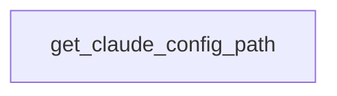

# Chapter 4: Runtime, Dependencies, and uv Packaging

Welcome to **Chapter 4: Runtime, Dependencies, and uv Packaging**. In this part of **Create Python Server Tutorial: Scaffold and Ship MCP Servers with uvx**, you will build an intuitive mental model first, then move into concrete implementation details and practical production tradeoffs.


This chapter focuses on dependency/runtime controls for reliable local and publish workflows.

## Learning Goals

- manage dependencies with `uv` conventions
- run generated servers in development and publish modes
- keep lockfiles and build artifacts reproducible
- avoid environment drift across contributors

## Packaging Flow

1. sync dependencies (`uv sync`)
2. build artifacts (`uv build`)
3. publish package (`uv publish`) with secure credential handling

## Source References

- [Create Python Server README](https://github.com/modelcontextprotocol/create-python-server/blob/main/README.md)
- [Template README - Building and Publishing](https://github.com/modelcontextprotocol/create-python-server/blob/main/src/create_mcp_server/template/README.md.jinja2#building-and-publishing)

## Summary

You now have a consistent runtime and packaging model for generated MCP servers.

Next: [Chapter 5: Local Integration: Claude Desktop and Inspector](05-local-integration-claude-desktop-and-inspector.md)

## Source Code Walkthrough

### `src/create_mcp_server/__init__.py`

The `get_claude_config_path` function in [`src/create_mcp_server/__init__.py`](https://github.com/modelcontextprotocol/create-python-server/blob/HEAD/src/create_mcp_server/__init__.py) handles a key part of this chapter's functionality:

```py


def get_claude_config_path() -> Path | None:
    """Get the Claude config directory based on platform"""
    if sys.platform == "win32":
        path = Path(Path.home(), "AppData", "Roaming", "Claude")
    elif sys.platform == "darwin":
        path = Path(Path.home(), "Library", "Application Support", "Claude")
    else:
        return None

    if path.exists():
        return path
    return None


def has_claude_app() -> bool:
    return get_claude_config_path() is not None


def update_claude_config(project_name: str, project_path: Path) -> bool:
    """Add the project to the Claude config if possible"""
    config_dir = get_claude_config_path()
    if not config_dir:
        return False

    config_file = config_dir / "claude_desktop_config.json"
    if not config_file.exists():
        return False

    try:
        config = json.loads(config_file.read_text())
```

This function is important because it defines how Create Python Server Tutorial: Scaffold and Ship MCP Servers with uvx implements the patterns covered in this chapter.


## How These Components Connect


