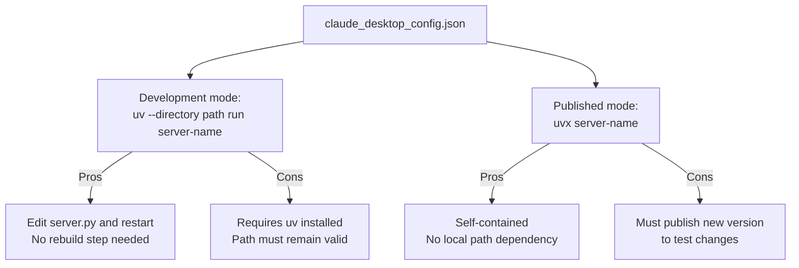
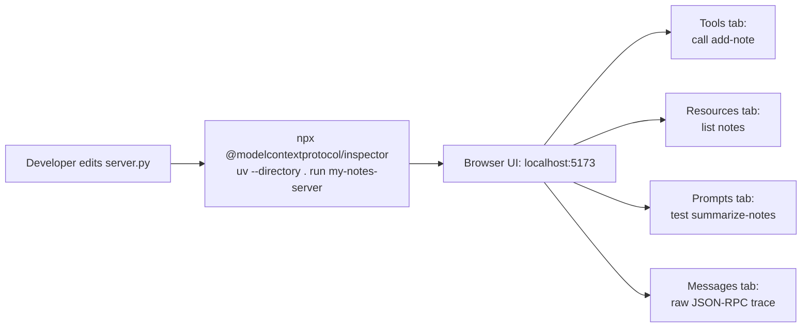
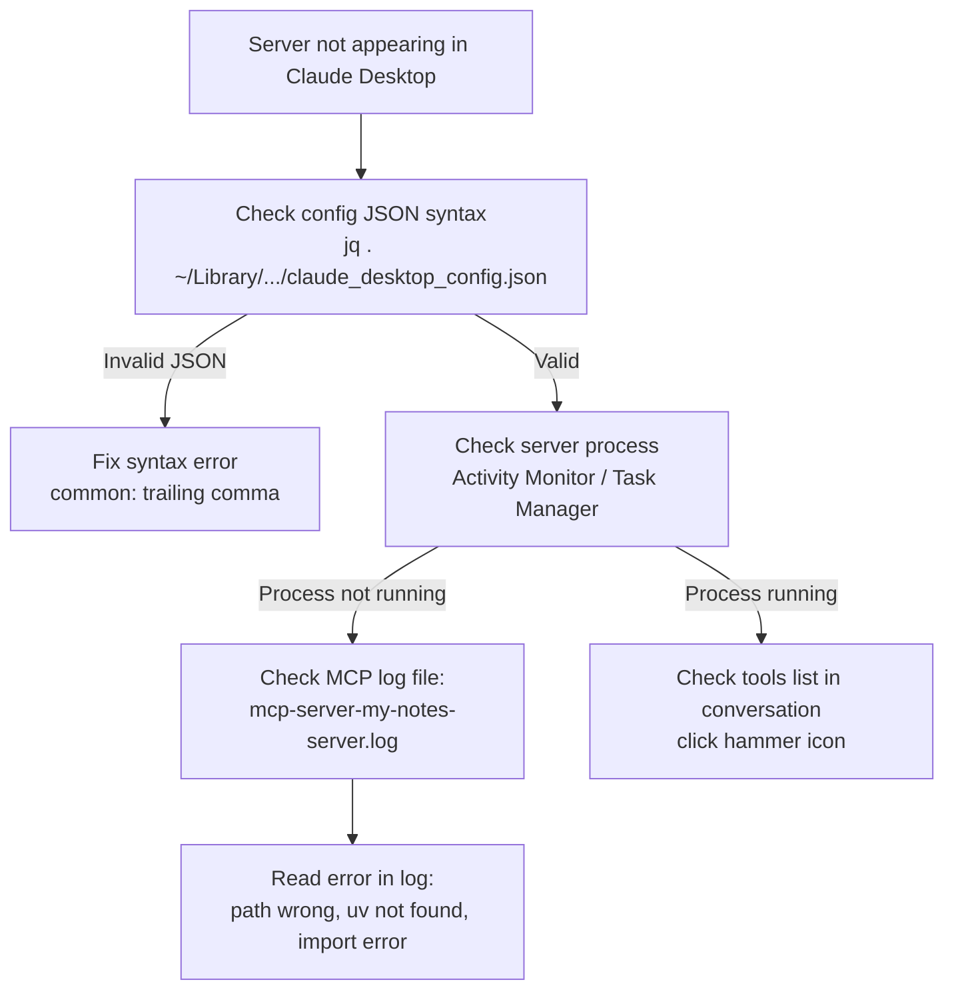

# Chapter 5: Local Integration: Claude Desktop and Inspector

This chapter explains how to wire a generated MCP server into Claude Desktop and how to use the MCP Inspector for iterative development validation. The generator can perform Claude Desktop registration automatically, but understanding the manual process is essential for troubleshooting.

## Learning Goals

- Configure a generated server for Claude Desktop in both development and published modes
- Use the MCP Inspector for stdio debugging and server validation
- Test development versus published server command paths
- Reduce time-to-diagnosis for integration failures

## Automatic Claude Desktop Registration

When the generator detects Claude Desktop is installed (by checking the config directory path), it automatically adds the server to `claude_desktop_config.json`:

```python
# From src/create_mcp_server/__init__.py
def get_claude_config_path() -> Path | None:
    if sys.platform == "win32":
        path = Path(Path.home(), "AppData", "Roaming", "Claude")
    elif sys.platform == "darwin":
        path = Path(Path.home(), "Library", "Application Support", "Claude")
    else:
        return None
    return path if path.exists() else None

def update_claude_config(project_name: str, project_path: Path) -> bool:
    config_dir = get_claude_config_path()
    if not config_dir:
        return False
    config_file = config_dir / "claude_desktop_config.json"
    if not config_file.exists():
        return False
    config = json.loads(config_file.read_text())
    config.setdefault("mcpServers", {})[project_name] = {
        "command": "uv",
        "args": ["--directory", str(project_path), "run", project_name],
    }
    config_file.write_text(json.dumps(config, indent=2))
    return True
```

The generator writes the **development mode** config (using `uv --directory`), not the published mode config.

## Claude Desktop Configuration



### Development Mode Config

```json
{
  "mcpServers": {
    "my-notes-server": {
      "command": "uv",
      "args": ["--directory", "/Users/you/projects/my-notes-server", "run", "my-notes-server"]
    }
  }
}
```

Use this during active development. Claude Desktop spawns `uv run my-notes-server` in the project directory — changes to `server.py` take effect on the next Claude Desktop restart.

### Published Mode Config

```json
{
  "mcpServers": {
    "my-notes-server": {
      "command": "uvx",
      "args": ["my-notes-server"]
    }
  }
}
```

Use this for stable deployed servers after publishing to PyPI. No local project directory required.

### Config File Locations

| Platform | Path |
|:---------|:-----|
| macOS | `~/Library/Application Support/Claude/claude_desktop_config.json` |
| Windows | `%APPDATA%\Claude\claude_desktop_config.json` |
| Linux | Not officially supported by Claude Desktop |

## MCP Inspector Integration

The Inspector is the primary development tool for iterating on server behavior without restarting Claude Desktop.



```bash
# Run with Inspector (development path)
npx @modelcontextprotocol/inspector uv --directory /path/to/my-notes-server run my-notes-server

# Run with Inspector (published path, after uvx install)
npx @modelcontextprotocol/inspector uvx my-notes-server
```

### Inspector Verification Checklist

After launching the Inspector, verify:

- [ ] **Tools tab**: `add-note` appears with `name` and `content` arguments
- [ ] **Resources tab**: empty list initially; after calling `add-note`, notes appear as `note://internal/<name>` URIs
- [ ] **Prompts tab**: `summarize-notes` appears with optional `style` argument
- [ ] **Messages tab**: `initialize` request shows correct server name and capabilities

### Testing the Full Primitive Lifecycle

```
1. Open Tools tab → Call "add-note" with name="test" content="hello world"
   Expected: TextContent response "Added note 'test' with content: hello world"

2. Open Resources tab → Click refresh (or observe automatic update notification)
   Expected: "note://internal/test" appears in the list

3. Click "note://internal/test" to read it
   Expected: "hello world" content

4. Open Prompts tab → Call "summarize-notes" with style="brief"
   Expected: UserMessage containing "- test: hello world"

5. Open Messages tab → Find the tools/call message pair
   Expected: Valid JSON-RPC request and response with correct IDs
```

## Troubleshooting Claude Desktop Integration



Log file locations:
- macOS: `~/Library/Logs/Claude/mcp-server-<name>.log`
- Windows: `%APPDATA%\Claude\logs\mcp-server-<name>.log`

Common failure patterns:

| Symptom | Cause | Fix |
|:--------|:------|:----|
| Server doesn't appear | Config JSON syntax error | Validate with `jq` |
| "uv not found" in log | uv not in PATH for GUI app | Use full path to uv in config |
| Import error in log | Missing `uv sync` | Run `uv sync` in project dir |
| Tools appear but calls fail | Unhandled exception in handler | Add try/except to `call_tool` |

## Source References

- [Template README — Claude Desktop Configuration](https://github.com/modelcontextprotocol/create-python-server/blob/main/src/create_mcp_server/template/README.md.jinja2)
- [Generator — Claude Config Update](https://github.com/modelcontextprotocol/create-python-server/blob/main/src/create_mcp_server/__init__.py)

## Summary

The generator auto-registers your server with Claude Desktop in development mode when possible. For manual configuration, choose the `uv --directory` pattern during development and `uvx` after publishing. Use the MCP Inspector as the primary iteration tool — it surfaces tool, resource, and prompt behavior interactively without restarting any host application. When Claude Desktop integration fails, check the config JSON syntax first, then the MCP log file.

Next: [Chapter 6: Customization and Extension Patterns](06-customization-and-extension-patterns.md)
