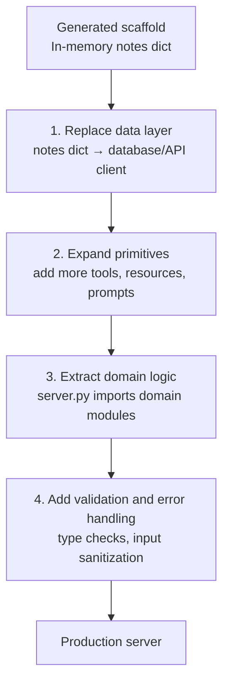
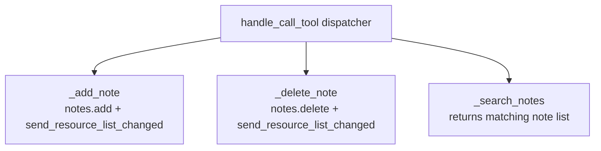
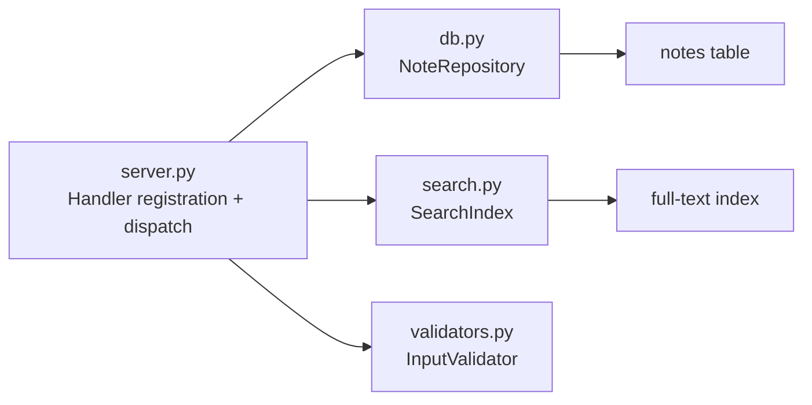

# Chapter 6: Customization and Extension Patterns

This chapter covers practical strategies for extending the generated scaffold into a production-grade, domain-specific MCP server — replacing the in-memory notes store, adding new tools and resources, and maintaining protocol contracts as complexity grows.

## Learning Goals

- Extend default primitive handlers with domain logic without breaking protocol contracts
- Preserve MCP semantics (tool error handling, resource URI conventions) during extension
- Keep handler boundaries thin and protocol-focused
- Avoid coupling business logic to scaffold assumptions

## Extension Strategy Overview



## Step 1: Replace the Data Layer

The `notes: dict[str, str]` state variable is the single seam to replace. Extract it into a repository abstraction:

```python
# Before (template)
notes: dict[str, str] = {}

@server.list_resources()
async def handle_list_resources() -> list[types.Resource]:
    return [types.Resource(uri=AnyUrl(f"note://internal/{name}"), ...) for name in notes]
```

```python
# After (database-backed)
from myserver.db import NoteRepository

repo = NoteRepository(connection_string=os.environ["DATABASE_URL"])

@server.list_resources()
async def handle_list_resources() -> list[types.Resource]:
    notes = await repo.list_all()
    return [
        types.Resource(
            uri=AnyUrl(f"note://internal/{note.id}"),
            name=f"Note: {note.title}",
            description=note.summary,
            mimeType="text/plain",
        )
        for note in notes
    ]
```

Keep the URI scheme consistent (`note://internal/`) so clients that have cached resource URIs continue to work.

## Step 2: Add New Tools

Extend `handle_list_tools` and `handle_call_tool` to support additional operations. Maintain the dispatch pattern:

```python
TOOLS = {
    "add-note": {
        "description": "Add a new note",
        "inputSchema": {
            "type": "object",
            "properties": {
                "name": {"type": "string"},
                "content": {"type": "string"},
            },
            "required": ["name", "content"],
        },
    },
    "delete-note": {
        "description": "Delete a note by name",
        "inputSchema": {
            "type": "object",
            "properties": {"name": {"type": "string"}},
            "required": ["name"],
        },
    },
    "search-notes": {
        "description": "Search notes by keyword",
        "inputSchema": {
            "type": "object",
            "properties": {
                "query": {"type": "string"},
                "limit": {"type": "integer", "default": 10},
            },
            "required": ["query"],
        },
    },
}

@server.list_tools()
async def handle_list_tools() -> list[types.Tool]:
    return [types.Tool(name=name, **spec) for name, spec in TOOLS.items()]

@server.call_tool()
async def handle_call_tool(name: str, arguments: dict | None) -> list[types.TextContent]:
    args = arguments or {}
    if name == "add-note":
        return await _add_note(args)
    elif name == "delete-note":
        return await _delete_note(args)
    elif name == "search-notes":
        return await _search_notes(args)
    else:
        raise ValueError(f"Unknown tool: {name}")
```



## Step 3: Error Handling Patterns

The template raises `ValueError` for unknown tools, which the MCP runtime converts to a protocol error response. For production, use structured error responses for known failure modes:

```python
async def _add_note(args: dict) -> list[types.TextContent]:
    name = args.get("name", "").strip()
    content = args.get("content", "").strip()

    if not name:
        return [types.TextContent(type="text", text="Error: note name cannot be empty")]
    if len(content) > 10_000:
        return [types.TextContent(type="text", text="Error: note content exceeds 10,000 character limit")]

    try:
        await repo.save(name, content)
        await server.request_context.session.send_resource_list_changed()
        return [types.TextContent(type="text", text=f"Added note '{name}'")]
    except DatabaseError as e:
        return [types.TextContent(type="text", text=f"Storage error: {e}")]
```

Key rule: **never raise exceptions from `call_tool`** for expected error conditions (validation failures, not-found cases). Return a `TextContent` with an error message so the LLM can communicate the failure to the user. Only raise for truly unexpected programming errors.

## Step 4: Module Structure for Complex Servers

As `server.py` grows, extract domain logic into sibling modules:

```
src/my_notes_server/
├── __init__.py         # Entry point — do not modify
├── server.py           # Handler registration — keep thin
├── db.py               # NoteRepository + database models
├── search.py           # Full-text search logic
├── validators.py       # Input validation helpers
└── notifications.py    # Resource change notification helpers
```



`server.py` should remain a thin dispatch layer. Business logic goes in the domain modules, making them independently testable without the MCP server running.

## Step 5: Environment Configuration

Use environment variables for all deployment-specific configuration:

```python
import os
from pathlib import Path

DATABASE_URL = os.environ.get("DATABASE_URL", "sqlite:///notes.db")
MAX_NOTES = int(os.environ.get("MAX_NOTES", "1000"))
LOG_LEVEL = os.environ.get("LOG_LEVEL", "WARNING")
```

Add these to the Claude Desktop config:
```json
{
  "mcpServers": {
    "my-notes-server": {
      "command": "uv",
      "args": ["--directory", "/path/to/server", "run", "my-notes-server"],
      "env": {
        "DATABASE_URL": "postgresql://localhost/notes",
        "LOG_LEVEL": "INFO"
      }
    }
  }
}
```

## Source References

- [Template Server Implementation](https://github.com/modelcontextprotocol/create-python-server/blob/main/src/create_mcp_server/template/server.py.jinja2)
- [MCP Python SDK](https://github.com/modelcontextprotocol/python-sdk)

## Summary

Extend the scaffold by replacing the `notes` dict with a real data layer, expanding the tool dispatch table, and extracting domain logic into testable modules. Keep `server.py` as a thin registration and dispatch layer. Return structured `TextContent` errors for expected failure conditions rather than raising exceptions. Use environment variables for deployment-specific configuration passed via the Claude Desktop config.

Next: [Chapter 7: Quality, Security, and Contribution Workflows](07-quality-security-and-contribution-workflows.md)
