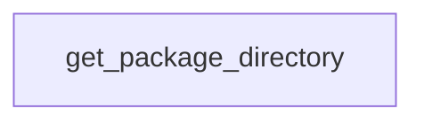

# Chapter 7: Quality, Security, and Contribution Workflows

Welcome to **Chapter 7: Quality, Security, and Contribution Workflows**. In this part of **Create Python Server Tutorial: Scaffold and Ship MCP Servers with uvx**, you will build an intuitive mental model first, then move into concrete implementation details and practical production tradeoffs.


This chapter outlines governance controls for scaffold-based MCP server projects.

## Learning Goals

- align contribution practices with repository standards
- incorporate security reporting and review practices
- define quality gates for generated and customized code
- standardize issue triage and pull request expectations

## Source References

- [Contributing Guide](https://github.com/modelcontextprotocol/create-python-server/blob/main/CONTRIBUTING.md)
- [Security Policy](https://github.com/modelcontextprotocol/create-python-server/blob/main/SECURITY.md)

## Summary

You now have a governance model for secure and maintainable scaffold-derived projects.

Next: [Chapter 8: Archived Status, Migration, and Long-Term Operations](08-archived-status-migration-and-long-term-operations.md)

## Depth Expansion Playbook

## Source Code Walkthrough

### `src/create_mcp_server/__init__.py`

The `get_package_directory` function in [`src/create_mcp_server/__init__.py`](https://github.com/modelcontextprotocol/create-python-server/blob/HEAD/src/create_mcp_server/__init__.py) handles a key part of this chapter's functionality:

```py


def get_package_directory(path: Path) -> Path:
    """Find the package directory under src/"""
    src_dir = next((path / "src").glob("*/__init__.py"), None)
    if src_dir is None:
        click.echo("❌ Error: Could not find __init__.py in src directory", err=True)
        sys.exit(1)
    return src_dir.parent


def copy_template(
    path: Path, name: str, description: str, version: str = "0.1.0"
) -> None:
    """Copy template files into src/<project_name>"""
    template_dir = Path(__file__).parent / "template"

    target_dir = get_package_directory(path)

    from jinja2 import Environment, FileSystemLoader

    env = Environment(loader=FileSystemLoader(str(template_dir)))

    files = [
        ("__init__.py.jinja2", "__init__.py", target_dir),
        ("server.py.jinja2", "server.py", target_dir),
        ("README.md.jinja2", "README.md", path),
    ]

    pyproject = PyProject(path / "pyproject.toml")
    bin_name = pyproject.first_binary

```

This function is important because it defines how Create Python Server Tutorial: Scaffold and Ship MCP Servers with uvx implements the patterns covered in this chapter.


## How These Components Connect


