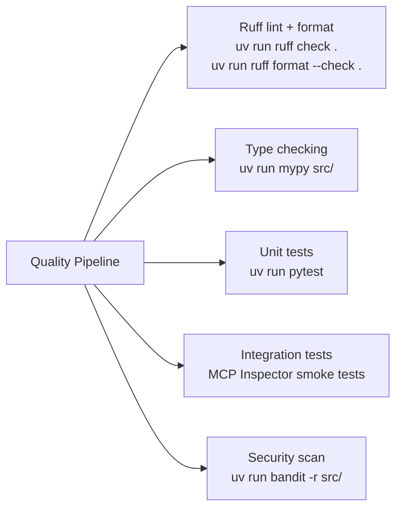
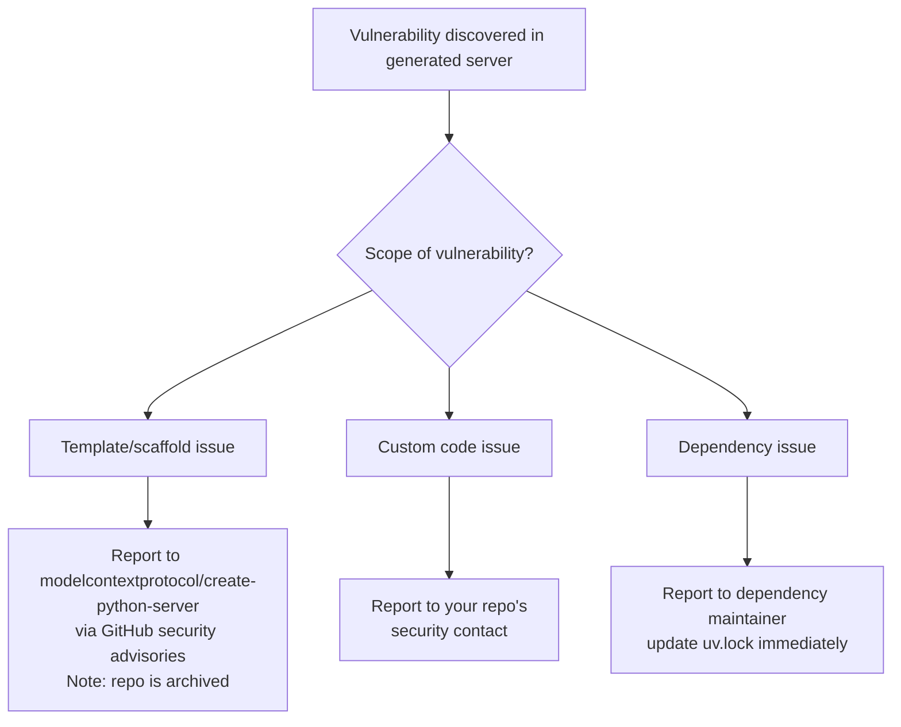

# Chapter 7: Quality, Security, and Contribution Workflows

This chapter outlines how to maintain quality and security in scaffold-derived MCP server projects, and how to contribute to the `create-python-server` tool itself (given its archived status).

## Learning Goals

- Align contribution practices with repository standards for scaffold-based projects
- Incorporate security reporting and review practices into generated server development
- Define quality gates for generated and customized code
- Standardize issue triage and pull request expectations

## Quality Gates for Generated Servers

Because generated servers start from a template, quality gates need to cover both the original scaffold and all customizations layered on top.



### Setting Up Testing

The generator does not scaffold test files — add them immediately after generation:

```bash
# Add test dependencies
uv add --dev pytest pytest-asyncio

# Create test structure
mkdir tests
touch tests/__init__.py
touch tests/test_server.py
```

```python
# tests/test_server.py
import pytest
import asyncio
from my_notes_server.server import handle_list_tools, handle_call_tool, notes

@pytest.mark.asyncio
async def test_list_tools_returns_add_note():
    tools = await handle_list_tools()
    assert any(t.name == "add-note" for t in tools)

@pytest.mark.asyncio
async def test_add_note_stores_and_returns():
    notes.clear()
    result = await handle_call_tool("add-note", {"name": "test", "content": "hello"})
    assert notes["test"] == "hello"
    assert "Added note 'test'" in result[0].text

@pytest.mark.asyncio
async def test_unknown_tool_raises():
    with pytest.raises(ValueError, match="Unknown tool"):
        await handle_call_tool("nonexistent-tool", {})
```

Note: testing handlers directly (without the MCP transport layer) requires carefully managing the global `notes` state between tests. Use `notes.clear()` in test setup or inject the state via a fixture.

### CI Configuration

The `create-python-server` repo itself uses GitHub Actions workflows for CI. For generated servers, a minimal CI config:

```yaml
# .github/workflows/ci.yml
name: CI
on: [push, pull_request]
jobs:
  test:
    runs-on: ubuntu-latest
    steps:
      - uses: actions/checkout@v4
      - uses: astral-sh/setup-uv@v3
      - run: uv sync --dev --all-extras
      - run: uv run ruff check .
      - run: uv run pytest
```

## Security Practices

### Input Validation

The template does minimal validation (`if not arguments: raise ValueError`). Production servers need explicit validation for all tool inputs:

```python
from typing import Any

def validate_note_name(name: Any) -> str:
    if not isinstance(name, str):
        raise TypeError("name must be a string")
    name = name.strip()
    if not name:
        raise ValueError("name cannot be empty")
    if len(name) > 255:
        raise ValueError("name exceeds 255 character limit")
    # Prevent path traversal in URI construction
    if "/" in name or ".." in name:
        raise ValueError("name contains invalid characters")
    return name
```

### Tool Side-Effect Disclosure

Every tool that modifies state, makes network calls, or reads sensitive data should document this in its `description` field — the LLM reads these descriptions to decide when to invoke tools:

```python
types.Tool(
    name="delete-all-notes",
    description="Permanently deletes ALL notes. This action cannot be undone.",
    ...
)
```

Clear side-effect descriptions allow LLM hosts with confirmation prompts to surface the right warnings to users.

### Secret Management

Never hardcode API keys or credentials in `server.py`. Use environment variables exclusively:

```python
import os

API_KEY = os.environ.get("MY_SERVICE_API_KEY")
if not API_KEY:
    raise RuntimeError("MY_SERVICE_API_KEY environment variable is required")
```

Log startup failures clearly so Claude Desktop's MCP log captures configuration errors.

## Security Reporting

The `create-python-server` repository includes a `SECURITY.md` that routes vulnerability reports through GitHub's private security advisory feature. For servers you build on the scaffold:

1. Create your own `SECURITY.md` with your reporting contact
2. Enable GitHub private security advisories in your repo settings
3. Do not disclose MCP server vulnerabilities in public issues



## Contributing to `create-python-server`

The repository is **archived** and does not accept new feature contributions. However:

- **Critical security vulnerabilities**: still reported via GitHub security advisories
- **Documentation corrections**: may be accepted as PRs at maintainer discretion
- **Forks**: teams who depend on the scaffold and need changes should fork and maintain internally

For the upstream `mcp` Python SDK (not archived), contributions follow the standard GitHub PR workflow in `modelcontextprotocol/python-sdk`.

## Code Style Conventions

Follow the conventions established in the source repo:

```bash
# Formatting (ruff is the recommended formatter)
uv run ruff format .

# Linting
uv run ruff check .

# Type annotations on all handler functions
@server.call_tool()
async def handle_call_tool(name: str, arguments: dict | None) -> list[types.TextContent]:
    ...
```

## Source References

- [Contributing Guide](https://github.com/modelcontextprotocol/create-python-server/blob/main/CONTRIBUTING.md)
- [Security Policy](https://github.com/modelcontextprotocol/create-python-server/blob/main/SECURITY.md)
- [GitHub Actions Workflows](https://github.com/modelcontextprotocol/create-python-server/tree/main/.github/workflows)

## Summary

Quality for scaffold-derived servers requires adding tests (the template ships none), setting up CI, and adding explicit input validation. Security practice centers on input validation, clear side-effect documentation in tool descriptions, and environment-variable-only secret management. The scaffold repo is archived so bug fixes and new features go to your internal fork; report security vulnerabilities via GitHub's private advisory feature regardless.

Next: [Chapter 8: Archived Status, Migration, and Long-Term Operations](08-archived-status-migration-and-long-term-operations.md)
