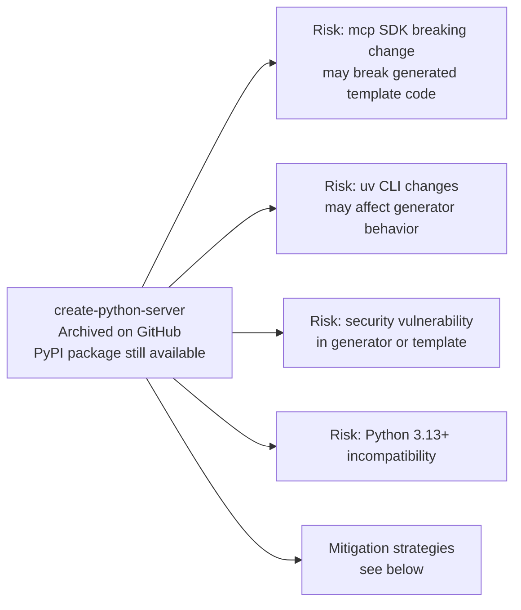
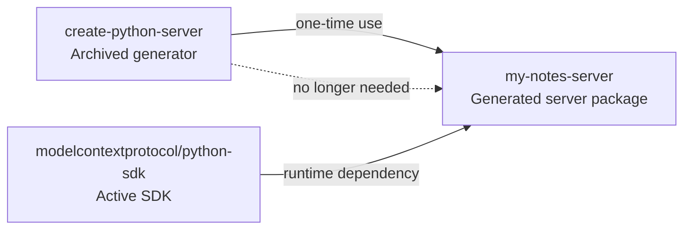
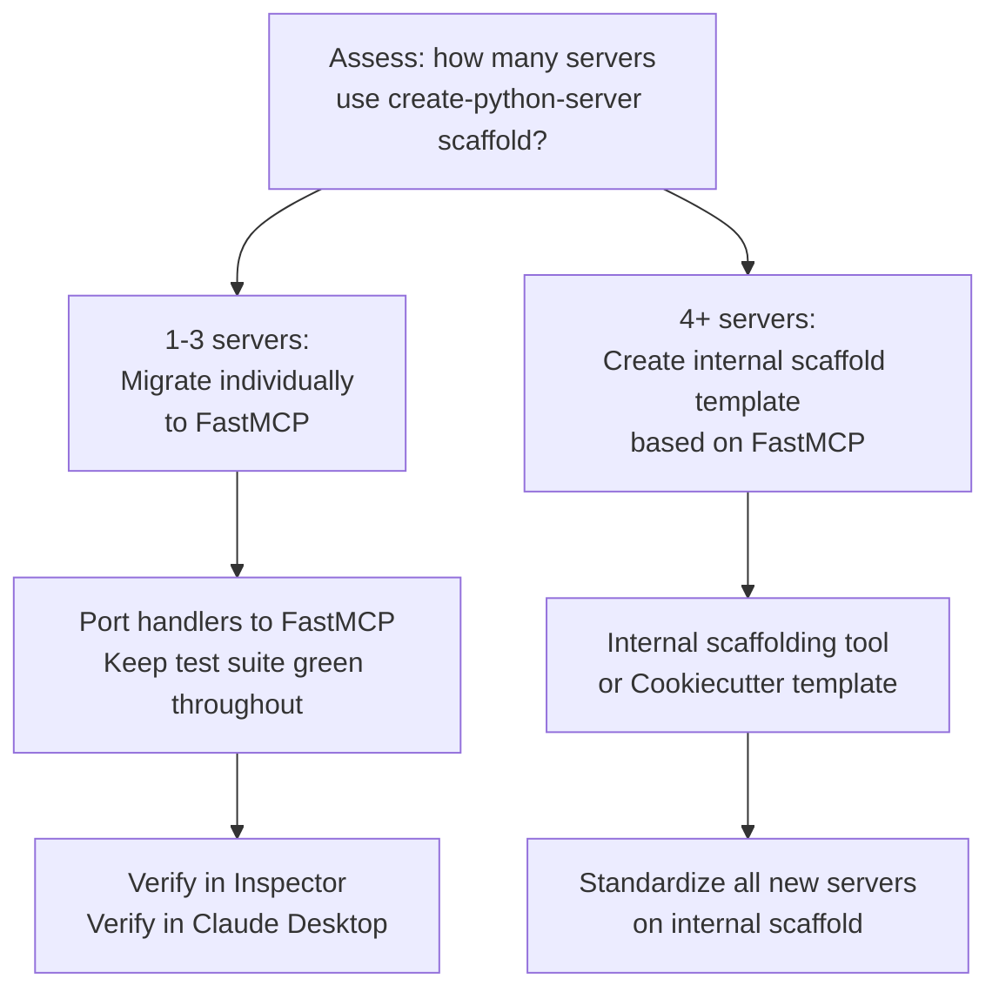

# Chapter 8: Archived Status, Migration, and Long-Term Operations

This chapter covers the long-term maintenance picture for teams relying on the `create-python-server` scaffold: what the archive status means operationally, how to sustain generated servers over time, and when and how to migrate to actively maintained scaffolding alternatives.

## Learning Goals

- Account for archived upstream status in risk planning and ownership models
- Define patch strategy for internal usage of archived tooling
- Plan migration toward actively maintained scaffolding paths
- Preserve compatibility and quality during transitions

## Understanding the Archive Status

`modelcontextprotocol/create-python-server` is archived: the repository is read-only, no new releases are published, and no pull requests are reviewed. The generator binary itself (`uvx create-mcp-server`) remains installable from PyPI for as long as the package is not yanked, but no functional updates will be made.



## Risk Assessment

| Risk | Likelihood | Impact | Mitigation |
|:-----|:-----------|:-------|:-----------|
| `mcp` SDK major version breaks generated code | Medium | High — servers stop running | Pin `mcp` version in `pyproject.toml` |
| Template uses deprecated `mcp` API | High over time | Medium — gradual deprecation warnings | Migrate to FastMCP API manually |
| Generator won't install due to dependency conflict | Low | Low — only affects new server generation | Fork generator or switch scaffolding tool |
| Security issue in template | Low | Medium | Patch generated code directly |

## What "Archived" Means for Running Servers

The archive status of the **generator** has minimal impact on already-generated servers:

- Generated servers are independent Python packages with their own `pyproject.toml`
- They depend on `mcp>=1.0.0` from the Python SDK (actively maintained)
- The generator's source code is no longer needed after the project is generated



The generated server's ongoing health depends on `modelcontextprotocol/python-sdk` (not archived), `uv` (not archived), and your own code quality.

## Long-Term Operating Model

### Pin the mcp SDK Version

In the short term, pin the `mcp` version to avoid unexpected breakage from minor updates:

```toml
# pyproject.toml — conservative pinning
dependencies = ["mcp>=1.2.0,<2.0.0"]
```

Upgrade the version constraint deliberately after reviewing the SDK changelog.

### Migrate to FastMCP API

The generated template uses the low-level `Server` API. The actively maintained Python SDK now encourages the `FastMCP` decorator pattern, which is more concise and receives more documentation attention:

```python
# Generated (low-level Server API)
server = Server("my-server")

@server.list_tools()
async def handle_list_tools() -> list[types.Tool]:
    return [types.Tool(name="add-note", ...)]

@server.call_tool()
async def handle_call_tool(name: str, arguments: dict | None) -> list[...]:
    ...
```

```python
# FastMCP API (recommended migration target)
from mcp.server.fastmcp import FastMCP

mcp = FastMCP("my-server")

@mcp.tool()
async def add_note(name: str, content: str) -> str:
    """Add a new note."""
    notes[name] = content
    return f"Added note '{name}'"
```

FastMCP advantages:
- Python type hints define input schema automatically (no manual JSON Schema)
- Docstring becomes tool description
- Fewer lines of boilerplate
- Aligns with current MCP Python SDK documentation

### Migration Checklist



### Migration Steps (Low-Level → FastMCP)

1. Add `from mcp.server.fastmcp import FastMCP` to `server.py`
2. Replace `Server("name")` with `mcp = FastMCP("name")`
3. Convert each `@server.list_tools()` + `@server.call_tool()` pair into `@mcp.tool()` functions
4. Convert `@server.list_resources()` + `@server.read_resource()` into `@mcp.resource()` functions
5. Convert `@server.list_prompts()` + `@server.get_prompt()` into `@mcp.prompt()` functions
6. Replace the `main()` async function with `mcp.run(transport="stdio")` (or remove and use `if __name__ == "__main__": mcp.run()`)
7. Update `__init__.py` if needed to match new entry point
8. Run the full test suite and verify with Inspector

## Alternative Scaffolding Options

If starting fresh today rather than migrating:

| Option | Approach | Notes |
|:-------|:---------|:------|
| `FastMCP` directly | `uv init` + `uv add mcp` + write `FastMCP` server | Most direct, minimal boilerplate |
| `mcp` CLI | `uvx create-mcp-server` (archived) | Still works, generates low-level API template |
| Cookiecutter | Community templates | Search PyPI for `cookiecutter-mcp` patterns |
| Internal scaffold | Fork of create-python-server with FastMCP template | For teams with many servers |

## Source References

- [Create Python Server Repository](https://github.com/modelcontextprotocol/create-python-server)
- [MCP Python SDK (Active)](https://github.com/modelcontextprotocol/python-sdk)
- [FastMCP Documentation](https://github.com/modelcontextprotocol/python-sdk/blob/main/README.md)

## Summary

The generator being archived does not threaten already-generated servers — those depend on the active Python SDK, not the generator. The primary operational risk is the low-level `Server` API drifting from the documentation and examples that increasingly target `FastMCP`. Migrate to `FastMCP` incrementally per server, verifying with the Inspector at each step. For new projects, start with `FastMCP` directly rather than going through the archived generator.

Return to the [Create Python Server Tutorial index](README.md).
