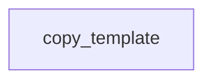

# Chapter 8: Archived Status, Migration, and Long-Term Operations

Welcome to **Chapter 8: Archived Status, Migration, and Long-Term Operations**. In this part of **Create Python Server Tutorial: Scaffold and Ship MCP Servers with uvx**, you will build an intuitive mental model first, then move into concrete implementation details and practical production tradeoffs.


This chapter covers long-term maintenance strategy for teams relying on archived scaffolding tooling.

## Learning Goals

- account for archived upstream status in risk planning
- define ownership and patch strategy for internal usage
- plan migration toward actively maintained scaffolding paths
- preserve compatibility and quality during transitions

## Migration Controls

| Control | Why It Matters |
|:--------|:---------------|
| internal ownership | ensures fixes can continue post-archive |
| fork readiness | supports urgent patching/security updates |
| compatibility tests | protects behavior through migration |
| phased rollout | lowers disruption for dependent teams |

## Source References

- [Create Python Server Repository](https://github.com/modelcontextprotocol/create-python-server)
- [Create Python Server README](https://github.com/modelcontextprotocol/create-python-server/blob/main/README.md)
- [MCP Python SDK](https://github.com/modelcontextprotocol/python-sdk)

## Summary

You now have a long-term operating model for scaffold-derived Python MCP services in archived-tool scenarios.

Return to the [Create Python Server Tutorial index](README.md).

## Depth Expansion Playbook

## Source Code Walkthrough

### `src/create_mcp_server/__init__.py`

The `copy_template` function in [`src/create_mcp_server/__init__.py`](https://github.com/modelcontextprotocol/create-python-server/blob/HEAD/src/create_mcp_server/__init__.py) handles a key part of this chapter's functionality:

```py


def copy_template(
    path: Path, name: str, description: str, version: str = "0.1.0"
) -> None:
    """Copy template files into src/<project_name>"""
    template_dir = Path(__file__).parent / "template"

    target_dir = get_package_directory(path)

    from jinja2 import Environment, FileSystemLoader

    env = Environment(loader=FileSystemLoader(str(template_dir)))

    files = [
        ("__init__.py.jinja2", "__init__.py", target_dir),
        ("server.py.jinja2", "server.py", target_dir),
        ("README.md.jinja2", "README.md", path),
    ]

    pyproject = PyProject(path / "pyproject.toml")
    bin_name = pyproject.first_binary

    template_vars = {
        "binary_name": bin_name,
        "server_name": name,
        "server_version": version,
        "server_description": description,
        "server_directory": str(path.resolve()),
    }

    try:
```

This function is important because it defines how Create Python Server Tutorial: Scaffold and Ship MCP Servers with uvx implements the patterns covered in this chapter.


## How These Components Connect


