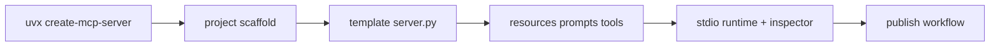

# Create Python Server Tutorial: Scaffold and Ship MCP Servers with uvx

> Learn how to use `modelcontextprotocol/create-python-server` to scaffold Python MCP servers with minimal setup, template-driven primitives, and publish-ready packaging workflows.

## Why This Track Matters

Teams adopting MCP with Python often lose time on project scaffolding and environment setup. `create-python-server` provides a minimal, repeatable bootstrap path with opinionated templates for resources, prompts, tools, and local runtime configuration.

This track focuses on:

- bootstrapping MCP Python server projects quickly with `uvx`
- understanding generated template architecture and defaults
- integrating local development with Claude Desktop and MCP Inspector
- managing archived-template risk and migration strategy

## Current Snapshot (Verified February 12, 2026)

- repository: [`modelcontextprotocol/create-python-server`](https://github.com/modelcontextprotocol/create-python-server)
- stars: about **476**
- repository status: **archived**
- latest release tag: [`v1.0.5`](https://github.com/modelcontextprotocol/create-python-server/tags) (tag commit)
- recent activity: updated on **February 4, 2026**
- package: `uvx create-mcp-server` (recommended) or `pip install create-mcp-server`
- license: MIT

## Mental Model

## Chapter Guide

| Chapter | Key Question | Outcome |
|:--------|:-------------|:--------|
| [01 - Getting Started and Scaffolding Workflow](01-getting-started-and-scaffolding-workflow.md) | How do I bootstrap an MCP Python server quickly? | Faster setup |
| [02 - Generated Project Structure and Conventions](02-generated-project-structure-and-conventions.md) | What files are generated and why? | Better code navigation |
| [03 - Template Server Architecture: Resources, Prompts, and Tools](03-template-server-architecture-resources-prompts-and-tools.md) | How do template handlers map to MCP primitives? | Stronger protocol understanding |
| [04 - Runtime, Dependencies, and uv Packaging](04-runtime-dependencies-and-uv-packaging.md) | How should dependencies and runtime execution be managed? | Reproducible builds |
| [05 - Local Integration: Claude Desktop and Inspector](05-local-integration-claude-desktop-and-inspector.md) | How do I wire generated servers into local MCP clients? | Faster validation |
| [06 - Customization and Extension Patterns](06-customization-and-extension-patterns.md) | How should teams evolve beyond template defaults safely? | Lower refactor risk |
| [07 - Quality, Security, and Contribution Workflows](07-quality-security-and-contribution-workflows.md) | How do I maintain safe, reviewable scaffold-based projects? | Better governance |
| [08 - Archived Status, Migration, and Long-Term Operations](08-archived-status-migration-and-long-term-operations.md) | How should teams handle long-term maintenance for archived scaffolding tools? | Durable operations |

## What You Will Learn

- how to bootstrap and run MCP Python servers with minimal friction
- how generated server templates implement core MCP primitives
- how to integrate local debugging and packaging workflows early
- how to plan migration and ownership when upstream tooling is archived

## Source References

- [Create Python Server README](https://github.com/modelcontextprotocol/create-python-server/blob/main/README.md)
- [Template README](https://github.com/modelcontextprotocol/create-python-server/blob/main/src/create_mcp_server/template/README.md.jinja2)
- [Template Server Implementation](https://github.com/modelcontextprotocol/create-python-server/blob/main/src/create_mcp_server/template/server.py.jinja2)
- [Contributing Guide](https://github.com/modelcontextprotocol/create-python-server/blob/main/CONTRIBUTING.md)
- [Security Policy](https://github.com/modelcontextprotocol/create-python-server/blob/main/SECURITY.md)

## Related Tutorials

- [MCP Python SDK Tutorial](../mcp-python-sdk-tutorial/)
- [MCP Quickstart Resources Tutorial](../mcp-quickstart-resources-tutorial/)
- [MCP Servers Tutorial](../mcp-servers-tutorial/)
- [MCP Inspector Tutorial](../mcp-inspector-tutorial/)

---

Start with [Chapter 1: Getting Started and Scaffolding Workflow](01-getting-started-and-scaffolding-workflow.md).
