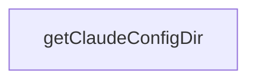

# Chapter 1: Getting Started and Scaffolding Flow

Welcome to **Chapter 1: Getting Started and Scaffolding Flow**. In this part of **Create TypeScript Server Tutorial: Scaffold MCP Servers with TypeScript Templates**, you will build an intuitive mental model first, then move into concrete implementation details and practical production tradeoffs.


This chapter covers first-run setup for new TypeScript MCP server projects.

## Learning Goals

- generate a project with `npx @modelcontextprotocol/create-server`
- understand scaffold command options and naming inputs
- run initial install/build cycle successfully
- establish reproducible onboarding instructions

## Quick Start

```bash
npx @modelcontextprotocol/create-server my-server
```

Then run `npm install`, `npm run build`, and optionally `npm run watch` for iterative development.

## Source References

- [Create TypeScript Server README](https://github.com/modelcontextprotocol/create-typescript-server/blob/main/README.md)

## Summary

You now have a reliable baseline for generating TypeScript MCP servers.

Next: [Chapter 2: Generated Structure and Build Pipeline](02-generated-structure-and-build-pipeline.md)

## Source Code Walkthrough

### `src/index.ts`

The `getClaudeConfigDir` function in [`src/index.ts`](https://github.com/modelcontextprotocol/create-typescript-server/blob/HEAD/src/index.ts) handles a key part of this chapter's functionality:

```ts

const __dirname = path.dirname(fileURLToPath(import.meta.url));
function getClaudeConfigDir(): string {
  switch (os.platform()) {
    case "darwin":
      return path.join(
        os.homedir(),
        "Library",
        "Application Support",
        "Claude",
      );
    case "win32":
      if (!process.env.APPDATA) {
        throw new Error("APPDATA environment variable is not set");
      }
      return path.join(process.env.APPDATA, "Claude");
    default:
      throw new Error(
        `Unsupported operating system for Claude configuration: ${os.platform()}`,
      );
  }
}

async function updateClaudeConfig(name: string, directory: string) {
  try {
    const configFile = path.join(
      getClaudeConfigDir(),
      "claude_desktop_config.json",
    );

    let config;
    try {
```

This function is important because it defines how Create TypeScript Server Tutorial: Scaffold MCP Servers with TypeScript Templates implements the patterns covered in this chapter.


## How These Components Connect


