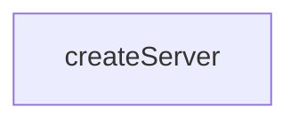

# Chapter 3: Template MCP Primitives: Resources, Tools, Prompts

Welcome to **Chapter 3: Template MCP Primitives: Resources, Tools, Prompts**. In this part of **Create TypeScript Server Tutorial: Scaffold MCP Servers with TypeScript Templates**, you will build an intuitive mental model first, then move into concrete implementation details and practical production tradeoffs.


This chapter examines generated primitive handlers and protocol mapping.

## Learning Goals

- inspect generated resource/tool/prompt examples
- understand handler signatures and data contracts
- extend primitive logic while preserving MCP semantics
- avoid schema drift during customization

## Source References

- [Template Server Source](https://github.com/modelcontextprotocol/create-typescript-server/blob/main/template/src/index.ts.ejs)
- [Template README](https://github.com/modelcontextprotocol/create-typescript-server/blob/main/template/README.md.ejs)

## Summary

You now have a primitive-level model for evolving generated TypeScript server code.

Next: [Chapter 4: Configuration, Metadata, and Packaging](04-configuration-metadata-and-packaging.md)

## Depth Expansion Playbook

## Source Code Walkthrough

### `src/index.ts`

The `createServer` function in [`src/index.ts`](https://github.com/modelcontextprotocol/create-typescript-server/blob/HEAD/src/index.ts) handles a key part of this chapter's functionality:

```ts
}

async function createServer(directory: string, options: any = {}) {
  // Check if directory already exists
  try {
    await fs.access(directory);
    console.log(chalk.red(`Error: Directory '${directory}' already exists.`));
    process.exit(1);
  } catch (err) {
    // Directory doesn't exist, we can proceed
  }

  const questions = [
    {
      type: "input",
      name: "name",
      message: "What is the name of your MCP server?",
      default: path.basename(directory),
      when: !options.name,
    },
    {
      type: "input",
      name: "description",
      message: "What is the description of your server?",
      default: "A Model Context Protocol server",
      when: !options.description,
    },
    {
      type: "confirm",
      name: "installForClaude",
      message: "Would you like to install this server for Claude.app?",
      default: true,
```

This function is important because it defines how Create TypeScript Server Tutorial: Scaffold MCP Servers with TypeScript Templates implements the patterns covered in this chapter.


## How These Components Connect


