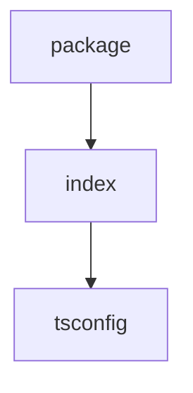

# Chapter 6: Debugging and Local Integration

Welcome to **Chapter 6: Debugging and Local Integration**. In this part of **Create TypeScript Server Tutorial: Scaffold MCP Servers with TypeScript Templates**, you will build an intuitive mental model first, then move into concrete implementation details and practical production tradeoffs.


This chapter explains debugging and local client integration patterns.

## Learning Goals

- use Inspector-oriented debugging loops with generated servers
- validate tool/resource/prompt behavior in local MCP clients
- instrument logging and error handling for faster diagnosis
- standardize local test steps for contributors

## Source References

- [Template README - Debugging](https://github.com/modelcontextprotocol/create-typescript-server/blob/main/template/README.md.ejs#debugging)
- [MCP Inspector](https://github.com/modelcontextprotocol/inspector)

## Summary

You now have a debugging and local-validation strategy for scaffolded TypeScript servers.

Next: [Chapter 7: Quality, Security, and Contribution Practices](07-quality-security-and-contribution-practices.md)

## Depth Expansion Playbook

## Source Code Walkthrough

### `package.json`

The `package` module in [`package.json`](https://github.com/modelcontextprotocol/create-typescript-server/blob/HEAD/package.json) handles a key part of this chapter's functionality:

```json
{
  "name": "@modelcontextprotocol/create-server",
  "version": "0.3.1",
  "description": "CLI tool to create new MCP servers",
  "license": "MIT",
  "author": "Anthropic, PBC (https://anthropic.com)",
  "homepage": "https://modelcontextprotocol.io",
  "bugs": "https://github.com/modelcontextprotocol/create-typescript-server/issues",
  "type": "module",
  "bin": {
    "create-mcp-server": "build/index.js"
  },
  "files": [
    "build",
    "template"
  ],
  "scripts": {
    "build": "tsc && shx chmod +x build/index.js",
    "prepare": "npm run build",
    "watch": "tsc --watch"
  },
  "dependencies": {
    "@modelcontextprotocol/sdk": "0.6.0",
    "chalk": "^5.3.0",
    "commander": "^12.0.0",
    "ejs": "^3.1.9",
    "inquirer": "^9.2.15",
    "ora": "^8.0.1"
  },
  "devDependencies": {
    "@types/ejs": "^3.1.5",
    "@types/inquirer": "^9.0.7",
    "@types/node": "^20.11.24",
    "shx": "^0.3.4",
    "typescript": "^5.3.3"
```

This module is important because it defines how Create TypeScript Server Tutorial: Scaffold MCP Servers with TypeScript Templates implements the patterns covered in this chapter.

### `src/index.ts`

The `index` module in [`src/index.ts`](https://github.com/modelcontextprotocol/create-typescript-server/blob/HEAD/src/index.ts) handles a key part of this chapter's functionality:

```ts
#!/usr/bin/env node
import chalk from "chalk";
import { Command } from "commander";
import ejs from "ejs";
import fs from "fs/promises";
import inquirer from "inquirer";
import ora from "ora";
import os from "os";
import path from "path";
import { fileURLToPath } from "url";

const __dirname = path.dirname(fileURLToPath(import.meta.url));
function getClaudeConfigDir(): string {
  switch (os.platform()) {
    case "darwin":
      return path.join(
        os.homedir(),
        "Library",
        "Application Support",
        "Claude",
      );
    case "win32":
      if (!process.env.APPDATA) {
        throw new Error("APPDATA environment variable is not set");
      }
      return path.join(process.env.APPDATA, "Claude");
    default:
      throw new Error(
        `Unsupported operating system for Claude configuration: ${os.platform()}`,
      );
  }
}

async function updateClaudeConfig(name: string, directory: string) {
  try {
```

This module is important because it defines how Create TypeScript Server Tutorial: Scaffold MCP Servers with TypeScript Templates implements the patterns covered in this chapter.

### `template/tsconfig.json`

The `tsconfig` module in [`template/tsconfig.json`](https://github.com/modelcontextprotocol/create-typescript-server/blob/HEAD/template/tsconfig.json) handles a key part of this chapter's functionality:

```json
{
  "compilerOptions": {
    "target": "ES2022",
    "module": "Node16",
    "moduleResolution": "Node16",
    "outDir": "./build",
    "rootDir": "./src",
    "strict": true,
    "esModuleInterop": true,
    "skipLibCheck": true,
    "forceConsistentCasingInFileNames": true
  },
  "include": ["src/**/*"],
  "exclude": ["node_modules"]
}

```

This module is important because it defines how Create TypeScript Server Tutorial: Scaffold MCP Servers with TypeScript Templates implements the patterns covered in this chapter.


## How These Components Connect


