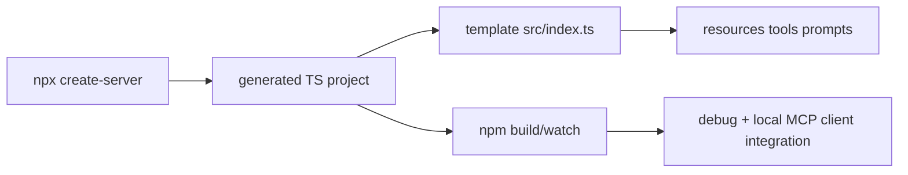

# Create TypeScript Server Tutorial: Scaffold MCP Servers with TypeScript Templates

> Learn how to use `modelcontextprotocol/create-typescript-server` to scaffold MCP server projects quickly, understand generated template structure, and operate build/debug workflows safely in archived-tooling environments.

## Why This Track Matters

TypeScript remains a common path for MCP server development. `create-typescript-server` provides a fast scaffold for new server projects with generated resources/tools/prompts examples and build wiring.

This track focuses on:

- bootstrapping MCP TypeScript server projects via `npx`
- understanding generated template conventions and extension points
- running build/watch/debug workflows productively
- managing archived-project risk for long-term maintenance

## Current Snapshot (auto-updated)

- repository: [`modelcontextprotocol/create-typescript-server`](https://github.com/modelcontextprotocol/create-typescript-server)
- stars: about **172**
- repository status: **archived**
- latest tag: [`0.3.1`](https://github.com/modelcontextprotocol/create-typescript-server/tags)
- recent activity: updated on **January 15, 2026**
- package baseline: `npx @modelcontextprotocol/create-server <project-name>`
- license: MIT

## Mental Model

## Chapter Guide

| Chapter | Key Question | Outcome |
|:--------|:-------------|:--------|
| [01 - Getting Started and Scaffolding Flow](01-getting-started-and-scaffolding-flow.md) | How do I create a new MCP TypeScript server quickly? | Faster setup |
| [02 - Generated Structure and Build Pipeline](02-generated-structure-and-build-pipeline.md) | What does the scaffold include and how does it build? | Better orientation |
| [03 - Template MCP Primitives: Resources, Tools, Prompts](03-template-mcp-primitives-resources-tools-prompts.md) | How are core MCP primitives modeled in generated code? | Stronger implementation baseline |
| [04 - Configuration, Metadata, and Packaging](04-configuration-metadata-and-packaging.md) | How should package metadata and TypeScript config be managed? | More reliable releases |
| [05 - Development Workflows: Build, Watch, and Link](05-development-workflows-build-watch-and-link.md) | How do teams iterate on generated projects efficiently? | Faster development loops |
| [06 - Debugging and Local Integration](06-debugging-and-local-integration.md) | How should generated servers be debugged and validated? | Better troubleshooting |
| [07 - Quality, Security, and Contribution Practices](07-quality-security-and-contribution-practices.md) | Which governance controls matter for scaffold-based projects? | Safer maintenance |
| [08 - Archived Status, Migration, and Long-Term Strategy](08-archived-status-migration-and-long-term-strategy.md) | How should teams plan around archived scaffolding tools? | Reduced long-term risk |

## What You Will Learn

- how to scaffold and run MCP TypeScript servers quickly and consistently
- how to extend generated primitive handlers without breaking protocol contracts
- how to operate build/debug loops with clear project boundaries
- how to create migration-ready plans for archived upstream tooling

## Source References

- [Create TypeScript Server README](https://github.com/modelcontextprotocol/create-typescript-server/blob/main/README.md)
- [Template README](https://github.com/modelcontextprotocol/create-typescript-server/blob/main/template/README.md.ejs)
- [Template Server Source](https://github.com/modelcontextprotocol/create-typescript-server/blob/main/template/src/index.ts.ejs)
- [Template Package Metadata](https://github.com/modelcontextprotocol/create-typescript-server/blob/main/template/package.json.ejs)
- [Contributing Guide](https://github.com/modelcontextprotocol/create-typescript-server/blob/main/CONTRIBUTING.md)
- [Security Policy](https://github.com/modelcontextprotocol/create-typescript-server/blob/main/SECURITY.md)

## Related Tutorials

- [MCP TypeScript SDK Tutorial](../mcp-typescript-sdk-tutorial/)
- [Create Python Server Tutorial](../create-python-server-tutorial/)
- [MCP Quickstart Resources Tutorial](../mcp-quickstart-resources-tutorial/)
- [MCP Servers Tutorial](../mcp-servers-tutorial/)

---

Start with [Chapter 1: Getting Started and Scaffolding Flow](01-getting-started-and-scaffolding-flow.md).

## Navigation & Backlinks

- [Start Here: Chapter 1: Getting Started and Scaffolding Flow](01-getting-started-and-scaffolding-flow.md)
- [Back to Main Catalog](../../README.md#-tutorial-catalog)
- [Browse A-Z Tutorial Directory](../../discoverability/tutorial-directory.md)
- [Search by Intent](../../discoverability/query-hub.md)
- [Explore Category Hubs](../../README.md#category-hubs)

## Full Chapter Map

1. [Chapter 1: Getting Started and Scaffolding Flow](01-getting-started-and-scaffolding-flow.md)
2. [Chapter 2: Generated Structure and Build Pipeline](02-generated-structure-and-build-pipeline.md)
3. [Chapter 3: Template MCP Primitives: Resources, Tools, Prompts](03-template-mcp-primitives-resources-tools-prompts.md)
4. [Chapter 4: Configuration, Metadata, and Packaging](04-configuration-metadata-and-packaging.md)
5. [Chapter 5: Development Workflows: Build, Watch, and Link](05-development-workflows-build-watch-and-link.md)
6. [Chapter 6: Debugging and Local Integration](06-debugging-and-local-integration.md)
7. [Chapter 7: Quality, Security, and Contribution Practices](07-quality-security-and-contribution-practices.md)
8. [Chapter 8: Archived Status, Migration, and Long-Term Strategy](08-archived-status-migration-and-long-term-strategy.md)

*Generated by [AI Codebase Knowledge Builder](https://github.com/The-Pocket/Tutorial-Codebase-Knowledge)*
