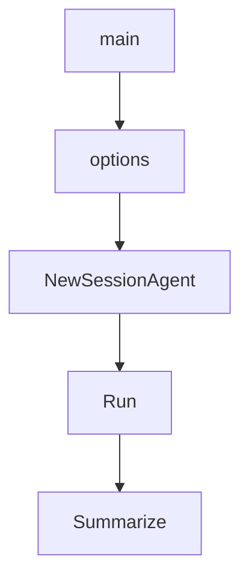

# Chapter 1: Getting Started

Welcome to **Chapter 1: Getting Started**. In this part of **Crush Tutorial: Multi-Model Terminal Coding Agent with Strong Extensibility**, you will build an intuitive mental model first, then move into concrete implementation details and practical production tradeoffs.


This chapter gets Crush installed and ready for real coding work in minutes.

## Learning Goals

- install Crush using your preferred platform path
- authenticate a provider and run first prompt
- validate session baseline in a local project
- fix common startup misconfigurations quickly

## Installation Paths

| Path | Command | Best For |
|:-----|:--------|:---------|
| Homebrew | `brew install charmbracelet/tap/crush` | macOS/Linux package-managed setup |
| NPM | `npm install -g @charmland/crush` | Node-centric environments |
| Winget | `winget install charmbracelet.crush` | Windows environments |
| Go install | `go install github.com/charmbracelet/crush@latest` | Go-native toolchain users |

## First Run Checklist

1. launch `crush`
2. configure provider credentials when prompted (or set env vars first)
3. open a project directory and ask for a scoped code task
4. verify tool calls and file operations behave as expected

## Quick Environment Baseline

```bash
export ANTHROPIC_API_KEY=...
# or OPENAI_API_KEY, OPENROUTER_API_KEY, etc.
crush
```

## Common Startup Issues

| Symptom | Cause | First Fix |
|:--------|:------|:----------|
| provider not available | missing env var | set provider key and restart Crush |
| unstable output quality | model mismatch for coding tasks | switch to coding-optimized model |
| unexpected filesystem actions | loose permissions/tool policy | set explicit permission controls in config |

## Source References

- [Crush README](https://github.com/charmbracelet/crush/blob/main/README.md#installation)
- [Getting Started section](https://github.com/charmbracelet/crush/blob/main/README.md#getting-started)

## Summary

You now have Crush installed and running with a valid provider path.

Next: [Chapter 2: Architecture and Session Model](02-architecture-and-session-model.md)

## Source Code Walkthrough

### `main.go`

The `main` function in [`main.go`](https://github.com/charmbracelet/crush/blob/HEAD/main.go) handles a key part of this chapter's functionality:

```go
// Package main is the entry point for the Crush CLI.
//
//	@title			Crush API
//	@version		1.0
//	@description	Crush is a terminal-based AI coding assistant. This API is served over a Unix socket (or Windows named pipe) and provides programmatic access to workspaces, sessions, agents, LSP, MCP, and more.
//	@contact.name	Charm
//	@contact.url	https://charm.sh
//	@license.name	MIT
//	@license.url	https://github.com/charmbracelet/crush/blob/main/LICENSE
//	@BasePath		/v1
package main

import (
	"log/slog"
	"net/http"
	_ "net/http/pprof"
	"os"

	"github.com/charmbracelet/crush/internal/cmd"
	_ "github.com/joho/godotenv/autoload"
)

func main() {
	if os.Getenv("CRUSH_PROFILE") != "" {
		go func() {
			slog.Info("Serving pprof at localhost:6060")
			if httpErr := http.ListenAndServe("localhost:6060", nil); httpErr != nil {
				slog.Error("Failed to pprof listen", "error", httpErr)
			}
		}()
```

This function is important because it defines how Crush Tutorial: Multi-Model Terminal Coding Agent with Strong Extensibility implements the patterns covered in this chapter.

### `schema.json`

The `options` interface in [`schema.json`](https://github.com/charmbracelet/crush/blob/HEAD/schema.json) handles a key part of this chapter's functionality:

```json
          "description": "Language Server Protocol configurations"
        },
        "options": {
          "$ref": "#/$defs/Options",
          "description": "General application options"
        },
        "permissions": {
          "$ref": "#/$defs/Permissions",
          "description": "Permission settings for tool usage"
        },
        "tools": {
          "$ref": "#/$defs/Tools",
          "description": "Tool configurations"
        }
      },
      "additionalProperties": false,
      "type": "object",
      "required": [
        "tools"
      ]
    },
    "LSPConfig": {
      "properties": {
        "disabled": {
          "type": "boolean",
          "description": "Whether this LSP server is disabled",
          "default": false
        },
        "command": {
          "type": "string",
          "description": "Command to execute for the LSP server",
          "examples": [
```

This interface is important because it defines how Crush Tutorial: Multi-Model Terminal Coding Agent with Strong Extensibility implements the patterns covered in this chapter.

### `internal/agent/agent.go`

The `NewSessionAgent` function in [`internal/agent/agent.go`](https://github.com/charmbracelet/crush/blob/HEAD/internal/agent/agent.go) handles a key part of this chapter's functionality:

```go
}

func NewSessionAgent(
	opts SessionAgentOptions,
) SessionAgent {
	return &sessionAgent{
		largeModel:           csync.NewValue(opts.LargeModel),
		smallModel:           csync.NewValue(opts.SmallModel),
		systemPromptPrefix:   csync.NewValue(opts.SystemPromptPrefix),
		systemPrompt:         csync.NewValue(opts.SystemPrompt),
		isSubAgent:           opts.IsSubAgent,
		sessions:             opts.Sessions,
		messages:             opts.Messages,
		disableAutoSummarize: opts.DisableAutoSummarize,
		tools:                csync.NewSliceFrom(opts.Tools),
		isYolo:               opts.IsYolo,
		notify:               opts.Notify,
		messageQueue:         csync.NewMap[string, []SessionAgentCall](),
		activeRequests:       csync.NewMap[string, context.CancelFunc](),
	}
}

func (a *sessionAgent) Run(ctx context.Context, call SessionAgentCall) (*fantasy.AgentResult, error) {
	if call.Prompt == "" && !message.ContainsTextAttachment(call.Attachments) {
		return nil, ErrEmptyPrompt
	}
	if call.SessionID == "" {
		return nil, ErrSessionMissing
	}

	// Queue the message if busy
	if a.IsSessionBusy(call.SessionID) {
```

This function is important because it defines how Crush Tutorial: Multi-Model Terminal Coding Agent with Strong Extensibility implements the patterns covered in this chapter.

### `internal/agent/agent.go`

The `Run` function in [`internal/agent/agent.go`](https://github.com/charmbracelet/crush/blob/HEAD/internal/agent/agent.go) handles a key part of this chapter's functionality:

```go

type SessionAgent interface {
	Run(context.Context, SessionAgentCall) (*fantasy.AgentResult, error)
	SetModels(large Model, small Model)
	SetTools(tools []fantasy.AgentTool)
	SetSystemPrompt(systemPrompt string)
	Cancel(sessionID string)
	CancelAll()
	IsSessionBusy(sessionID string) bool
	IsBusy() bool
	QueuedPrompts(sessionID string) int
	QueuedPromptsList(sessionID string) []string
	ClearQueue(sessionID string)
	Summarize(context.Context, string, fantasy.ProviderOptions) error
	Model() Model
}

type Model struct {
	Model      fantasy.LanguageModel
	CatwalkCfg catwalk.Model
	ModelCfg   config.SelectedModel
}

type sessionAgent struct {
	largeModel         *csync.Value[Model]
	smallModel         *csync.Value[Model]
	systemPromptPrefix *csync.Value[string]
	systemPrompt       *csync.Value[string]
	tools              *csync.Slice[fantasy.AgentTool]

	isSubAgent           bool
	sessions             session.Service
```

This function is important because it defines how Crush Tutorial: Multi-Model Terminal Coding Agent with Strong Extensibility implements the patterns covered in this chapter.


## How These Components Connect


