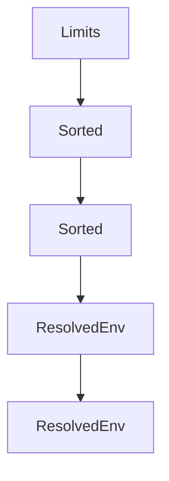

# Chapter 2: Architecture and Session Model

Welcome to **Chapter 2: Architecture and Session Model**. In this part of **Crush Tutorial: Multi-Model Terminal Coding Agent with Strong Extensibility**, you will build an intuitive mental model first, then move into concrete implementation details and practical production tradeoffs.


This chapter explains the core operating model behind Crush's terminal workflows.

## Learning Goals

- understand how Crush structures project and session context
- use session boundaries intentionally across tasks
- apply config precedence correctly for local vs global behavior
- avoid cross-project context leakage

## Core Runtime Concepts

| Concept | Description | Why It Matters |
|:--------|:------------|:---------------|
| session-based operation | multiple work sessions per project | isolate tasks and maintain history |
| project-local config | `.crush.json` or `crush.json` in repo | task- and repo-specific behavior |
| global config | `$HOME/.config/crush/crush.json` | personal defaults across projects |
| global data store | platform-specific data path | state persistence and diagnostics |

## Config Precedence

Crush applies configuration from highest to lowest priority:

1. `.crush.json`
2. `crush.json`
3. `$HOME/.config/crush/crush.json`

This lets teams enforce repo-level conventions while preserving personal defaults.

## Session Isolation Pattern

- keep each major task in a dedicated session
- prefer explicit project-local config for team repositories
- reset session when switching architecture contexts

## Source References

- [Crush README: Configuration](https://github.com/charmbracelet/crush/blob/main/README.md#configuration)
- [Crush README: Features](https://github.com/charmbracelet/crush/blob/main/README.md#features)

## Summary

You now understand how Crush organizes context and configuration across sessions and projects.

Next: [Chapter 3: Providers and Model Configuration](03-providers-and-model-configuration.md)

## Source Code Walkthrough

### `internal/config/config.go`

The `Limits` function in [`internal/config/config.go`](https://github.com/charmbracelet/crush/blob/HEAD/internal/config/config.go) handles a key part of this chapter's functionality:

```go
}

func (c Completions) Limits() (depth, items int) {
	return ptrValOr(c.MaxDepth, 0), ptrValOr(c.MaxItems, 0)
}

type Permissions struct {
	AllowedTools []string `json:"allowed_tools,omitempty" jsonschema:"description=List of tools that don't require permission prompts,example=bash,example=view"`
}

type TrailerStyle string

const (
	TrailerStyleNone         TrailerStyle = "none"
	TrailerStyleCoAuthoredBy TrailerStyle = "co-authored-by"
	TrailerStyleAssistedBy   TrailerStyle = "assisted-by"
)

type Attribution struct {
	TrailerStyle  TrailerStyle `json:"trailer_style,omitempty" jsonschema:"description=Style of attribution trailer to add to commits,enum=none,enum=co-authored-by,enum=assisted-by,default=assisted-by"`
	CoAuthoredBy  *bool        `json:"co_authored_by,omitempty" jsonschema:"description=Deprecated: use trailer_style instead"`
	GeneratedWith bool         `json:"generated_with,omitempty" jsonschema:"description=Add Generated with Crush line to commit messages and issues and PRs,default=true"`
}

// JSONSchemaExtend marks the co_authored_by field as deprecated in the schema.
func (Attribution) JSONSchemaExtend(schema *jsonschema.Schema) {
	if schema.Properties != nil {
		if prop, ok := schema.Properties.Get("co_authored_by"); ok {
			prop.Deprecated = true
		}
	}
}
```

This function is important because it defines how Crush Tutorial: Multi-Model Terminal Coding Agent with Strong Extensibility implements the patterns covered in this chapter.

### `internal/config/config.go`

The `Sorted` function in [`internal/config/config.go`](https://github.com/charmbracelet/crush/blob/HEAD/internal/config/config.go) handles a key part of this chapter's functionality:

```go
}

func (m MCPs) Sorted() []MCP {
	sorted := make([]MCP, 0, len(m))
	for k, v := range m {
		sorted = append(sorted, MCP{
			Name: k,
			MCP:  v,
		})
	}
	slices.SortFunc(sorted, func(a, b MCP) int {
		return strings.Compare(a.Name, b.Name)
	})
	return sorted
}

type LSPs map[string]LSPConfig

type LSP struct {
	Name string    `json:"name"`
	LSP  LSPConfig `json:"lsp"`
}

func (l LSPs) Sorted() []LSP {
	sorted := make([]LSP, 0, len(l))
	for k, v := range l {
		sorted = append(sorted, LSP{
			Name: k,
			LSP:  v,
		})
	}
	slices.SortFunc(sorted, func(a, b LSP) int {
```

This function is important because it defines how Crush Tutorial: Multi-Model Terminal Coding Agent with Strong Extensibility implements the patterns covered in this chapter.

### `internal/config/config.go`

The `Sorted` function in [`internal/config/config.go`](https://github.com/charmbracelet/crush/blob/HEAD/internal/config/config.go) handles a key part of this chapter's functionality:

```go
}

func (m MCPs) Sorted() []MCP {
	sorted := make([]MCP, 0, len(m))
	for k, v := range m {
		sorted = append(sorted, MCP{
			Name: k,
			MCP:  v,
		})
	}
	slices.SortFunc(sorted, func(a, b MCP) int {
		return strings.Compare(a.Name, b.Name)
	})
	return sorted
}

type LSPs map[string]LSPConfig

type LSP struct {
	Name string    `json:"name"`
	LSP  LSPConfig `json:"lsp"`
}

func (l LSPs) Sorted() []LSP {
	sorted := make([]LSP, 0, len(l))
	for k, v := range l {
		sorted = append(sorted, LSP{
			Name: k,
			LSP:  v,
		})
	}
	slices.SortFunc(sorted, func(a, b LSP) int {
```

This function is important because it defines how Crush Tutorial: Multi-Model Terminal Coding Agent with Strong Extensibility implements the patterns covered in this chapter.

### `internal/config/config.go`

The `ResolvedEnv` function in [`internal/config/config.go`](https://github.com/charmbracelet/crush/blob/HEAD/internal/config/config.go) handles a key part of this chapter's functionality:

```go
}

func (l LSPConfig) ResolvedEnv() []string {
	return resolveEnvs(l.Env)
}

func (m MCPConfig) ResolvedEnv() []string {
	return resolveEnvs(m.Env)
}

func (m MCPConfig) ResolvedHeaders() map[string]string {
	resolver := NewShellVariableResolver(env.New())
	for e, v := range m.Headers {
		var err error
		m.Headers[e], err = resolver.ResolveValue(v)
		if err != nil {
			slog.Error("Error resolving header variable", "error", err, "variable", e, "value", v)
			continue
		}
	}
	return m.Headers
}

type Agent struct {
	ID          string `json:"id,omitempty"`
	Name        string `json:"name,omitempty"`
	Description string `json:"description,omitempty"`
	// This is the id of the system prompt used by the agent
	Disabled bool `json:"disabled,omitempty"`

	Model SelectedModelType `json:"model" jsonschema:"required,description=The model type to use for this agent,enum=large,enum=small,default=large"`

```

This function is important because it defines how Crush Tutorial: Multi-Model Terminal Coding Agent with Strong Extensibility implements the patterns covered in this chapter.


## How These Components Connect


