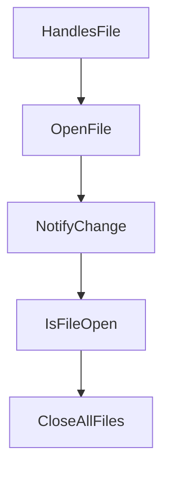

# Chapter 2: Architecture and Session Model

Welcome to **Chapter 2: Architecture and Session Model**. In this part of **Crush Tutorial: Multi-Model Terminal Coding Agent with Strong Extensibility**, you will build an intuitive mental model first, then move into concrete implementation details and practical production tradeoffs.


This chapter explains the core operating model behind Crush's terminal workflows.

## Learning Goals

- understand how Crush structures project and session context
- use session boundaries intentionally across tasks
- apply config precedence correctly for local vs global behavior
- avoid cross-project context leakage

## Core Runtime Concepts

| Concept | Description | Why It Matters |
|:--------|:------------|:---------------|
| session-based operation | multiple work sessions per project | isolate tasks and maintain history |
| project-local config | `.crush.json` or `crush.json` in repo | task- and repo-specific behavior |
| global config | `$HOME/.config/crush/crush.json` | personal defaults across projects |
| global data store | platform-specific data path | state persistence and diagnostics |

## Config Precedence

Crush applies configuration from highest to lowest priority:

1. `.crush.json`
2. `crush.json`
3. `$HOME/.config/crush/crush.json`

This lets teams enforce repo-level conventions while preserving personal defaults.

## Session Isolation Pattern

- keep each major task in a dedicated session
- prefer explicit project-local config for team repositories
- reset session when switching architecture contexts

## Source References

- [Crush README: Configuration](https://github.com/charmbracelet/crush/blob/main/README.md#configuration)
- [Crush README: Features](https://github.com/charmbracelet/crush/blob/main/README.md#features)

## Summary

You now understand how Crush organizes context and configuration across sessions and projects.

Next: [Chapter 3: Providers and Model Configuration](03-providers-and-model-configuration.md)

## Depth Expansion Playbook

## Source Code Walkthrough

### `internal/lsp/client.go`

The `HandlesFile` function in [`internal/lsp/client.go`](https://github.com/charmbracelet/crush/blob/HEAD/internal/lsp/client.go) handles a key part of this chapter's functionality:

```go
}

// HandlesFile checks if this LSP client handles the given file based on its
// extension and whether it's within the working directory.
func (c *Client) HandlesFile(path string) bool {
	if c == nil {
		return false
	}
	if !fsext.HasPrefix(path, c.cwd) {
		slog.Debug("File outside workspace", "name", c.name, "file", path, "workDir", c.cwd)
		return false
	}
	return handlesFiletype(c.name, c.fileTypes, path)
}

// OpenFile opens a file in the LSP server.
func (c *Client) OpenFile(ctx context.Context, filepath string) error {
	if !c.HandlesFile(filepath) {
		return nil
	}

	uri := string(protocol.URIFromPath(filepath))

	if _, exists := c.openFiles.Get(uri); exists {
		return nil // Already open
	}

	// Skip files that do not exist or cannot be read
	content, err := os.ReadFile(filepath)
	if err != nil {
		return fmt.Errorf("error reading file: %w", err)
	}
```

This function is important because it defines how Crush Tutorial: Multi-Model Terminal Coding Agent with Strong Extensibility implements the patterns covered in this chapter.

### `internal/lsp/client.go`

The `OpenFile` function in [`internal/lsp/client.go`](https://github.com/charmbracelet/crush/blob/HEAD/internal/lsp/client.go) handles a key part of this chapter's functionality:

```go

	// Files are currently opened by the LSP
	openFiles *csync.Map[string, *OpenFileInfo]

	// Server state
	serverState atomic.Value
}

// New creates a new LSP client using the powernap implementation.
func New(
	ctx context.Context,
	name string,
	cfg config.LSPConfig,
	resolver config.VariableResolver,
	cwd string,
	debug bool,
) (*Client, error) {
	client := &Client{
		name:        name,
		fileTypes:   cfg.FileTypes,
		diagnostics: csync.NewVersionedMap[protocol.DocumentURI, []protocol.Diagnostic](),
		openFiles:   csync.NewMap[string, *OpenFileInfo](),
		config:      cfg,
		ctx:         ctx,
		debug:       debug,
		resolver:    resolver,
		cwd:         cwd,
	}
	client.serverState.Store(StateStopped)

	if err := client.createPowernapClient(); err != nil {
		return nil, err
```

This function is important because it defines how Crush Tutorial: Multi-Model Terminal Coding Agent with Strong Extensibility implements the patterns covered in this chapter.

### `internal/lsp/client.go`

The `NotifyChange` function in [`internal/lsp/client.go`](https://github.com/charmbracelet/crush/blob/HEAD/internal/lsp/client.go) handles a key part of this chapter's functionality:

```go
}

// NotifyChange notifies the server about a file change.
func (c *Client) NotifyChange(ctx context.Context, filepath string) error {
	if c == nil {
		return nil
	}
	uri := string(protocol.URIFromPath(filepath))

	content, err := os.ReadFile(filepath)
	if err != nil {
		return fmt.Errorf("error reading file: %w", err)
	}

	fileInfo, isOpen := c.openFiles.Get(uri)
	if !isOpen {
		return fmt.Errorf("cannot notify change for unopened file: %s", filepath)
	}

	// Increment version
	fileInfo.Version++

	// Create change event
	changes := []protocol.TextDocumentContentChangeEvent{
		{
			Value: protocol.TextDocumentContentChangeWholeDocument{
				Text: string(content),
			},
		},
	}

	return c.client.NotifyDidChangeTextDocument(ctx, uri, int(fileInfo.Version), changes)
```

This function is important because it defines how Crush Tutorial: Multi-Model Terminal Coding Agent with Strong Extensibility implements the patterns covered in this chapter.

### `internal/lsp/client.go`

The `IsFileOpen` function in [`internal/lsp/client.go`](https://github.com/charmbracelet/crush/blob/HEAD/internal/lsp/client.go) handles a key part of this chapter's functionality:

```go
}

// IsFileOpen checks if a file is currently open.
func (c *Client) IsFileOpen(filepath string) bool {
	uri := string(protocol.URIFromPath(filepath))
	_, exists := c.openFiles.Get(uri)
	return exists
}

// CloseAllFiles closes all currently open files.
func (c *Client) CloseAllFiles(ctx context.Context) {
	for uri := range c.openFiles.Seq2() {
		if c.debug {
			slog.Debug("Closing file", "file", uri)
		}
		if err := c.client.NotifyDidCloseTextDocument(ctx, uri); err != nil {
			slog.Warn("Error closing file", "uri", uri, "error", err)
			continue
		}
		c.openFiles.Del(uri)
	}
}

// GetFileDiagnostics returns diagnostics for a specific file.
func (c *Client) GetFileDiagnostics(uri protocol.DocumentURI) []protocol.Diagnostic {
	diags, _ := c.diagnostics.Get(uri)
	return diags
}

// GetDiagnostics returns all diagnostics for all files.
func (c *Client) GetDiagnostics() map[protocol.DocumentURI][]protocol.Diagnostic {
	if c == nil {
```

This function is important because it defines how Crush Tutorial: Multi-Model Terminal Coding Agent with Strong Extensibility implements the patterns covered in this chapter.


## How These Components Connect


