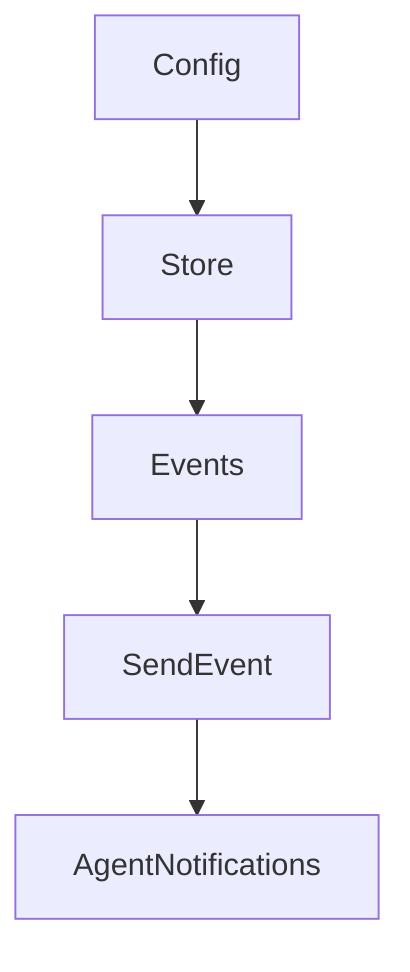

# Chapter 3: Providers and Model Configuration

Welcome to **Chapter 3: Providers and Model Configuration**. In this part of **Crush Tutorial: Multi-Model Terminal Coding Agent with Strong Extensibility**, you will build an intuitive mental model first, then move into concrete implementation details and practical production tradeoffs.


This chapter covers provider setup, model routing, and custom provider definitions.

## Learning Goals

- configure supported providers via environment variables
- define custom OpenAI-compatible and Anthropic-compatible providers
- tune model metadata for stable coding behavior
- avoid provider drift across team environments

## Provider Baseline

Crush supports many providers directly via environment variables, including:

- Anthropic
- OpenAI
- Vercel AI Gateway
- Gemini
- OpenRouter
- Groq
- Vertex AI
- Amazon Bedrock

## Custom Provider Pattern

For non-default endpoints, define provider objects in config using:

- `type: openai-compat` for OpenAI-compatible APIs
- `type: anthropic` for Anthropic-compatible APIs

Include model metadata such as context window and token defaults when available.

## Routing Stability Tips

| Risk | Mitigation |
|:-----|:-----------|
| inconsistent responses between machines | share a team config baseline |
| accidental provider fallback | pin active provider/model explicitly |
| cost surprises | capture token economics in model metadata |

## Source References

- [Crush README: Getting Started](https://github.com/charmbracelet/crush/blob/main/README.md#getting-started)
- [Crush README: Custom Providers](https://github.com/charmbracelet/crush/blob/main/README.md#custom-providers)
- [Crush schema](https://github.com/charmbracelet/crush/blob/main/schema.json)

## Summary

You now have a predictable strategy for provider selection and model routing in Crush.

Next: [Chapter 4: Permissions and Tool Controls](04-permissions-and-tool-controls.md)

## Source Code Walkthrough

### `internal/app/app.go`

The `Config` function in [`internal/app/app.go`](https://github.com/charmbracelet/crush/blob/HEAD/internal/app/app.go) handles a key part of this chapter's functionality:

```go
	LSPManager *lsp.Manager

	config *config.ConfigStore

	serviceEventsWG *sync.WaitGroup
	eventsCtx       context.Context
	events          chan tea.Msg
	tuiWG           *sync.WaitGroup

	// global context and cleanup functions
	globalCtx          context.Context
	cleanupFuncs       []func(context.Context) error
	agentNotifications *pubsub.Broker[notify.Notification]
}

// New initializes a new application instance.
func New(ctx context.Context, conn *sql.DB, store *config.ConfigStore) (*App, error) {
	q := db.New(conn)
	sessions := session.NewService(q, conn)
	messages := message.NewService(q)
	files := history.NewService(q, conn)
	cfg := store.Config()
	skipPermissionsRequests := store.Overrides().SkipPermissionRequests
	var allowedTools []string
	if cfg.Permissions != nil && cfg.Permissions.AllowedTools != nil {
		allowedTools = cfg.Permissions.AllowedTools
	}

	app := &App{
		Sessions:    sessions,
		Messages:    messages,
		History:     files,
```

This function is important because it defines how Crush Tutorial: Multi-Model Terminal Coding Agent with Strong Extensibility implements the patterns covered in this chapter.

### `internal/app/app.go`

The `Store` function in [`internal/app/app.go`](https://github.com/charmbracelet/crush/blob/HEAD/internal/app/app.go) handles a key part of this chapter's functionality:

```go
	LSPManager *lsp.Manager

	config *config.ConfigStore

	serviceEventsWG *sync.WaitGroup
	eventsCtx       context.Context
	events          chan tea.Msg
	tuiWG           *sync.WaitGroup

	// global context and cleanup functions
	globalCtx          context.Context
	cleanupFuncs       []func(context.Context) error
	agentNotifications *pubsub.Broker[notify.Notification]
}

// New initializes a new application instance.
func New(ctx context.Context, conn *sql.DB, store *config.ConfigStore) (*App, error) {
	q := db.New(conn)
	sessions := session.NewService(q, conn)
	messages := message.NewService(q)
	files := history.NewService(q, conn)
	cfg := store.Config()
	skipPermissionsRequests := store.Overrides().SkipPermissionRequests
	var allowedTools []string
	if cfg.Permissions != nil && cfg.Permissions.AllowedTools != nil {
		allowedTools = cfg.Permissions.AllowedTools
	}

	app := &App{
		Sessions:    sessions,
		Messages:    messages,
		History:     files,
```

This function is important because it defines how Crush Tutorial: Multi-Model Terminal Coding Agent with Strong Extensibility implements the patterns covered in this chapter.

### `internal/app/app.go`

The `Events` function in [`internal/app/app.go`](https://github.com/charmbracelet/crush/blob/HEAD/internal/app/app.go) handles a key part of this chapter's functionality:

```go
	config *config.ConfigStore

	serviceEventsWG *sync.WaitGroup
	eventsCtx       context.Context
	events          chan tea.Msg
	tuiWG           *sync.WaitGroup

	// global context and cleanup functions
	globalCtx          context.Context
	cleanupFuncs       []func(context.Context) error
	agentNotifications *pubsub.Broker[notify.Notification]
}

// New initializes a new application instance.
func New(ctx context.Context, conn *sql.DB, store *config.ConfigStore) (*App, error) {
	q := db.New(conn)
	sessions := session.NewService(q, conn)
	messages := message.NewService(q)
	files := history.NewService(q, conn)
	cfg := store.Config()
	skipPermissionsRequests := store.Overrides().SkipPermissionRequests
	var allowedTools []string
	if cfg.Permissions != nil && cfg.Permissions.AllowedTools != nil {
		allowedTools = cfg.Permissions.AllowedTools
	}

	app := &App{
		Sessions:    sessions,
		Messages:    messages,
		History:     files,
		Permissions: permission.NewPermissionService(store.WorkingDir(), skipPermissionsRequests, allowedTools),
		FileTracker: filetracker.NewService(q),
```

This function is important because it defines how Crush Tutorial: Multi-Model Terminal Coding Agent with Strong Extensibility implements the patterns covered in this chapter.

### `internal/app/app.go`

The `SendEvent` function in [`internal/app/app.go`](https://github.com/charmbracelet/crush/blob/HEAD/internal/app/app.go) handles a key part of this chapter's functionality:

```go
}

// SendEvent pushes a message into the application's events channel.
// It is non-blocking; the message is dropped if the channel is full.
func (app *App) SendEvent(msg tea.Msg) {
	select {
	case app.events <- msg:
	default:
	}
}

// AgentNotifications returns the broker for agent notification events.
func (app *App) AgentNotifications() *pubsub.Broker[notify.Notification] {
	return app.agentNotifications
}

// resolveSession resolves which session to use for a non-interactive run
// If continueSessionID is set, it looks up that session by ID
// If useLast is set, it returns the most recently updated top-level session
// Otherwise, it creates a new session
func (app *App) resolveSession(ctx context.Context, continueSessionID string, useLast bool) (session.Session, error) {
	switch {
	case continueSessionID != "":
		if app.Sessions.IsAgentToolSession(continueSessionID) {
			return session.Session{}, fmt.Errorf("cannot continue an agent tool session: %s", continueSessionID)
		}
		sess, err := app.Sessions.Get(ctx, continueSessionID)
		if err != nil {
			return session.Session{}, fmt.Errorf("session not found: %s", continueSessionID)
		}
		if sess.ParentSessionID != "" {
			return session.Session{}, fmt.Errorf("cannot continue a child session: %s", continueSessionID)
```

This function is important because it defines how Crush Tutorial: Multi-Model Terminal Coding Agent with Strong Extensibility implements the patterns covered in this chapter.


## How These Components Connect


