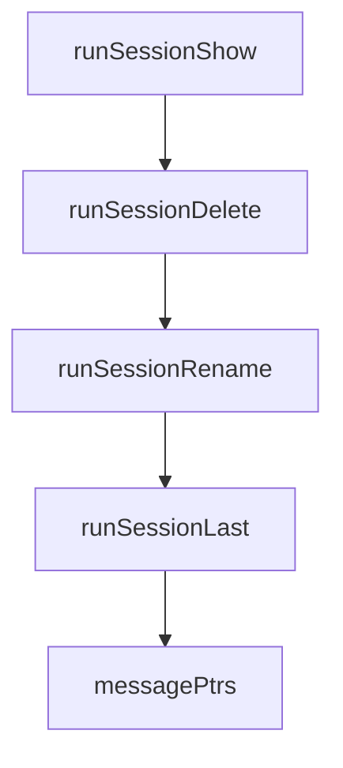

# Chapter 3: Providers and Model Configuration

Welcome to **Chapter 3: Providers and Model Configuration**. In this part of **Crush Tutorial: Multi-Model Terminal Coding Agent with Strong Extensibility**, you will build an intuitive mental model first, then move into concrete implementation details and practical production tradeoffs.


This chapter covers provider setup, model routing, and custom provider definitions.

## Learning Goals

- configure supported providers via environment variables
- define custom OpenAI-compatible and Anthropic-compatible providers
- tune model metadata for stable coding behavior
- avoid provider drift across team environments

## Provider Baseline

Crush supports many providers directly via environment variables, including:

- Anthropic
- OpenAI
- Vercel AI Gateway
- Gemini
- OpenRouter
- Groq
- Vertex AI
- Amazon Bedrock

## Custom Provider Pattern

For non-default endpoints, define provider objects in config using:

- `type: openai-compat` for OpenAI-compatible APIs
- `type: anthropic` for Anthropic-compatible APIs

Include model metadata such as context window and token defaults when available.

## Routing Stability Tips

| Risk | Mitigation |
|:-----|:-----------|
| inconsistent responses between machines | share a team config baseline |
| accidental provider fallback | pin active provider/model explicitly |
| cost surprises | capture token economics in model metadata |

## Source References

- [Crush README: Getting Started](https://github.com/charmbracelet/crush/blob/main/README.md#getting-started)
- [Crush README: Custom Providers](https://github.com/charmbracelet/crush/blob/main/README.md#custom-providers)
- [Crush schema](https://github.com/charmbracelet/crush/blob/main/schema.json)

## Summary

You now have a predictable strategy for provider selection and model routing in Crush.

Next: [Chapter 4: Permissions and Tool Controls](04-permissions-and-tool-controls.md)

## Depth Expansion Playbook

## Source Code Walkthrough

### `internal/cmd/session.go`

The `runSessionShow` function in [`internal/cmd/session.go`](https://github.com/charmbracelet/crush/blob/HEAD/internal/cmd/session.go) handles a key part of this chapter's functionality:

```go
	Long:  "Show session details. Use --json for machine-readable output. ID can be a UUID, full hash, or hash prefix.",
	Args:  cobra.ExactArgs(1),
	RunE:  runSessionShow,
}

var sessionLastCmd = &cobra.Command{
	Use:   "last",
	Short: "Show most recent session",
	Long:  "Show the last updated session. Use --json for machine-readable output.",
	RunE:  runSessionLast,
}

var sessionDeleteCmd = &cobra.Command{
	Use:     "delete <id>",
	Aliases: []string{"rm"},
	Short:   "Delete a session",
	Long:    "Delete a session by ID. Use --json for machine-readable output. ID can be a UUID, full hash, or hash prefix.",
	Args:    cobra.ExactArgs(1),
	RunE:    runSessionDelete,
}

var sessionRenameCmd = &cobra.Command{
	Use:   "rename <id> <title>",
	Short: "Rename a session",
	Long:  "Rename a session by ID. Use --json for machine-readable output. ID can be a UUID, full hash, or hash prefix.",
	Args:  cobra.MinimumNArgs(2),
	RunE:  runSessionRename,
}

func init() {
	sessionListCmd.Flags().BoolVar(&sessionListJSON, "json", false, "output in JSON format")
	sessionShowCmd.Flags().BoolVar(&sessionShowJSON, "json", false, "output in JSON format")
```

This function is important because it defines how Crush Tutorial: Multi-Model Terminal Coding Agent with Strong Extensibility implements the patterns covered in this chapter.

### `internal/cmd/session.go`

The `runSessionDelete` function in [`internal/cmd/session.go`](https://github.com/charmbracelet/crush/blob/HEAD/internal/cmd/session.go) handles a key part of this chapter's functionality:

```go
	Long:    "Delete a session by ID. Use --json for machine-readable output. ID can be a UUID, full hash, or hash prefix.",
	Args:    cobra.ExactArgs(1),
	RunE:    runSessionDelete,
}

var sessionRenameCmd = &cobra.Command{
	Use:   "rename <id> <title>",
	Short: "Rename a session",
	Long:  "Rename a session by ID. Use --json for machine-readable output. ID can be a UUID, full hash, or hash prefix.",
	Args:  cobra.MinimumNArgs(2),
	RunE:  runSessionRename,
}

func init() {
	sessionListCmd.Flags().BoolVar(&sessionListJSON, "json", false, "output in JSON format")
	sessionShowCmd.Flags().BoolVar(&sessionShowJSON, "json", false, "output in JSON format")
	sessionLastCmd.Flags().BoolVar(&sessionLastJSON, "json", false, "output in JSON format")
	sessionDeleteCmd.Flags().BoolVar(&sessionDeleteJSON, "json", false, "output in JSON format")
	sessionRenameCmd.Flags().BoolVar(&sessionRenameJSON, "json", false, "output in JSON format")
	sessionCmd.AddCommand(sessionListCmd)
	sessionCmd.AddCommand(sessionShowCmd)
	sessionCmd.AddCommand(sessionLastCmd)
	sessionCmd.AddCommand(sessionDeleteCmd)
	sessionCmd.AddCommand(sessionRenameCmd)
}

type sessionServices struct {
	sessions session.Service
	messages message.Service
}

func sessionSetup(cmd *cobra.Command) (context.Context, *sessionServices, func(), error) {
```

This function is important because it defines how Crush Tutorial: Multi-Model Terminal Coding Agent with Strong Extensibility implements the patterns covered in this chapter.

### `internal/cmd/session.go`

The `runSessionRename` function in [`internal/cmd/session.go`](https://github.com/charmbracelet/crush/blob/HEAD/internal/cmd/session.go) handles a key part of this chapter's functionality:

```go
	Long:  "Rename a session by ID. Use --json for machine-readable output. ID can be a UUID, full hash, or hash prefix.",
	Args:  cobra.MinimumNArgs(2),
	RunE:  runSessionRename,
}

func init() {
	sessionListCmd.Flags().BoolVar(&sessionListJSON, "json", false, "output in JSON format")
	sessionShowCmd.Flags().BoolVar(&sessionShowJSON, "json", false, "output in JSON format")
	sessionLastCmd.Flags().BoolVar(&sessionLastJSON, "json", false, "output in JSON format")
	sessionDeleteCmd.Flags().BoolVar(&sessionDeleteJSON, "json", false, "output in JSON format")
	sessionRenameCmd.Flags().BoolVar(&sessionRenameJSON, "json", false, "output in JSON format")
	sessionCmd.AddCommand(sessionListCmd)
	sessionCmd.AddCommand(sessionShowCmd)
	sessionCmd.AddCommand(sessionLastCmd)
	sessionCmd.AddCommand(sessionDeleteCmd)
	sessionCmd.AddCommand(sessionRenameCmd)
}

type sessionServices struct {
	sessions session.Service
	messages message.Service
}

func sessionSetup(cmd *cobra.Command) (context.Context, *sessionServices, func(), error) {
	dataDir, _ := cmd.Flags().GetString("data-dir")
	ctx := cmd.Context()

	if dataDir == "" {
		cfg, err := config.Init("", "", false)
		if err != nil {
			return nil, nil, nil, fmt.Errorf("failed to initialize config: %w", err)
		}
```

This function is important because it defines how Crush Tutorial: Multi-Model Terminal Coding Agent with Strong Extensibility implements the patterns covered in this chapter.

### `internal/cmd/session.go`

The `runSessionLast` function in [`internal/cmd/session.go`](https://github.com/charmbracelet/crush/blob/HEAD/internal/cmd/session.go) handles a key part of this chapter's functionality:

```go
	Short: "Show most recent session",
	Long:  "Show the last updated session. Use --json for machine-readable output.",
	RunE:  runSessionLast,
}

var sessionDeleteCmd = &cobra.Command{
	Use:     "delete <id>",
	Aliases: []string{"rm"},
	Short:   "Delete a session",
	Long:    "Delete a session by ID. Use --json for machine-readable output. ID can be a UUID, full hash, or hash prefix.",
	Args:    cobra.ExactArgs(1),
	RunE:    runSessionDelete,
}

var sessionRenameCmd = &cobra.Command{
	Use:   "rename <id> <title>",
	Short: "Rename a session",
	Long:  "Rename a session by ID. Use --json for machine-readable output. ID can be a UUID, full hash, or hash prefix.",
	Args:  cobra.MinimumNArgs(2),
	RunE:  runSessionRename,
}

func init() {
	sessionListCmd.Flags().BoolVar(&sessionListJSON, "json", false, "output in JSON format")
	sessionShowCmd.Flags().BoolVar(&sessionShowJSON, "json", false, "output in JSON format")
	sessionLastCmd.Flags().BoolVar(&sessionLastJSON, "json", false, "output in JSON format")
	sessionDeleteCmd.Flags().BoolVar(&sessionDeleteJSON, "json", false, "output in JSON format")
	sessionRenameCmd.Flags().BoolVar(&sessionRenameJSON, "json", false, "output in JSON format")
	sessionCmd.AddCommand(sessionListCmd)
	sessionCmd.AddCommand(sessionShowCmd)
	sessionCmd.AddCommand(sessionLastCmd)
	sessionCmd.AddCommand(sessionDeleteCmd)
```

This function is important because it defines how Crush Tutorial: Multi-Model Terminal Coding Agent with Strong Extensibility implements the patterns covered in this chapter.


## How These Components Connect


