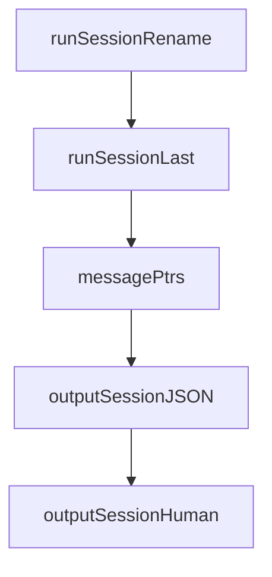

# Chapter 4: Permissions and Tool Controls

Welcome to **Chapter 4: Permissions and Tool Controls**. In this part of **Crush Tutorial: Multi-Model Terminal Coding Agent with Strong Extensibility**, you will build an intuitive mental model first, then move into concrete implementation details and practical production tradeoffs.


This chapter covers how to define safe execution boundaries without killing productivity.

## Learning Goals

- set explicit tool-permission policies in Crush
- constrain high-risk tools and commands
- understand `--yolo` mode risks
- use ignore rules to reduce accidental context exposure

## Permission Controls

| Control | Location | Purpose |
|:--------|:---------|:--------|
| `permissions.allowed_tools` | config | allow safe tools to run without repeated prompts |
| `options.disabled_tools` | config | fully hide high-risk or irrelevant built-in tools |
| `disabled_tools` under MCP configs | config | disable specific MCP-exposed tools |
| `--yolo` | CLI flag | bypass prompts; use only in trusted environments |

## Practical Safety Baseline

1. default to prompts for write/destructive actions
2. disable tools not required for your current task class
3. use `.crushignore` to exclude large/noisy/sensitive paths
4. reserve `--yolo` for disposable sandboxes

## Source References

- [Crush README: Allowing Tools](https://github.com/charmbracelet/crush/blob/main/README.md#allowing-tools)
- [Crush README: Disabling Built-In Tools](https://github.com/charmbracelet/crush/blob/main/README.md#disabling-built-in-tools)
- [Crush README: Ignoring Files](https://github.com/charmbracelet/crush/blob/main/README.md#ignoring-files)

## Summary

You now have a practical control model for balancing Crush autonomy and safety.

Next: [Chapter 5: LSP and MCP Integration](05-lsp-and-mcp-integration.md)

## Source Code Walkthrough

### `internal/cmd/session.go`

The `runSessionRename` function in [`internal/cmd/session.go`](https://github.com/charmbracelet/crush/blob/HEAD/internal/cmd/session.go) handles a key part of this chapter's functionality:

```go
	Long:  "Rename a session by ID. Use --json for machine-readable output. ID can be a UUID, full hash, or hash prefix.",
	Args:  cobra.MinimumNArgs(2),
	RunE:  runSessionRename,
}

func init() {
	sessionListCmd.Flags().BoolVar(&sessionListJSON, "json", false, "output in JSON format")
	sessionShowCmd.Flags().BoolVar(&sessionShowJSON, "json", false, "output in JSON format")
	sessionLastCmd.Flags().BoolVar(&sessionLastJSON, "json", false, "output in JSON format")
	sessionDeleteCmd.Flags().BoolVar(&sessionDeleteJSON, "json", false, "output in JSON format")
	sessionRenameCmd.Flags().BoolVar(&sessionRenameJSON, "json", false, "output in JSON format")
	sessionCmd.AddCommand(sessionListCmd)
	sessionCmd.AddCommand(sessionShowCmd)
	sessionCmd.AddCommand(sessionLastCmd)
	sessionCmd.AddCommand(sessionDeleteCmd)
	sessionCmd.AddCommand(sessionRenameCmd)
}

type sessionServices struct {
	sessions session.Service
	messages message.Service
}

func sessionSetup(cmd *cobra.Command) (context.Context, *sessionServices, func(), error) {
	dataDir, _ := cmd.Flags().GetString("data-dir")
	ctx := cmd.Context()

	if dataDir == "" {
		cfg, err := config.Init("", "", false)
		if err != nil {
			return nil, nil, nil, fmt.Errorf("failed to initialize config: %w", err)
		}
```

This function is important because it defines how Crush Tutorial: Multi-Model Terminal Coding Agent with Strong Extensibility implements the patterns covered in this chapter.

### `internal/cmd/session.go`

The `runSessionLast` function in [`internal/cmd/session.go`](https://github.com/charmbracelet/crush/blob/HEAD/internal/cmd/session.go) handles a key part of this chapter's functionality:

```go
	Short: "Show most recent session",
	Long:  "Show the last updated session. Use --json for machine-readable output.",
	RunE:  runSessionLast,
}

var sessionDeleteCmd = &cobra.Command{
	Use:     "delete <id>",
	Aliases: []string{"rm"},
	Short:   "Delete a session",
	Long:    "Delete a session by ID. Use --json for machine-readable output. ID can be a UUID, full hash, or hash prefix.",
	Args:    cobra.ExactArgs(1),
	RunE:    runSessionDelete,
}

var sessionRenameCmd = &cobra.Command{
	Use:   "rename <id> <title>",
	Short: "Rename a session",
	Long:  "Rename a session by ID. Use --json for machine-readable output. ID can be a UUID, full hash, or hash prefix.",
	Args:  cobra.MinimumNArgs(2),
	RunE:  runSessionRename,
}

func init() {
	sessionListCmd.Flags().BoolVar(&sessionListJSON, "json", false, "output in JSON format")
	sessionShowCmd.Flags().BoolVar(&sessionShowJSON, "json", false, "output in JSON format")
	sessionLastCmd.Flags().BoolVar(&sessionLastJSON, "json", false, "output in JSON format")
	sessionDeleteCmd.Flags().BoolVar(&sessionDeleteJSON, "json", false, "output in JSON format")
	sessionRenameCmd.Flags().BoolVar(&sessionRenameJSON, "json", false, "output in JSON format")
	sessionCmd.AddCommand(sessionListCmd)
	sessionCmd.AddCommand(sessionShowCmd)
	sessionCmd.AddCommand(sessionLastCmd)
	sessionCmd.AddCommand(sessionDeleteCmd)
```

This function is important because it defines how Crush Tutorial: Multi-Model Terminal Coding Agent with Strong Extensibility implements the patterns covered in this chapter.

### `internal/cmd/session.go`

The `messagePtrs` function in [`internal/cmd/session.go`](https://github.com/charmbracelet/crush/blob/HEAD/internal/cmd/session.go) handles a key part of this chapter's functionality:

```go
	}

	msgPtrs := messagePtrs(msgs)
	if sessionShowJSON {
		return outputSessionJSON(cmd.OutOrStdout(), sess, msgPtrs)
	}
	return outputSessionHuman(ctx, sess, msgPtrs)
}

func runSessionDelete(cmd *cobra.Command, args []string) error {
	event.SetNonInteractive(true)
	event.SessionDeletedCommand(sessionDeleteJSON)

	ctx, svc, cleanup, err := sessionSetup(cmd)
	if err != nil {
		return err
	}
	defer cleanup()

	sess, err := resolveSessionID(ctx, svc.sessions, args[0])
	if err != nil {
		return err
	}

	if err := svc.sessions.Delete(ctx, sess.ID); err != nil {
		return fmt.Errorf("failed to delete session: %w", err)
	}

	out := cmd.OutOrStdout()
	if sessionDeleteJSON {
		enc := json.NewEncoder(out)
		enc.SetEscapeHTML(false)
```

This function is important because it defines how Crush Tutorial: Multi-Model Terminal Coding Agent with Strong Extensibility implements the patterns covered in this chapter.

### `internal/cmd/session.go`

The `outputSessionJSON` function in [`internal/cmd/session.go`](https://github.com/charmbracelet/crush/blob/HEAD/internal/cmd/session.go) handles a key part of this chapter's functionality:

```go
	msgPtrs := messagePtrs(msgs)
	if sessionShowJSON {
		return outputSessionJSON(cmd.OutOrStdout(), sess, msgPtrs)
	}
	return outputSessionHuman(ctx, sess, msgPtrs)
}

func runSessionDelete(cmd *cobra.Command, args []string) error {
	event.SetNonInteractive(true)
	event.SessionDeletedCommand(sessionDeleteJSON)

	ctx, svc, cleanup, err := sessionSetup(cmd)
	if err != nil {
		return err
	}
	defer cleanup()

	sess, err := resolveSessionID(ctx, svc.sessions, args[0])
	if err != nil {
		return err
	}

	if err := svc.sessions.Delete(ctx, sess.ID); err != nil {
		return fmt.Errorf("failed to delete session: %w", err)
	}

	out := cmd.OutOrStdout()
	if sessionDeleteJSON {
		enc := json.NewEncoder(out)
		enc.SetEscapeHTML(false)
		return enc.Encode(sessionMutationResult{
			ID:      session.HashID(sess.ID),
```

This function is important because it defines how Crush Tutorial: Multi-Model Terminal Coding Agent with Strong Extensibility implements the patterns covered in this chapter.


## How These Components Connect


