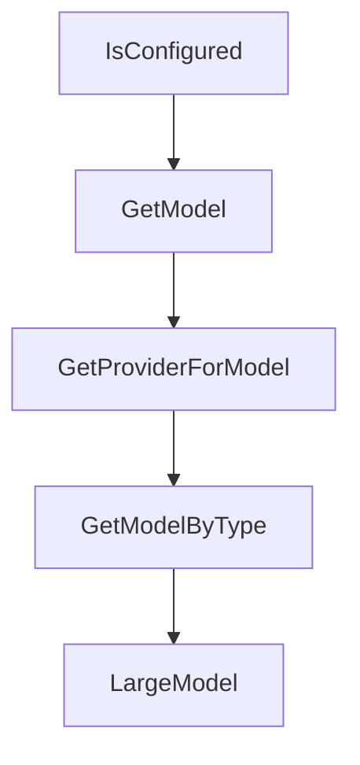

# Chapter 4: Permissions and Tool Controls

Welcome to **Chapter 4: Permissions and Tool Controls**. In this part of **Crush Tutorial: Multi-Model Terminal Coding Agent with Strong Extensibility**, you will build an intuitive mental model first, then move into concrete implementation details and practical production tradeoffs.


This chapter covers how to define safe execution boundaries without killing productivity.

## Learning Goals

- set explicit tool-permission policies in Crush
- constrain high-risk tools and commands
- understand `--yolo` mode risks
- use ignore rules to reduce accidental context exposure

## Permission Controls

| Control | Location | Purpose |
|:--------|:---------|:--------|
| `permissions.allowed_tools` | config | allow safe tools to run without repeated prompts |
| `options.disabled_tools` | config | fully hide high-risk or irrelevant built-in tools |
| `disabled_tools` under MCP configs | config | disable specific MCP-exposed tools |
| `--yolo` | CLI flag | bypass prompts; use only in trusted environments |

## Practical Safety Baseline

1. default to prompts for write/destructive actions
2. disable tools not required for your current task class
3. use `.crushignore` to exclude large/noisy/sensitive paths
4. reserve `--yolo` for disposable sandboxes

## Source References

- [Crush README: Allowing Tools](https://github.com/charmbracelet/crush/blob/main/README.md#allowing-tools)
- [Crush README: Disabling Built-In Tools](https://github.com/charmbracelet/crush/blob/main/README.md#disabling-built-in-tools)
- [Crush README: Ignoring Files](https://github.com/charmbracelet/crush/blob/main/README.md#ignoring-files)

## Summary

You now have a practical control model for balancing Crush autonomy and safety.

Next: [Chapter 5: LSP and MCP Integration](05-lsp-and-mcp-integration.md)

## Depth Expansion Playbook

## Source Code Walkthrough

### `internal/config/config.go`

The `IsConfigured` function in [`internal/config/config.go`](https://github.com/charmbracelet/crush/blob/HEAD/internal/config/config.go) handles a key part of this chapter's functionality:

```go
}

// IsConfigured  return true if at least one provider is configured
func (c *Config) IsConfigured() bool {
	return len(c.EnabledProviders()) > 0
}

func (c *Config) GetModel(provider, model string) *catwalk.Model {
	if providerConfig, ok := c.Providers.Get(provider); ok {
		for _, m := range providerConfig.Models {
			if m.ID == model {
				return &m
			}
		}
	}
	return nil
}

func (c *Config) GetProviderForModel(modelType SelectedModelType) *ProviderConfig {
	model, ok := c.Models[modelType]
	if !ok {
		return nil
	}
	if providerConfig, ok := c.Providers.Get(model.Provider); ok {
		return &providerConfig
	}
	return nil
}

func (c *Config) GetModelByType(modelType SelectedModelType) *catwalk.Model {
	model, ok := c.Models[modelType]
	if !ok {
```

This function is important because it defines how Crush Tutorial: Multi-Model Terminal Coding Agent with Strong Extensibility implements the patterns covered in this chapter.

### `internal/config/config.go`

The `GetModel` function in [`internal/config/config.go`](https://github.com/charmbracelet/crush/blob/HEAD/internal/config/config.go) handles a key part of this chapter's functionality:

```go
}

func (c *Config) GetModel(provider, model string) *catwalk.Model {
	if providerConfig, ok := c.Providers.Get(provider); ok {
		for _, m := range providerConfig.Models {
			if m.ID == model {
				return &m
			}
		}
	}
	return nil
}

func (c *Config) GetProviderForModel(modelType SelectedModelType) *ProviderConfig {
	model, ok := c.Models[modelType]
	if !ok {
		return nil
	}
	if providerConfig, ok := c.Providers.Get(model.Provider); ok {
		return &providerConfig
	}
	return nil
}

func (c *Config) GetModelByType(modelType SelectedModelType) *catwalk.Model {
	model, ok := c.Models[modelType]
	if !ok {
		return nil
	}
	return c.GetModel(model.Provider, model.Model)
}

```

This function is important because it defines how Crush Tutorial: Multi-Model Terminal Coding Agent with Strong Extensibility implements the patterns covered in this chapter.

### `internal/config/config.go`

The `GetProviderForModel` function in [`internal/config/config.go`](https://github.com/charmbracelet/crush/blob/HEAD/internal/config/config.go) handles a key part of this chapter's functionality:

```go
}

func (c *Config) GetProviderForModel(modelType SelectedModelType) *ProviderConfig {
	model, ok := c.Models[modelType]
	if !ok {
		return nil
	}
	if providerConfig, ok := c.Providers.Get(model.Provider); ok {
		return &providerConfig
	}
	return nil
}

func (c *Config) GetModelByType(modelType SelectedModelType) *catwalk.Model {
	model, ok := c.Models[modelType]
	if !ok {
		return nil
	}
	return c.GetModel(model.Provider, model.Model)
}

func (c *Config) LargeModel() *catwalk.Model {
	model, ok := c.Models[SelectedModelTypeLarge]
	if !ok {
		return nil
	}
	return c.GetModel(model.Provider, model.Model)
}

func (c *Config) SmallModel() *catwalk.Model {
	model, ok := c.Models[SelectedModelTypeSmall]
	if !ok {
```

This function is important because it defines how Crush Tutorial: Multi-Model Terminal Coding Agent with Strong Extensibility implements the patterns covered in this chapter.

### `internal/config/config.go`

The `GetModelByType` function in [`internal/config/config.go`](https://github.com/charmbracelet/crush/blob/HEAD/internal/config/config.go) handles a key part of this chapter's functionality:

```go
}

func (c *Config) GetModelByType(modelType SelectedModelType) *catwalk.Model {
	model, ok := c.Models[modelType]
	if !ok {
		return nil
	}
	return c.GetModel(model.Provider, model.Model)
}

func (c *Config) LargeModel() *catwalk.Model {
	model, ok := c.Models[SelectedModelTypeLarge]
	if !ok {
		return nil
	}
	return c.GetModel(model.Provider, model.Model)
}

func (c *Config) SmallModel() *catwalk.Model {
	model, ok := c.Models[SelectedModelTypeSmall]
	if !ok {
		return nil
	}
	return c.GetModel(model.Provider, model.Model)
}

const maxRecentModelsPerType = 5

func allToolNames() []string {
	return []string{
		"agent",
		"bash",
```

This function is important because it defines how Crush Tutorial: Multi-Model Terminal Coding Agent with Strong Extensibility implements the patterns covered in this chapter.


## How These Components Connect


