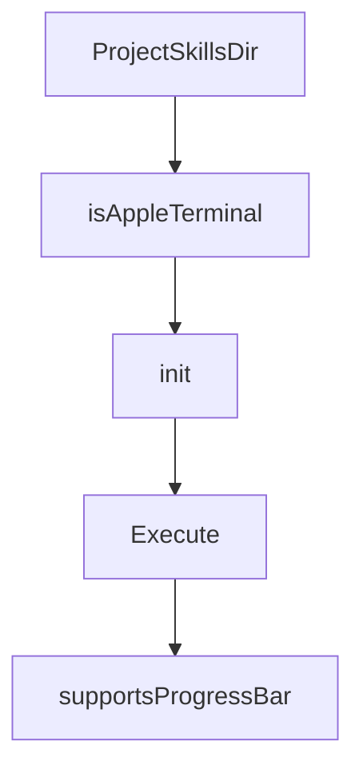

# Chapter 5: LSP and MCP Integration

Welcome to **Chapter 5: LSP and MCP Integration**. In this part of **Crush Tutorial: Multi-Model Terminal Coding Agent with Strong Extensibility**, you will build an intuitive mental model first, then move into concrete implementation details and practical production tradeoffs.


This chapter explains how to extend Crush with richer code intelligence and external tools.

## Learning Goals

- configure LSP servers for stronger code context
- add MCP servers over stdio/http/sse transports
- control MCP timeouts, headers, and disabled tools
- operationalize integrations for team usage

## LSP Integration Pattern

```json
{
  "$schema": "https://charm.land/crush.json",
  "lsp": {
    "go": { "command": "gopls" },
    "typescript": { "command": "typescript-language-server", "args": ["--stdio"] }
  }
}
```

## MCP Integration Pattern

```json
{
  "$schema": "https://charm.land/crush.json",
  "mcp": {
    "filesystem": {
      "type": "stdio",
      "command": "node",
      "args": ["/path/to/server.js"],
      "timeout": 120
    }
  }
}
```

## Integration Rollout Checklist

- verify server command reliability outside Crush first
- set explicit timeouts and minimal headers/secrets
- disable dangerous or irrelevant MCP tools by default
- document integration profile per repository type

## Source References

- [Crush README: LSPs](https://github.com/charmbracelet/crush/blob/main/README.md#lsps)
- [Crush README: MCPs](https://github.com/charmbracelet/crush/blob/main/README.md#mcps)
- [Crush schema](https://github.com/charmbracelet/crush/blob/main/schema.json)

## Summary

You now know how to wire Crush into language tooling and MCP ecosystems safely.

Next: [Chapter 6: Skills, Commands, and Workflow Customization](06-skills-commands-and-workflow-customization.md)

## Source Code Walkthrough

### `internal/config/load.go`

The `ProjectSkillsDir` function in [`internal/config/load.go`](https://github.com/charmbracelet/crush/blob/HEAD/internal/config/load.go) handles a key part of this chapter's functionality:

```go

	// Project specific skills dirs.
	c.Options.SkillsPaths = append(c.Options.SkillsPaths, ProjectSkillsDir(workingDir)...)

	if str, ok := os.LookupEnv("CRUSH_DISABLE_PROVIDER_AUTO_UPDATE"); ok {
		c.Options.DisableProviderAutoUpdate, _ = strconv.ParseBool(str)
	}

	if str, ok := os.LookupEnv("CRUSH_DISABLE_DEFAULT_PROVIDERS"); ok {
		c.Options.DisableDefaultProviders, _ = strconv.ParseBool(str)
	}

	if c.Options.Attribution == nil {
		c.Options.Attribution = &Attribution{
			TrailerStyle:  TrailerStyleAssistedBy,
			GeneratedWith: true,
		}
	} else if c.Options.Attribution.TrailerStyle == "" {
		// Migrate deprecated co_authored_by or apply default
		if c.Options.Attribution.CoAuthoredBy != nil {
			if *c.Options.Attribution.CoAuthoredBy {
				c.Options.Attribution.TrailerStyle = TrailerStyleCoAuthoredBy
			} else {
				c.Options.Attribution.TrailerStyle = TrailerStyleNone
			}
		} else {
			c.Options.Attribution.TrailerStyle = TrailerStyleAssistedBy
		}
	}
	c.Options.InitializeAs = cmp.Or(c.Options.InitializeAs, defaultInitializeAs)
}

```

This function is important because it defines how Crush Tutorial: Multi-Model Terminal Coding Agent with Strong Extensibility implements the patterns covered in this chapter.

### `internal/config/load.go`

The `isAppleTerminal` function in [`internal/config/load.go`](https://github.com/charmbracelet/crush/blob/HEAD/internal/config/load.go) handles a key part of this chapter's functionality:

```go
	}

	if isAppleTerminal() {
		slog.Warn("Detected Apple Terminal, enabling transparent mode")
		assignIfNil(&cfg.Options.TUI.Transparent, true)
	}

	// Load known providers, this loads the config from catwalk
	providers, err := Providers(cfg)
	if err != nil {
		return nil, err
	}
	store.knownProviders = providers

	env := env.New()
	// Configure providers
	valueResolver := NewShellVariableResolver(env)
	store.resolver = valueResolver
	if err := cfg.configureProviders(store, env, valueResolver, store.knownProviders); err != nil {
		return nil, fmt.Errorf("failed to configure providers: %w", err)
	}

	if !cfg.IsConfigured() {
		slog.Warn("No providers configured")
		return store, nil
	}

	if err := configureSelectedModels(store, store.knownProviders); err != nil {
		return nil, fmt.Errorf("failed to configure selected models: %w", err)
	}
	store.SetupAgents()
	return store, nil
```

This function is important because it defines how Crush Tutorial: Multi-Model Terminal Coding Agent with Strong Extensibility implements the patterns covered in this chapter.

### `internal/cmd/root.go`

The `init` function in [`internal/cmd/root.go`](https://github.com/charmbracelet/crush/blob/HEAD/internal/cmd/root.go) handles a key part of this chapter's functionality:

```go
var clientHost string

func init() {
	rootCmd.PersistentFlags().StringP("cwd", "c", "", "Current working directory")
	rootCmd.PersistentFlags().StringP("data-dir", "D", "", "Custom crush data directory")
	rootCmd.PersistentFlags().BoolP("debug", "d", false, "Debug")
	rootCmd.PersistentFlags().StringVarP(&clientHost, "host", "H", server.DefaultHost(), "Connect to a specific crush server host (for advanced users)")
	rootCmd.Flags().BoolP("help", "h", false, "Help")
	rootCmd.Flags().BoolP("yolo", "y", false, "Automatically accept all permissions (dangerous mode)")
	rootCmd.Flags().StringP("session", "s", "", "Continue a previous session by ID")
	rootCmd.Flags().BoolP("continue", "C", false, "Continue the most recent session")
	rootCmd.MarkFlagsMutuallyExclusive("session", "continue")

	rootCmd.AddCommand(
		runCmd,
		dirsCmd,
		projectsCmd,
		updateProvidersCmd,
		logsCmd,
		schemaCmd,
		loginCmd,
		statsCmd,
		sessionCmd,
	)
}

var rootCmd = &cobra.Command{
	Use:   "crush",
	Short: "A terminal-first AI assistant for software development",
	Long:  "A glamorous, terminal-first AI assistant for software development and adjacent tasks",
	Example: `
# Run in interactive mode
```

This function is important because it defines how Crush Tutorial: Multi-Model Terminal Coding Agent with Strong Extensibility implements the patterns covered in this chapter.

### `internal/cmd/root.go`

The `Execute` function in [`internal/cmd/root.go`](https://github.com/charmbracelet/crush/blob/HEAD/internal/cmd/root.go) handles a key part of this chapter's functionality:

```go
`

func Execute() {
	// FIXME: config.Load uses slog internally during provider resolution,
	// but the file-based logger isn't set up until after config is loaded
	// (because the log path depends on the data directory from config).
	// This creates a window where slog calls in config.Load leak to
	// stderr. We discard early logs here as a workaround. The proper
	// fix is to remove slog calls from config.Load and have it return
	// warnings/diagnostics instead of logging them as a side effect.
	slog.SetDefault(slog.New(slog.DiscardHandler))

	// NOTE: very hacky: we create a colorprofile writer with STDOUT, then make
	// it forward to a bytes.Buffer, write the colored heartbit to it, and then
	// finally prepend it in the version template.
	// Unfortunately cobra doesn't give us a way to set a function to handle
	// printing the version, and PreRunE runs after the version is already
	// handled, so that doesn't work either.
	// This is the only way I could find that works relatively well.
	if term.IsTerminal(os.Stdout.Fd()) {
		var b bytes.Buffer
		w := colorprofile.NewWriter(os.Stdout, os.Environ())
		w.Forward = &b
		_, _ = w.WriteString(heartbit.String())
		rootCmd.SetVersionTemplate(b.String() + "\n" + defaultVersionTemplate)
	}
	if err := fang.Execute(
		context.Background(),
		rootCmd,
		fang.WithVersion(version.Version),
		fang.WithNotifySignal(os.Interrupt),
	); err != nil {
```

This function is important because it defines how Crush Tutorial: Multi-Model Terminal Coding Agent with Strong Extensibility implements the patterns covered in this chapter.


## How These Components Connect


