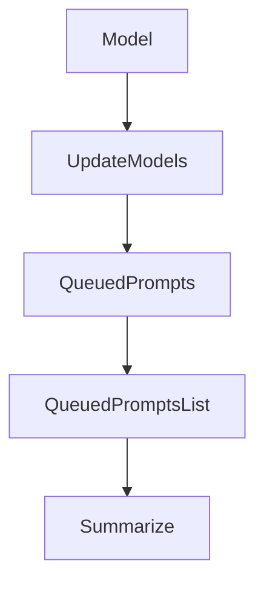

# Chapter 5: LSP and MCP Integration

Welcome to **Chapter 5: LSP and MCP Integration**. In this part of **Crush Tutorial: Multi-Model Terminal Coding Agent with Strong Extensibility**, you will build an intuitive mental model first, then move into concrete implementation details and practical production tradeoffs.


This chapter explains how to extend Crush with richer code intelligence and external tools.

## Learning Goals

- configure LSP servers for stronger code context
- add MCP servers over stdio/http/sse transports
- control MCP timeouts, headers, and disabled tools
- operationalize integrations for team usage

## LSP Integration Pattern

```json
{
  "$schema": "https://charm.land/crush.json",
  "lsp": {
    "go": { "command": "gopls" },
    "typescript": { "command": "typescript-language-server", "args": ["--stdio"] }
  }
}
```

## MCP Integration Pattern

```json
{
  "$schema": "https://charm.land/crush.json",
  "mcp": {
    "filesystem": {
      "type": "stdio",
      "command": "node",
      "args": ["/path/to/server.js"],
      "timeout": 120
    }
  }
}
```

## Integration Rollout Checklist

- verify server command reliability outside Crush first
- set explicit timeouts and minimal headers/secrets
- disable dangerous or irrelevant MCP tools by default
- document integration profile per repository type

## Source References

- [Crush README: LSPs](https://github.com/charmbracelet/crush/blob/main/README.md#lsps)
- [Crush README: MCPs](https://github.com/charmbracelet/crush/blob/main/README.md#mcps)
- [Crush schema](https://github.com/charmbracelet/crush/blob/main/schema.json)

## Summary

You now know how to wire Crush into language tooling and MCP ecosystems safely.

Next: [Chapter 6: Skills, Commands, and Workflow Customization](06-skills-commands-and-workflow-customization.md)

## Depth Expansion Playbook

## Source Code Walkthrough

### `internal/agent/coordinator.go`

The `Model` function in [`internal/agent/coordinator.go`](https://github.com/charmbracelet/crush/blob/HEAD/internal/agent/coordinator.go) handles a key part of this chapter's functionality:

```go
var (
	errCoderAgentNotConfigured         = errors.New("coder agent not configured")
	errModelProviderNotConfigured      = errors.New("model provider not configured")
	errLargeModelNotSelected           = errors.New("large model not selected")
	errSmallModelNotSelected           = errors.New("small model not selected")
	errLargeModelProviderNotConfigured = errors.New("large model provider not configured")
	errSmallModelProviderNotConfigured = errors.New("small model provider not configured")
	errLargeModelNotFound              = errors.New("large model not found in provider config")
	errSmallModelNotFound              = errors.New("small model not found in provider config")
)

type Coordinator interface {
	// INFO: (kujtim) this is not used yet we will use this when we have multiple agents
	// SetMainAgent(string)
	Run(ctx context.Context, sessionID, prompt string, attachments ...message.Attachment) (*fantasy.AgentResult, error)
	Cancel(sessionID string)
	CancelAll()
	IsSessionBusy(sessionID string) bool
	IsBusy() bool
	QueuedPrompts(sessionID string) int
	QueuedPromptsList(sessionID string) []string
	ClearQueue(sessionID string)
	Summarize(context.Context, string) error
	Model() Model
	UpdateModels(ctx context.Context) error
}

type coordinator struct {
	cfg         *config.ConfigStore
	sessions    session.Service
	messages    message.Service
	permissions permission.Service
```

This function is important because it defines how Crush Tutorial: Multi-Model Terminal Coding Agent with Strong Extensibility implements the patterns covered in this chapter.

### `internal/agent/coordinator.go`

The `UpdateModels` function in [`internal/agent/coordinator.go`](https://github.com/charmbracelet/crush/blob/HEAD/internal/agent/coordinator.go) handles a key part of this chapter's functionality:

```go
	Summarize(context.Context, string) error
	Model() Model
	UpdateModels(ctx context.Context) error
}

type coordinator struct {
	cfg         *config.ConfigStore
	sessions    session.Service
	messages    message.Service
	permissions permission.Service
	history     history.Service
	filetracker filetracker.Service
	lspManager  *lsp.Manager
	notify      pubsub.Publisher[notify.Notification]

	currentAgent SessionAgent
	agents       map[string]SessionAgent

	readyWg errgroup.Group
}

func NewCoordinator(
	ctx context.Context,
	cfg *config.ConfigStore,
	sessions session.Service,
	messages message.Service,
	permissions permission.Service,
	history history.Service,
	filetracker filetracker.Service,
	lspManager *lsp.Manager,
	notify pubsub.Publisher[notify.Notification],
) (Coordinator, error) {
```

This function is important because it defines how Crush Tutorial: Multi-Model Terminal Coding Agent with Strong Extensibility implements the patterns covered in this chapter.

### `internal/agent/coordinator.go`

The `QueuedPrompts` function in [`internal/agent/coordinator.go`](https://github.com/charmbracelet/crush/blob/HEAD/internal/agent/coordinator.go) handles a key part of this chapter's functionality:

```go
	IsSessionBusy(sessionID string) bool
	IsBusy() bool
	QueuedPrompts(sessionID string) int
	QueuedPromptsList(sessionID string) []string
	ClearQueue(sessionID string)
	Summarize(context.Context, string) error
	Model() Model
	UpdateModels(ctx context.Context) error
}

type coordinator struct {
	cfg         *config.ConfigStore
	sessions    session.Service
	messages    message.Service
	permissions permission.Service
	history     history.Service
	filetracker filetracker.Service
	lspManager  *lsp.Manager
	notify      pubsub.Publisher[notify.Notification]

	currentAgent SessionAgent
	agents       map[string]SessionAgent

	readyWg errgroup.Group
}

func NewCoordinator(
	ctx context.Context,
	cfg *config.ConfigStore,
	sessions session.Service,
	messages message.Service,
	permissions permission.Service,
```

This function is important because it defines how Crush Tutorial: Multi-Model Terminal Coding Agent with Strong Extensibility implements the patterns covered in this chapter.

### `internal/agent/coordinator.go`

The `QueuedPromptsList` function in [`internal/agent/coordinator.go`](https://github.com/charmbracelet/crush/blob/HEAD/internal/agent/coordinator.go) handles a key part of this chapter's functionality:

```go
	IsBusy() bool
	QueuedPrompts(sessionID string) int
	QueuedPromptsList(sessionID string) []string
	ClearQueue(sessionID string)
	Summarize(context.Context, string) error
	Model() Model
	UpdateModels(ctx context.Context) error
}

type coordinator struct {
	cfg         *config.ConfigStore
	sessions    session.Service
	messages    message.Service
	permissions permission.Service
	history     history.Service
	filetracker filetracker.Service
	lspManager  *lsp.Manager
	notify      pubsub.Publisher[notify.Notification]

	currentAgent SessionAgent
	agents       map[string]SessionAgent

	readyWg errgroup.Group
}

func NewCoordinator(
	ctx context.Context,
	cfg *config.ConfigStore,
	sessions session.Service,
	messages message.Service,
	permissions permission.Service,
	history history.Service,
```

This function is important because it defines how Crush Tutorial: Multi-Model Terminal Coding Agent with Strong Extensibility implements the patterns covered in this chapter.


## How These Components Connect


