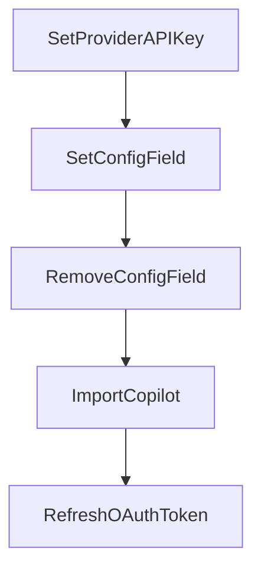

# Chapter 6: Skills, Commands, and Workflow Customization

Welcome to **Chapter 6: Skills, Commands, and Workflow Customization**. In this part of **Crush Tutorial: Multi-Model Terminal Coding Agent with Strong Extensibility**, you will build an intuitive mental model first, then move into concrete implementation details and practical production tradeoffs.


This chapter turns Crush into a reusable engineering system rather than a one-off assistant.

## Learning Goals

- use Agent Skills in local and project scopes
- load custom markdown commands from supported directories
- integrate MCP prompts into command workflows
- standardize reusable patterns across teams

## Skills Discovery Paths

Crush can discover skills from:

- `~/.config/crush/skills` (Unix)
- `%LOCALAPPDATA%\crush\skills` (Windows)
- additional paths in `options.skills_paths`

## Custom Command Sources

From internal command loading behavior, custom commands are read from:

- XDG config command dir
- `~/.crush/commands`
- project command directory under configured data path

This supports personal command libraries plus project-scoped commands.

## Workflow Pattern

1. encode standards in `SKILL.md` packages
2. add repeatable command snippets for frequent tasks
3. keep project-specific commands near repository workflows
4. review command/tool permissions with every rollout

## Source References

- [Crush README: Agent Skills](https://github.com/charmbracelet/crush/blob/main/README.md#agent-skills)
- [Crush README: Initialization](https://github.com/charmbracelet/crush/blob/main/README.md#initialization)
- [Command loader source](https://github.com/charmbracelet/crush/blob/main/internal/commands/commands.go)

## Summary

You now have the building blocks for durable, reusable Crush workflows.

Next: [Chapter 7: Logs, Debugging, and Operations](07-logs-debugging-and-operations.md)

## Source Code Walkthrough

### `internal/workspace/client_workspace.go`

The `SetProviderAPIKey` function in [`internal/workspace/client_workspace.go`](https://github.com/charmbracelet/crush/blob/HEAD/internal/workspace/client_workspace.go) handles a key part of this chapter's functionality:

```go
}

func (w *ClientWorkspace) SetProviderAPIKey(scope config.Scope, providerID string, apiKey any) error {
	err := w.client.SetProviderAPIKey(context.Background(), w.workspaceID(), scope, providerID, apiKey)
	if err == nil {
		w.refreshWorkspace()
	}
	return err
}

func (w *ClientWorkspace) SetConfigField(scope config.Scope, key string, value any) error {
	err := w.client.SetConfigField(context.Background(), w.workspaceID(), scope, key, value)
	if err == nil {
		w.refreshWorkspace()
	}
	return err
}

func (w *ClientWorkspace) RemoveConfigField(scope config.Scope, key string) error {
	err := w.client.RemoveConfigField(context.Background(), w.workspaceID(), scope, key)
	if err == nil {
		w.refreshWorkspace()
	}
	return err
}

func (w *ClientWorkspace) ImportCopilot() (*oauth.Token, bool) {
	token, ok, err := w.client.ImportCopilot(context.Background(), w.workspaceID())
	if err != nil {
		return nil, false
	}
	if ok {
```

This function is important because it defines how Crush Tutorial: Multi-Model Terminal Coding Agent with Strong Extensibility implements the patterns covered in this chapter.

### `internal/workspace/client_workspace.go`

The `SetConfigField` function in [`internal/workspace/client_workspace.go`](https://github.com/charmbracelet/crush/blob/HEAD/internal/workspace/client_workspace.go) handles a key part of this chapter's functionality:

```go
}

func (w *ClientWorkspace) SetConfigField(scope config.Scope, key string, value any) error {
	err := w.client.SetConfigField(context.Background(), w.workspaceID(), scope, key, value)
	if err == nil {
		w.refreshWorkspace()
	}
	return err
}

func (w *ClientWorkspace) RemoveConfigField(scope config.Scope, key string) error {
	err := w.client.RemoveConfigField(context.Background(), w.workspaceID(), scope, key)
	if err == nil {
		w.refreshWorkspace()
	}
	return err
}

func (w *ClientWorkspace) ImportCopilot() (*oauth.Token, bool) {
	token, ok, err := w.client.ImportCopilot(context.Background(), w.workspaceID())
	if err != nil {
		return nil, false
	}
	if ok {
		w.refreshWorkspace()
	}
	return token, ok
}

func (w *ClientWorkspace) RefreshOAuthToken(ctx context.Context, scope config.Scope, providerID string) error {
	err := w.client.RefreshOAuthToken(ctx, w.workspaceID(), scope, providerID)
	if err == nil {
```

This function is important because it defines how Crush Tutorial: Multi-Model Terminal Coding Agent with Strong Extensibility implements the patterns covered in this chapter.

### `internal/workspace/client_workspace.go`

The `RemoveConfigField` function in [`internal/workspace/client_workspace.go`](https://github.com/charmbracelet/crush/blob/HEAD/internal/workspace/client_workspace.go) handles a key part of this chapter's functionality:

```go
}

func (w *ClientWorkspace) RemoveConfigField(scope config.Scope, key string) error {
	err := w.client.RemoveConfigField(context.Background(), w.workspaceID(), scope, key)
	if err == nil {
		w.refreshWorkspace()
	}
	return err
}

func (w *ClientWorkspace) ImportCopilot() (*oauth.Token, bool) {
	token, ok, err := w.client.ImportCopilot(context.Background(), w.workspaceID())
	if err != nil {
		return nil, false
	}
	if ok {
		w.refreshWorkspace()
	}
	return token, ok
}

func (w *ClientWorkspace) RefreshOAuthToken(ctx context.Context, scope config.Scope, providerID string) error {
	err := w.client.RefreshOAuthToken(ctx, w.workspaceID(), scope, providerID)
	if err == nil {
		w.refreshWorkspace()
	}
	return err
}

// -- Project lifecycle --

func (w *ClientWorkspace) ProjectNeedsInitialization() (bool, error) {
```

This function is important because it defines how Crush Tutorial: Multi-Model Terminal Coding Agent with Strong Extensibility implements the patterns covered in this chapter.

### `internal/workspace/client_workspace.go`

The `ImportCopilot` function in [`internal/workspace/client_workspace.go`](https://github.com/charmbracelet/crush/blob/HEAD/internal/workspace/client_workspace.go) handles a key part of this chapter's functionality:

```go
}

func (w *ClientWorkspace) ImportCopilot() (*oauth.Token, bool) {
	token, ok, err := w.client.ImportCopilot(context.Background(), w.workspaceID())
	if err != nil {
		return nil, false
	}
	if ok {
		w.refreshWorkspace()
	}
	return token, ok
}

func (w *ClientWorkspace) RefreshOAuthToken(ctx context.Context, scope config.Scope, providerID string) error {
	err := w.client.RefreshOAuthToken(ctx, w.workspaceID(), scope, providerID)
	if err == nil {
		w.refreshWorkspace()
	}
	return err
}

// -- Project lifecycle --

func (w *ClientWorkspace) ProjectNeedsInitialization() (bool, error) {
	return w.client.ProjectNeedsInitialization(context.Background(), w.workspaceID())
}

func (w *ClientWorkspace) MarkProjectInitialized() error {
	return w.client.MarkProjectInitialized(context.Background(), w.workspaceID())
}

func (w *ClientWorkspace) InitializePrompt() (string, error) {
```

This function is important because it defines how Crush Tutorial: Multi-Model Terminal Coding Agent with Strong Extensibility implements the patterns covered in this chapter.


## How These Components Connect


