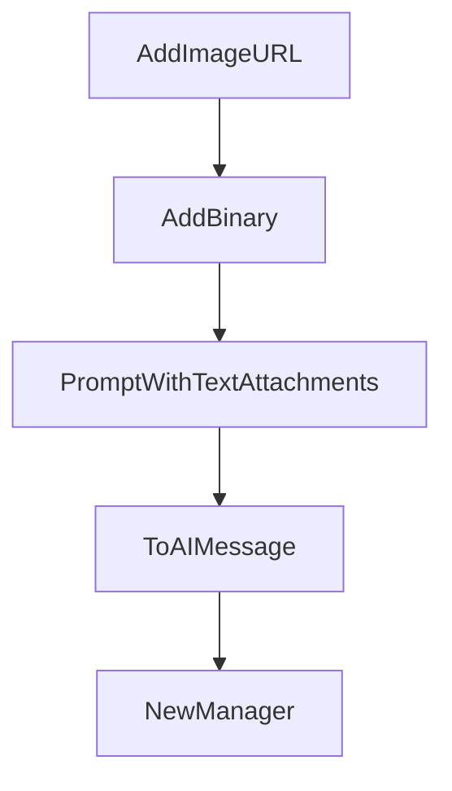

# Chapter 6: Skills, Commands, and Workflow Customization

Welcome to **Chapter 6: Skills, Commands, and Workflow Customization**. In this part of **Crush Tutorial: Multi-Model Terminal Coding Agent with Strong Extensibility**, you will build an intuitive mental model first, then move into concrete implementation details and practical production tradeoffs.


This chapter turns Crush into a reusable engineering system rather than a one-off assistant.

## Learning Goals

- use Agent Skills in local and project scopes
- load custom markdown commands from supported directories
- integrate MCP prompts into command workflows
- standardize reusable patterns across teams

## Skills Discovery Paths

Crush can discover skills from:

- `~/.config/crush/skills` (Unix)
- `%LOCALAPPDATA%\crush\skills` (Windows)
- additional paths in `options.skills_paths`

## Custom Command Sources

From internal command loading behavior, custom commands are read from:

- XDG config command dir
- `~/.crush/commands`
- project command directory under configured data path

This supports personal command libraries plus project-scoped commands.

## Workflow Pattern

1. encode standards in `SKILL.md` packages
2. add repeatable command snippets for frequent tasks
3. keep project-specific commands near repository workflows
4. review command/tool permissions with every rollout

## Source References

- [Crush README: Agent Skills](https://github.com/charmbracelet/crush/blob/main/README.md#agent-skills)
- [Crush README: Initialization](https://github.com/charmbracelet/crush/blob/main/README.md#initialization)
- [Command loader source](https://github.com/charmbracelet/crush/blob/main/internal/commands/commands.go)

## Summary

You now have the building blocks for durable, reusable Crush workflows.

Next: [Chapter 7: Logs, Debugging, and Operations](07-logs-debugging-and-operations.md)

## Depth Expansion Playbook

## Source Code Walkthrough

### `internal/message/content.go`

The `AddImageURL` function in [`internal/message/content.go`](https://github.com/charmbracelet/crush/blob/HEAD/internal/message/content.go) handles a key part of this chapter's functionality:

```go
}

func (m *Message) AddImageURL(url, detail string) {
	m.Parts = append(m.Parts, ImageURLContent{URL: url, Detail: detail})
}

func (m *Message) AddBinary(mimeType string, data []byte) {
	m.Parts = append(m.Parts, BinaryContent{MIMEType: mimeType, Data: data})
}

func PromptWithTextAttachments(prompt string, attachments []Attachment) string {
	var sb strings.Builder
	sb.WriteString(prompt)
	addedAttachments := false
	for _, content := range attachments {
		if !content.IsText() {
			continue
		}
		if !addedAttachments {
			sb.WriteString("\n<system_info>The files below have been attached by the user, consider them in your response</system_info>\n")
			addedAttachments = true
		}
		if content.FilePath != "" {
			fmt.Fprintf(&sb, "<file path='%s'>\n", content.FilePath)
		} else {
			sb.WriteString("<file>\n")
		}
		sb.WriteString("\n")
		sb.Write(content.Content)
		sb.WriteString("\n</file>\n")
	}
	return sb.String()
```

This function is important because it defines how Crush Tutorial: Multi-Model Terminal Coding Agent with Strong Extensibility implements the patterns covered in this chapter.

### `internal/message/content.go`

The `AddBinary` function in [`internal/message/content.go`](https://github.com/charmbracelet/crush/blob/HEAD/internal/message/content.go) handles a key part of this chapter's functionality:

```go
}

func (m *Message) AddBinary(mimeType string, data []byte) {
	m.Parts = append(m.Parts, BinaryContent{MIMEType: mimeType, Data: data})
}

func PromptWithTextAttachments(prompt string, attachments []Attachment) string {
	var sb strings.Builder
	sb.WriteString(prompt)
	addedAttachments := false
	for _, content := range attachments {
		if !content.IsText() {
			continue
		}
		if !addedAttachments {
			sb.WriteString("\n<system_info>The files below have been attached by the user, consider them in your response</system_info>\n")
			addedAttachments = true
		}
		if content.FilePath != "" {
			fmt.Fprintf(&sb, "<file path='%s'>\n", content.FilePath)
		} else {
			sb.WriteString("<file>\n")
		}
		sb.WriteString("\n")
		sb.Write(content.Content)
		sb.WriteString("\n</file>\n")
	}
	return sb.String()
}

func (m *Message) ToAIMessage() []fantasy.Message {
	var messages []fantasy.Message
```

This function is important because it defines how Crush Tutorial: Multi-Model Terminal Coding Agent with Strong Extensibility implements the patterns covered in this chapter.

### `internal/message/content.go`

The `PromptWithTextAttachments` function in [`internal/message/content.go`](https://github.com/charmbracelet/crush/blob/HEAD/internal/message/content.go) handles a key part of this chapter's functionality:

```go
}

func PromptWithTextAttachments(prompt string, attachments []Attachment) string {
	var sb strings.Builder
	sb.WriteString(prompt)
	addedAttachments := false
	for _, content := range attachments {
		if !content.IsText() {
			continue
		}
		if !addedAttachments {
			sb.WriteString("\n<system_info>The files below have been attached by the user, consider them in your response</system_info>\n")
			addedAttachments = true
		}
		if content.FilePath != "" {
			fmt.Fprintf(&sb, "<file path='%s'>\n", content.FilePath)
		} else {
			sb.WriteString("<file>\n")
		}
		sb.WriteString("\n")
		sb.Write(content.Content)
		sb.WriteString("\n</file>\n")
	}
	return sb.String()
}

func (m *Message) ToAIMessage() []fantasy.Message {
	var messages []fantasy.Message
	switch m.Role {
	case User:
		var parts []fantasy.MessagePart
		text := strings.TrimSpace(m.Content().Text)
```

This function is important because it defines how Crush Tutorial: Multi-Model Terminal Coding Agent with Strong Extensibility implements the patterns covered in this chapter.

### `internal/message/content.go`

The `ToAIMessage` function in [`internal/message/content.go`](https://github.com/charmbracelet/crush/blob/HEAD/internal/message/content.go) handles a key part of this chapter's functionality:

```go
}

func (m *Message) ToAIMessage() []fantasy.Message {
	var messages []fantasy.Message
	switch m.Role {
	case User:
		var parts []fantasy.MessagePart
		text := strings.TrimSpace(m.Content().Text)
		var textAttachments []Attachment
		for _, content := range m.BinaryContent() {
			if !strings.HasPrefix(content.MIMEType, "text/") {
				continue
			}
			textAttachments = append(textAttachments, Attachment{
				FilePath: content.Path,
				MimeType: content.MIMEType,
				Content:  content.Data,
			})
		}
		text = PromptWithTextAttachments(text, textAttachments)
		if text != "" {
			parts = append(parts, fantasy.TextPart{Text: text})
		}
		for _, content := range m.BinaryContent() {
			// skip text attachements
			if strings.HasPrefix(content.MIMEType, "text/") {
				continue
			}
			parts = append(parts, fantasy.FilePart{
				Filename:  content.Path,
				Data:      content.Data,
				MediaType: content.MIMEType,
```

This function is important because it defines how Crush Tutorial: Multi-Model Terminal Coding Agent with Strong Extensibility implements the patterns covered in this chapter.


## How These Components Connect


