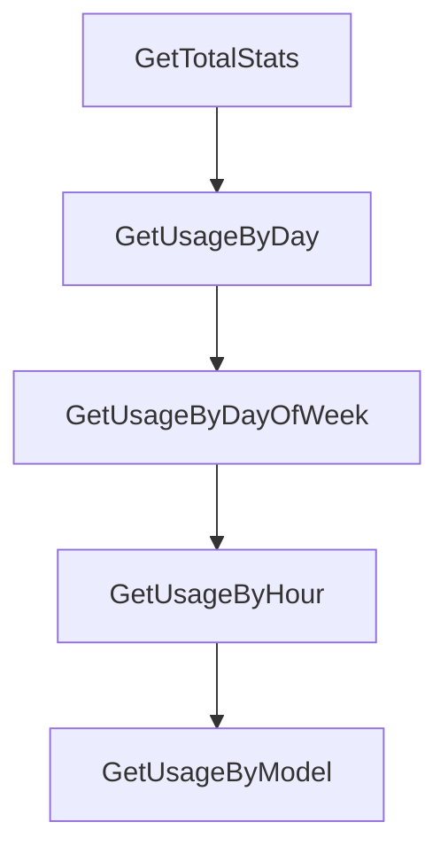

# Chapter 7: Logs, Debugging, and Operations

Welcome to **Chapter 7: Logs, Debugging, and Operations**. In this part of **Crush Tutorial: Multi-Model Terminal Coding Agent with Strong Extensibility**, you will build an intuitive mental model first, then move into concrete implementation details and practical production tradeoffs.


This chapter covers the operator workflows you need when Crush behavior deviates from expectations.

## Learning Goals

- inspect and follow Crush logs effectively
- enable debug instrumentation for deeper troubleshooting
- manage provider list updates in connected and air-gapped contexts
- create fast diagnosis loops for production issues

## Logging Baseline

| Need | Command / Config |
|:-----|:------------------|
| recent logs | `crush logs` |
| short tail | `crush logs --tail 500` |
| live follow | `crush logs --follow` |
| debug mode | `--debug` or `options.debug: true` |

Log path reference (project-relative): `./.crush/logs/crush.log`.

## Provider Update Operations

Crush can auto-update provider metadata from Catwalk. For restricted environments:

- disable automatic updates with config or env var
- run explicit `crush update-providers` against remote/local/embedded sources

## Source References

- [Crush README: Logging](https://github.com/charmbracelet/crush/blob/main/README.md#logging)
- [Crush README: Provider Auto-Updates](https://github.com/charmbracelet/crush/blob/main/README.md#provider-auto-updates)

## Summary

You now have practical diagnostics and maintenance workflows for operating Crush reliably.

Next: [Chapter 8: Production Governance and Rollout](08-production-governance-and-rollout.md)

## Depth Expansion Playbook

## Source Code Walkthrough

### `internal/db/stats.sql.go`

The `GetTotalStats` function in [`internal/db/stats.sql.go`](https://github.com/charmbracelet/crush/blob/HEAD/internal/db/stats.sql.go) handles a key part of this chapter's functionality:

```go
}

const getTotalStats = `-- name: GetTotalStats :one
SELECT
    COUNT(*) as total_sessions,
    COALESCE(SUM(prompt_tokens), 0) as total_prompt_tokens,
    COALESCE(SUM(completion_tokens), 0) as total_completion_tokens,
    COALESCE(SUM(cost), 0) as total_cost,
    COALESCE(SUM(message_count), 0) as total_messages,
    COALESCE(AVG(prompt_tokens + completion_tokens), 0) as avg_tokens_per_session,
    COALESCE(AVG(message_count), 0) as avg_messages_per_session
FROM sessions
WHERE parent_session_id IS NULL
`

type GetTotalStatsRow struct {
	TotalSessions         int64       `json:"total_sessions"`
	TotalPromptTokens     interface{} `json:"total_prompt_tokens"`
	TotalCompletionTokens interface{} `json:"total_completion_tokens"`
	TotalCost             interface{} `json:"total_cost"`
	TotalMessages         interface{} `json:"total_messages"`
	AvgTokensPerSession   interface{} `json:"avg_tokens_per_session"`
	AvgMessagesPerSession interface{} `json:"avg_messages_per_session"`
}

func (q *Queries) GetTotalStats(ctx context.Context) (GetTotalStatsRow, error) {
	row := q.queryRow(ctx, q.getTotalStatsStmt, getTotalStats)
	var i GetTotalStatsRow
	err := row.Scan(
		&i.TotalSessions,
		&i.TotalPromptTokens,
		&i.TotalCompletionTokens,
```

This function is important because it defines how Crush Tutorial: Multi-Model Terminal Coding Agent with Strong Extensibility implements the patterns covered in this chapter.

### `internal/db/stats.sql.go`

The `GetUsageByDay` function in [`internal/db/stats.sql.go`](https://github.com/charmbracelet/crush/blob/HEAD/internal/db/stats.sql.go) handles a key part of this chapter's functionality:

```go
}

const getUsageByDay = `-- name: GetUsageByDay :many
SELECT
    date(created_at, 'unixepoch') as day,
    SUM(prompt_tokens) as prompt_tokens,
    SUM(completion_tokens) as completion_tokens,
    SUM(cost) as cost,
    COUNT(*) as session_count
FROM sessions
WHERE parent_session_id IS NULL
GROUP BY date(created_at, 'unixepoch')
ORDER BY day DESC
`

type GetUsageByDayRow struct {
	Day              interface{}     `json:"day"`
	PromptTokens     sql.NullFloat64 `json:"prompt_tokens"`
	CompletionTokens sql.NullFloat64 `json:"completion_tokens"`
	Cost             sql.NullFloat64 `json:"cost"`
	SessionCount     int64           `json:"session_count"`
}

func (q *Queries) GetUsageByDay(ctx context.Context) ([]GetUsageByDayRow, error) {
	rows, err := q.query(ctx, q.getUsageByDayStmt, getUsageByDay)
	if err != nil {
		return nil, err
	}
	defer rows.Close()
	items := []GetUsageByDayRow{}
	for rows.Next() {
		var i GetUsageByDayRow
```

This function is important because it defines how Crush Tutorial: Multi-Model Terminal Coding Agent with Strong Extensibility implements the patterns covered in this chapter.

### `internal/db/stats.sql.go`

The `GetUsageByDayOfWeek` function in [`internal/db/stats.sql.go`](https://github.com/charmbracelet/crush/blob/HEAD/internal/db/stats.sql.go) handles a key part of this chapter's functionality:

```go
}

const getUsageByDayOfWeek = `-- name: GetUsageByDayOfWeek :many
SELECT
    CAST(strftime('%w', created_at, 'unixepoch') AS INTEGER) as day_of_week,
    COUNT(*) as session_count,
    SUM(prompt_tokens) as prompt_tokens,
    SUM(completion_tokens) as completion_tokens
FROM sessions
WHERE parent_session_id IS NULL
GROUP BY day_of_week
ORDER BY day_of_week
`

type GetUsageByDayOfWeekRow struct {
	DayOfWeek        int64           `json:"day_of_week"`
	SessionCount     int64           `json:"session_count"`
	PromptTokens     sql.NullFloat64 `json:"prompt_tokens"`
	CompletionTokens sql.NullFloat64 `json:"completion_tokens"`
}

func (q *Queries) GetUsageByDayOfWeek(ctx context.Context) ([]GetUsageByDayOfWeekRow, error) {
	rows, err := q.query(ctx, q.getUsageByDayOfWeekStmt, getUsageByDayOfWeek)
	if err != nil {
		return nil, err
	}
	defer rows.Close()
	items := []GetUsageByDayOfWeekRow{}
	for rows.Next() {
		var i GetUsageByDayOfWeekRow
		if err := rows.Scan(
			&i.DayOfWeek,
```

This function is important because it defines how Crush Tutorial: Multi-Model Terminal Coding Agent with Strong Extensibility implements the patterns covered in this chapter.

### `internal/db/stats.sql.go`

The `GetUsageByHour` function in [`internal/db/stats.sql.go`](https://github.com/charmbracelet/crush/blob/HEAD/internal/db/stats.sql.go) handles a key part of this chapter's functionality:

```go
}

const getUsageByHour = `-- name: GetUsageByHour :many
SELECT
    CAST(strftime('%H', created_at, 'unixepoch') AS INTEGER) as hour,
    COUNT(*) as session_count
FROM sessions
WHERE parent_session_id IS NULL
GROUP BY hour
ORDER BY hour
`

type GetUsageByHourRow struct {
	Hour         int64 `json:"hour"`
	SessionCount int64 `json:"session_count"`
}

func (q *Queries) GetUsageByHour(ctx context.Context) ([]GetUsageByHourRow, error) {
	rows, err := q.query(ctx, q.getUsageByHourStmt, getUsageByHour)
	if err != nil {
		return nil, err
	}
	defer rows.Close()
	items := []GetUsageByHourRow{}
	for rows.Next() {
		var i GetUsageByHourRow
		if err := rows.Scan(&i.Hour, &i.SessionCount); err != nil {
			return nil, err
		}
		items = append(items, i)
	}
	if err := rows.Close(); err != nil {
```

This function is important because it defines how Crush Tutorial: Multi-Model Terminal Coding Agent with Strong Extensibility implements the patterns covered in this chapter.


## How These Components Connect


