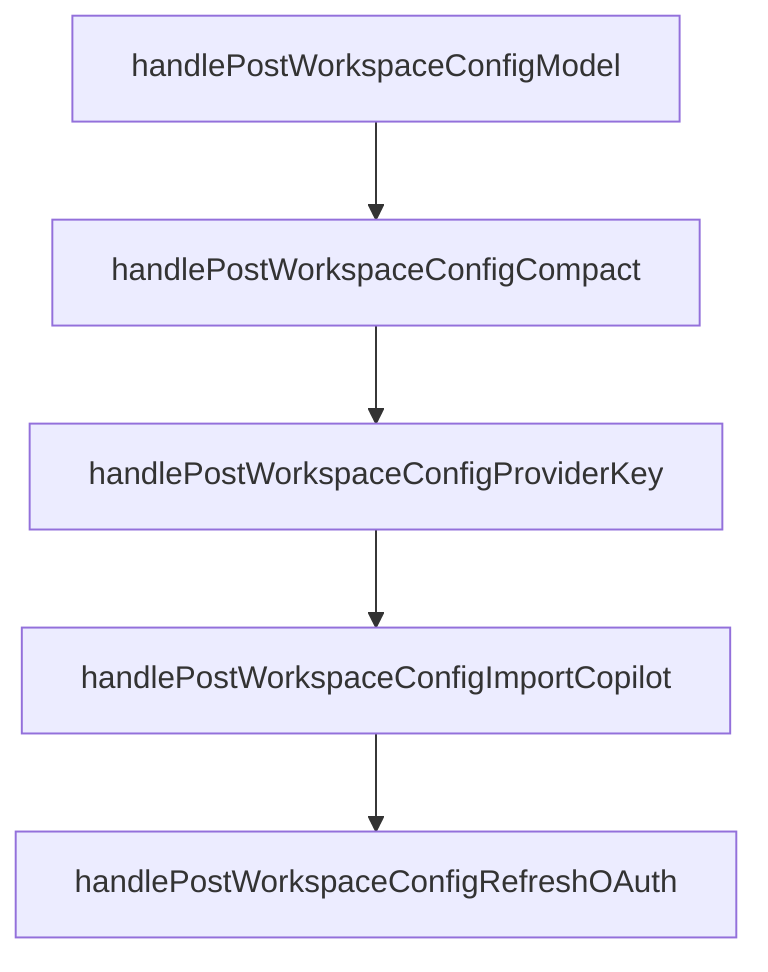

# Chapter 7: Logs, Debugging, and Operations

Welcome to **Chapter 7: Logs, Debugging, and Operations**. In this part of **Crush Tutorial: Multi-Model Terminal Coding Agent with Strong Extensibility**, you will build an intuitive mental model first, then move into concrete implementation details and practical production tradeoffs.


This chapter covers the operator workflows you need when Crush behavior deviates from expectations.

## Learning Goals

- inspect and follow Crush logs effectively
- enable debug instrumentation for deeper troubleshooting
- manage provider list updates in connected and air-gapped contexts
- create fast diagnosis loops for production issues

## Logging Baseline

| Need | Command / Config |
|:-----|:------------------|
| recent logs | `crush logs` |
| short tail | `crush logs --tail 500` |
| live follow | `crush logs --follow` |
| debug mode | `--debug` or `options.debug: true` |

Log path reference (project-relative): `./.crush/logs/crush.log`.

## Provider Update Operations

Crush can auto-update provider metadata from Catwalk. For restricted environments:

- disable automatic updates with config or env var
- run explicit `crush update-providers` against remote/local/embedded sources

## Source References

- [Crush README: Logging](https://github.com/charmbracelet/crush/blob/main/README.md#logging)
- [Crush README: Provider Auto-Updates](https://github.com/charmbracelet/crush/blob/main/README.md#provider-auto-updates)

## Summary

You now have practical diagnostics and maintenance workflows for operating Crush reliably.

Next: [Chapter 8: Production Governance and Rollout](08-production-governance-and-rollout.md)

## Source Code Walkthrough

### `internal/server/config.go`

The `handlePostWorkspaceConfigModel` function in [`internal/server/config.go`](https://github.com/charmbracelet/crush/blob/HEAD/internal/server/config.go) handles a key part of this chapter's functionality:

```go
}

// handlePostWorkspaceConfigModel updates the preferred model.
//
//	@Summary		Set the preferred model
//	@Tags			config
//	@Accept			json
//	@Param			id		path	string						true	"Workspace ID"
//	@Param			request	body	proto.ConfigModelRequest	true	"Config model request"
//	@Success		200
//	@Failure		400	{object}	proto.Error
//	@Failure		404	{object}	proto.Error
//	@Failure		500	{object}	proto.Error
//	@Router			/workspaces/{id}/config/model [post]
func (c *controllerV1) handlePostWorkspaceConfigModel(w http.ResponseWriter, r *http.Request) {
	id := r.PathValue("id")

	var req proto.ConfigModelRequest
	if err := json.NewDecoder(r.Body).Decode(&req); err != nil {
		c.server.logError(r, "Failed to decode request", "error", err)
		jsonError(w, http.StatusBadRequest, "failed to decode request")
		return
	}

	if err := c.backend.UpdatePreferredModel(id, req.Scope, req.ModelType, req.Model); err != nil {
		c.handleError(w, r, err)
		return
	}
	w.WriteHeader(http.StatusOK)
}

// handlePostWorkspaceConfigCompact sets compact mode.
```

This function is important because it defines how Crush Tutorial: Multi-Model Terminal Coding Agent with Strong Extensibility implements the patterns covered in this chapter.

### `internal/server/config.go`

The `handlePostWorkspaceConfigCompact` function in [`internal/server/config.go`](https://github.com/charmbracelet/crush/blob/HEAD/internal/server/config.go) handles a key part of this chapter's functionality:

```go
}

// handlePostWorkspaceConfigCompact sets compact mode.
//
//	@Summary		Set compact mode
//	@Tags			config
//	@Accept			json
//	@Param			id		path	string						true	"Workspace ID"
//	@Param			request	body	proto.ConfigCompactRequest	true	"Config compact request"
//	@Success		200
//	@Failure		400	{object}	proto.Error
//	@Failure		404	{object}	proto.Error
//	@Failure		500	{object}	proto.Error
//	@Router			/workspaces/{id}/config/compact [post]
func (c *controllerV1) handlePostWorkspaceConfigCompact(w http.ResponseWriter, r *http.Request) {
	id := r.PathValue("id")

	var req proto.ConfigCompactRequest
	if err := json.NewDecoder(r.Body).Decode(&req); err != nil {
		c.server.logError(r, "Failed to decode request", "error", err)
		jsonError(w, http.StatusBadRequest, "failed to decode request")
		return
	}

	if err := c.backend.SetCompactMode(id, req.Scope, req.Enabled); err != nil {
		c.handleError(w, r, err)
		return
	}
	w.WriteHeader(http.StatusOK)
}

// handlePostWorkspaceConfigProviderKey sets a provider API key.
```

This function is important because it defines how Crush Tutorial: Multi-Model Terminal Coding Agent with Strong Extensibility implements the patterns covered in this chapter.

### `internal/server/config.go`

The `handlePostWorkspaceConfigProviderKey` function in [`internal/server/config.go`](https://github.com/charmbracelet/crush/blob/HEAD/internal/server/config.go) handles a key part of this chapter's functionality:

```go
}

// handlePostWorkspaceConfigProviderKey sets a provider API key.
//
//	@Summary		Set provider API key
//	@Tags			config
//	@Accept			json
//	@Param			id		path	string							true	"Workspace ID"
//	@Param			request	body	proto.ConfigProviderKeyRequest	true	"Config provider key request"
//	@Success		200
//	@Failure		400	{object}	proto.Error
//	@Failure		404	{object}	proto.Error
//	@Failure		500	{object}	proto.Error
//	@Router			/workspaces/{id}/config/provider-key [post]
func (c *controllerV1) handlePostWorkspaceConfigProviderKey(w http.ResponseWriter, r *http.Request) {
	id := r.PathValue("id")

	var req proto.ConfigProviderKeyRequest
	if err := json.NewDecoder(r.Body).Decode(&req); err != nil {
		c.server.logError(r, "Failed to decode request", "error", err)
		jsonError(w, http.StatusBadRequest, "failed to decode request")
		return
	}

	if err := c.backend.SetProviderAPIKey(id, req.Scope, req.ProviderID, req.APIKey); err != nil {
		c.handleError(w, r, err)
		return
	}
	w.WriteHeader(http.StatusOK)
}

// handlePostWorkspaceConfigImportCopilot imports Copilot credentials.
```

This function is important because it defines how Crush Tutorial: Multi-Model Terminal Coding Agent with Strong Extensibility implements the patterns covered in this chapter.

### `internal/server/config.go`

The `handlePostWorkspaceConfigImportCopilot` function in [`internal/server/config.go`](https://github.com/charmbracelet/crush/blob/HEAD/internal/server/config.go) handles a key part of this chapter's functionality:

```go
}

// handlePostWorkspaceConfigImportCopilot imports Copilot credentials.
//
//	@Summary		Import Copilot credentials
//	@Tags			config
//	@Produce		json
//	@Param			id	path		string						true	"Workspace ID"
//	@Success		200	{object}	proto.ImportCopilotResponse
//	@Failure		404	{object}	proto.Error
//	@Failure		500	{object}	proto.Error
//	@Router			/workspaces/{id}/config/import-copilot [post]
func (c *controllerV1) handlePostWorkspaceConfigImportCopilot(w http.ResponseWriter, r *http.Request) {
	id := r.PathValue("id")
	token, ok, err := c.backend.ImportCopilot(id)
	if err != nil {
		c.handleError(w, r, err)
		return
	}
	jsonEncode(w, proto.ImportCopilotResponse{Token: token, Success: ok})
}

// handlePostWorkspaceConfigRefreshOAuth refreshes an OAuth token for a provider.
//
//	@Summary		Refresh OAuth token
//	@Tags			config
//	@Accept			json
//	@Param			id		path	string							true	"Workspace ID"
//	@Param			request	body	proto.ConfigRefreshOAuthRequest	true	"Refresh OAuth request"
//	@Success		200
//	@Failure		400	{object}	proto.Error
//	@Failure		404	{object}	proto.Error
```

This function is important because it defines how Crush Tutorial: Multi-Model Terminal Coding Agent with Strong Extensibility implements the patterns covered in this chapter.


## How These Components Connect


