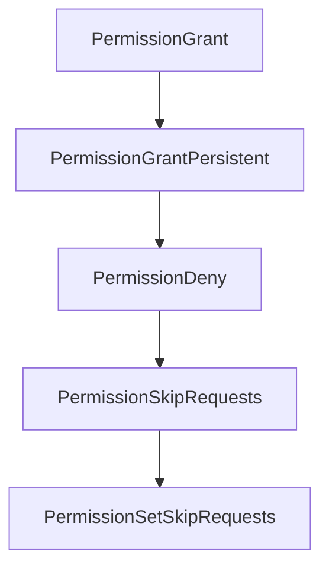

# Chapter 8: Production Governance and Rollout

Welcome to **Chapter 8: Production Governance and Rollout**. In this part of **Crush Tutorial: Multi-Model Terminal Coding Agent with Strong Extensibility**, you will build an intuitive mental model first, then move into concrete implementation details and practical production tradeoffs.


This chapter provides a governance framework for deploying Crush across real engineering teams.

## Learning Goals

- define production configuration and policy baselines
- enforce attribution, metrics, and privacy preferences intentionally
- standardize rollout stages across teams and repos
- maintain operational quality over time

## Governance Baseline

| Area | Recommended Policy |
|:-----|:-------------------|
| config management | publish approved `.crush.json` templates per repo class |
| tool safety | start with restrictive `allowed_tools` and `disabled_tools` |
| attribution | choose `assisted-by`, `co-authored-by`, or `none` explicitly |
| telemetry | configure `disable_metrics` or `DO_NOT_TRACK` where required |
| rollout | pilot -> expand -> enforce policy checks |

## Rollout Stages

1. run pilot with senior maintainers and strict permissions
2. refine model/provider defaults and command packs
3. publish team onboarding docs + starter configs
4. expand to broader teams with monitored issue intake
5. audit quarterly for drift in models, tools, and policies

## Source References

- [Crush README: Attribution Settings](https://github.com/charmbracelet/crush/blob/main/README.md#attribution-settings)
- [Crush README: Metrics](https://github.com/charmbracelet/crush/blob/main/README.md#metrics)
- [Crush README: Configuration](https://github.com/charmbracelet/crush/blob/main/README.md#configuration)

## Summary

You now have an end-to-end framework for adopting Crush as a governed coding-agent platform.

Compare terminal-first practices in the [Goose Tutorial](../goose-tutorial/).

## Source Code Walkthrough

### `internal/workspace/app_workspace.go`

The `PermissionGrant` function in [`internal/workspace/app_workspace.go`](https://github.com/charmbracelet/crush/blob/HEAD/internal/workspace/app_workspace.go) handles a key part of this chapter's functionality:

```go
// -- Permissions --

func (w *AppWorkspace) PermissionGrant(perm permission.PermissionRequest) {
	w.app.Permissions.Grant(perm)
}

func (w *AppWorkspace) PermissionGrantPersistent(perm permission.PermissionRequest) {
	w.app.Permissions.GrantPersistent(perm)
}

func (w *AppWorkspace) PermissionDeny(perm permission.PermissionRequest) {
	w.app.Permissions.Deny(perm)
}

func (w *AppWorkspace) PermissionSkipRequests() bool {
	return w.app.Permissions.SkipRequests()
}

func (w *AppWorkspace) PermissionSetSkipRequests(skip bool) {
	w.app.Permissions.SetSkipRequests(skip)
}

// -- FileTracker --

func (w *AppWorkspace) FileTrackerRecordRead(ctx context.Context, sessionID, path string) {
	w.app.FileTracker.RecordRead(ctx, sessionID, path)
}

func (w *AppWorkspace) FileTrackerLastReadTime(ctx context.Context, sessionID, path string) time.Time {
	return w.app.FileTracker.LastReadTime(ctx, sessionID, path)
}

```

This function is important because it defines how Crush Tutorial: Multi-Model Terminal Coding Agent with Strong Extensibility implements the patterns covered in this chapter.

### `internal/workspace/app_workspace.go`

The `PermissionGrantPersistent` function in [`internal/workspace/app_workspace.go`](https://github.com/charmbracelet/crush/blob/HEAD/internal/workspace/app_workspace.go) handles a key part of this chapter's functionality:

```go
}

func (w *AppWorkspace) PermissionGrantPersistent(perm permission.PermissionRequest) {
	w.app.Permissions.GrantPersistent(perm)
}

func (w *AppWorkspace) PermissionDeny(perm permission.PermissionRequest) {
	w.app.Permissions.Deny(perm)
}

func (w *AppWorkspace) PermissionSkipRequests() bool {
	return w.app.Permissions.SkipRequests()
}

func (w *AppWorkspace) PermissionSetSkipRequests(skip bool) {
	w.app.Permissions.SetSkipRequests(skip)
}

// -- FileTracker --

func (w *AppWorkspace) FileTrackerRecordRead(ctx context.Context, sessionID, path string) {
	w.app.FileTracker.RecordRead(ctx, sessionID, path)
}

func (w *AppWorkspace) FileTrackerLastReadTime(ctx context.Context, sessionID, path string) time.Time {
	return w.app.FileTracker.LastReadTime(ctx, sessionID, path)
}

func (w *AppWorkspace) FileTrackerListReadFiles(ctx context.Context, sessionID string) ([]string, error) {
	return w.app.FileTracker.ListReadFiles(ctx, sessionID)
}

```

This function is important because it defines how Crush Tutorial: Multi-Model Terminal Coding Agent with Strong Extensibility implements the patterns covered in this chapter.

### `internal/workspace/app_workspace.go`

The `PermissionDeny` function in [`internal/workspace/app_workspace.go`](https://github.com/charmbracelet/crush/blob/HEAD/internal/workspace/app_workspace.go) handles a key part of this chapter's functionality:

```go
}

func (w *AppWorkspace) PermissionDeny(perm permission.PermissionRequest) {
	w.app.Permissions.Deny(perm)
}

func (w *AppWorkspace) PermissionSkipRequests() bool {
	return w.app.Permissions.SkipRequests()
}

func (w *AppWorkspace) PermissionSetSkipRequests(skip bool) {
	w.app.Permissions.SetSkipRequests(skip)
}

// -- FileTracker --

func (w *AppWorkspace) FileTrackerRecordRead(ctx context.Context, sessionID, path string) {
	w.app.FileTracker.RecordRead(ctx, sessionID, path)
}

func (w *AppWorkspace) FileTrackerLastReadTime(ctx context.Context, sessionID, path string) time.Time {
	return w.app.FileTracker.LastReadTime(ctx, sessionID, path)
}

func (w *AppWorkspace) FileTrackerListReadFiles(ctx context.Context, sessionID string) ([]string, error) {
	return w.app.FileTracker.ListReadFiles(ctx, sessionID)
}

// -- History --

func (w *AppWorkspace) ListSessionHistory(ctx context.Context, sessionID string) ([]history.File, error) {
	return w.app.History.ListBySession(ctx, sessionID)
```

This function is important because it defines how Crush Tutorial: Multi-Model Terminal Coding Agent with Strong Extensibility implements the patterns covered in this chapter.

### `internal/workspace/app_workspace.go`

The `PermissionSkipRequests` function in [`internal/workspace/app_workspace.go`](https://github.com/charmbracelet/crush/blob/HEAD/internal/workspace/app_workspace.go) handles a key part of this chapter's functionality:

```go
}

func (w *AppWorkspace) PermissionSkipRequests() bool {
	return w.app.Permissions.SkipRequests()
}

func (w *AppWorkspace) PermissionSetSkipRequests(skip bool) {
	w.app.Permissions.SetSkipRequests(skip)
}

// -- FileTracker --

func (w *AppWorkspace) FileTrackerRecordRead(ctx context.Context, sessionID, path string) {
	w.app.FileTracker.RecordRead(ctx, sessionID, path)
}

func (w *AppWorkspace) FileTrackerLastReadTime(ctx context.Context, sessionID, path string) time.Time {
	return w.app.FileTracker.LastReadTime(ctx, sessionID, path)
}

func (w *AppWorkspace) FileTrackerListReadFiles(ctx context.Context, sessionID string) ([]string, error) {
	return w.app.FileTracker.ListReadFiles(ctx, sessionID)
}

// -- History --

func (w *AppWorkspace) ListSessionHistory(ctx context.Context, sessionID string) ([]history.File, error) {
	return w.app.History.ListBySession(ctx, sessionID)
}

// -- LSP --

```

This function is important because it defines how Crush Tutorial: Multi-Model Terminal Coding Agent with Strong Extensibility implements the patterns covered in this chapter.


## How These Components Connect


