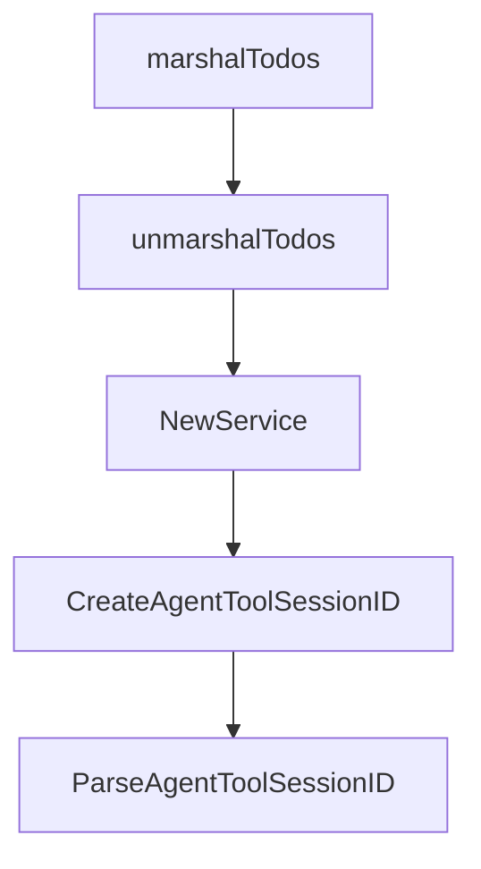

# Chapter 8: Production Governance and Rollout

Welcome to **Chapter 8: Production Governance and Rollout**. In this part of **Crush Tutorial: Multi-Model Terminal Coding Agent with Strong Extensibility**, you will build an intuitive mental model first, then move into concrete implementation details and practical production tradeoffs.


This chapter provides a governance framework for deploying Crush across real engineering teams.

## Learning Goals

- define production configuration and policy baselines
- enforce attribution, metrics, and privacy preferences intentionally
- standardize rollout stages across teams and repos
- maintain operational quality over time

## Governance Baseline

| Area | Recommended Policy |
|:-----|:-------------------|
| config management | publish approved `.crush.json` templates per repo class |
| tool safety | start with restrictive `allowed_tools` and `disabled_tools` |
| attribution | choose `assisted-by`, `co-authored-by`, or `none` explicitly |
| telemetry | configure `disable_metrics` or `DO_NOT_TRACK` where required |
| rollout | pilot -> expand -> enforce policy checks |

## Rollout Stages

1. run pilot with senior maintainers and strict permissions
2. refine model/provider defaults and command packs
3. publish team onboarding docs + starter configs
4. expand to broader teams with monitored issue intake
5. audit quarterly for drift in models, tools, and policies

## Source References

- [Crush README: Attribution Settings](https://github.com/charmbracelet/crush/blob/main/README.md#attribution-settings)
- [Crush README: Metrics](https://github.com/charmbracelet/crush/blob/main/README.md#metrics)
- [Crush README: Configuration](https://github.com/charmbracelet/crush/blob/main/README.md#configuration)

## Summary

You now have an end-to-end framework for adopting Crush as a governed coding-agent platform.

Compare terminal-first practices in the [Goose Tutorial](../goose-tutorial/).

## Depth Expansion Playbook

## Source Code Walkthrough

### `internal/session/session.go`

The `marshalTodos` function in [`internal/session/session.go`](https://github.com/charmbracelet/crush/blob/HEAD/internal/session/session.go) handles a key part of this chapter's functionality:

```go

func (s *service) Save(ctx context.Context, session Session) (Session, error) {
	todosJSON, err := marshalTodos(session.Todos)
	if err != nil {
		return Session{}, err
	}

	dbSession, err := s.q.UpdateSession(ctx, db.UpdateSessionParams{
		ID:               session.ID,
		Title:            session.Title,
		PromptTokens:     session.PromptTokens,
		CompletionTokens: session.CompletionTokens,
		SummaryMessageID: sql.NullString{
			String: session.SummaryMessageID,
			Valid:  session.SummaryMessageID != "",
		},
		Cost: session.Cost,
		Todos: sql.NullString{
			String: todosJSON,
			Valid:  todosJSON != "",
		},
	})
	if err != nil {
		return Session{}, err
	}
	session = s.fromDBItem(dbSession)
	s.Publish(pubsub.UpdatedEvent, session)
	return session, nil
}

// UpdateTitleAndUsage updates only the title and usage fields atomically.
// This is safer than fetching, modifying, and saving the entire session.
```

This function is important because it defines how Crush Tutorial: Multi-Model Terminal Coding Agent with Strong Extensibility implements the patterns covered in this chapter.

### `internal/session/session.go`

The `unmarshalTodos` function in [`internal/session/session.go`](https://github.com/charmbracelet/crush/blob/HEAD/internal/session/session.go) handles a key part of this chapter's functionality:

```go

func (s service) fromDBItem(item db.Session) Session {
	todos, err := unmarshalTodos(item.Todos.String)
	if err != nil {
		slog.Error("Failed to unmarshal todos", "session_id", item.ID, "error", err)
	}
	return Session{
		ID:               item.ID,
		ParentSessionID:  item.ParentSessionID.String,
		Title:            item.Title,
		MessageCount:     item.MessageCount,
		PromptTokens:     item.PromptTokens,
		CompletionTokens: item.CompletionTokens,
		SummaryMessageID: item.SummaryMessageID.String,
		Cost:             item.Cost,
		Todos:            todos,
		CreatedAt:        item.CreatedAt,
		UpdatedAt:        item.UpdatedAt,
	}
}

func marshalTodos(todos []Todo) (string, error) {
	if len(todos) == 0 {
		return "", nil
	}
	data, err := json.Marshal(todos)
	if err != nil {
		return "", err
	}
	return string(data), nil
}

```

This function is important because it defines how Crush Tutorial: Multi-Model Terminal Coding Agent with Strong Extensibility implements the patterns covered in this chapter.

### `internal/session/session.go`

The `NewService` function in [`internal/session/session.go`](https://github.com/charmbracelet/crush/blob/HEAD/internal/session/session.go) handles a key part of this chapter's functionality:

```go
}

func NewService(q *db.Queries, conn *sql.DB) Service {
	broker := pubsub.NewBroker[Session]()
	return &service{
		Broker: broker,
		db:     conn,
		q:      q,
	}
}

// CreateAgentToolSessionID creates a session ID for agent tool sessions using the format "messageID$$toolCallID"
func (s *service) CreateAgentToolSessionID(messageID, toolCallID string) string {
	return fmt.Sprintf("%s$$%s", messageID, toolCallID)
}

// ParseAgentToolSessionID parses an agent tool session ID into its components
func (s *service) ParseAgentToolSessionID(sessionID string) (messageID string, toolCallID string, ok bool) {
	parts := strings.Split(sessionID, "$$")
	if len(parts) != 2 {
		return "", "", false
	}
	return parts[0], parts[1], true
}

// IsAgentToolSession checks if a session ID follows the agent tool session format
func (s *service) IsAgentToolSession(sessionID string) bool {
	_, _, ok := s.ParseAgentToolSessionID(sessionID)
	return ok
}

```

This function is important because it defines how Crush Tutorial: Multi-Model Terminal Coding Agent with Strong Extensibility implements the patterns covered in this chapter.

### `internal/session/session.go`

The `CreateAgentToolSessionID` function in [`internal/session/session.go`](https://github.com/charmbracelet/crush/blob/HEAD/internal/session/session.go) handles a key part of this chapter's functionality:

```go

	// Agent tool session management
	CreateAgentToolSessionID(messageID, toolCallID string) string
	ParseAgentToolSessionID(sessionID string) (messageID string, toolCallID string, ok bool)
	IsAgentToolSession(sessionID string) bool
}

type service struct {
	*pubsub.Broker[Session]
	db *sql.DB
	q  *db.Queries
}

func (s *service) Create(ctx context.Context, title string) (Session, error) {
	dbSession, err := s.q.CreateSession(ctx, db.CreateSessionParams{
		ID:    uuid.New().String(),
		Title: title,
	})
	if err != nil {
		return Session{}, err
	}
	session := s.fromDBItem(dbSession)
	s.Publish(pubsub.CreatedEvent, session)
	event.SessionCreated()
	return session, nil
}

func (s *service) CreateTaskSession(ctx context.Context, toolCallID, parentSessionID, title string) (Session, error) {
	dbSession, err := s.q.CreateSession(ctx, db.CreateSessionParams{
		ID:              toolCallID,
		ParentSessionID: sql.NullString{String: parentSessionID, Valid: true},
		Title:           title,
```

This function is important because it defines how Crush Tutorial: Multi-Model Terminal Coding Agent with Strong Extensibility implements the patterns covered in this chapter.


## How These Components Connect


