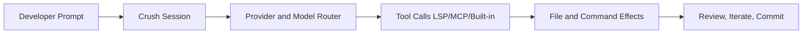

# Crush Tutorial: Multi-Model Terminal Coding Agent with Strong Extensibility

> Learn how to use `charmbracelet/crush` for terminal-native coding workflows with flexible model providers, LSP/MCP integrations, and production-grade controls.

## Why This Track Matters

Crush is one of the fastest-growing terminal coding agents and is designed around practical developer loops: model flexibility, project sessions, local config control, and advanced integrations.

This track focuses on:

- installing and configuring Crush for immediate coding work
- controlling providers, permissions, and tool behavior safely
- integrating LSP and MCP for richer code intelligence
- standardizing Crush usage across team environments

## Current Snapshot (Verified February 12, 2026)

- repository: [`charmbracelet/crush`](https://github.com/charmbracelet/crush)
- stars: about **19.7k**
- latest release: [`v0.42.0`](https://github.com/charmbracelet/crush/releases/tag/v0.42.0)
- recent activity: updates on **February 11, 2026**
- project positioning: terminal-first coding agent with multi-provider, multi-session workflows

## Mental Model

## Chapter Guide

| Chapter | Key Question | Outcome |
|:--------|:-------------|:--------|
| [01 - Getting Started](01-getting-started.md) | How do I install and run Crush fast? | Working baseline |
| [02 - Architecture and Session Model](02-architecture-and-session-model.md) | How does Crush manage project and session state? | Runtime mental model |
| [03 - Providers and Model Configuration](03-providers-and-model-configuration.md) | How do I configure providers and models robustly? | Stable provider strategy |
| [04 - Permissions and Tool Controls](04-permissions-and-tool-controls.md) | How do I enforce safe tool execution boundaries? | Safer execution model |
| [05 - LSP and MCP Integration](05-lsp-and-mcp-integration.md) | How do I plug in language servers and MCP tools? | Extended capabilities |
| [06 - Skills, Commands, and Workflow Customization](06-skills-commands-and-workflow-customization.md) | How do I tailor Crush to team and project conventions? | Reusable workflow system |
| [07 - Logs, Debugging, and Operations](07-logs-debugging-and-operations.md) | How do I diagnose and maintain Crush at scale? | Operational confidence |
| [08 - Production Governance and Rollout](08-production-governance-and-rollout.md) | How do teams adopt Crush safely in production repos? | Governance runbook |

## What You Will Learn

- how to configure Crush for consistent coding-agent performance
- how to manage provider routing and custom model definitions
- how to extend Crush with LSP, MCP, skills, and custom commands
- how to operate Crush with robust production controls

## Source References

- [Crush Repository](https://github.com/charmbracelet/crush)
- [Crush README](https://github.com/charmbracelet/crush/blob/main/README.md)
- [Crush Releases](https://github.com/charmbracelet/crush/releases)
- [Crush Configuration Schema](https://github.com/charmbracelet/crush/blob/main/schema.json)
- [Crush Command Loader](https://github.com/charmbracelet/crush/blob/main/internal/commands/commands.go)

## Related Tutorials

- [Goose Tutorial](../goose-tutorial/)
- [OpenCode Tutorial](../opencode-tutorial/)
- [Kilo Code Tutorial](../kilocode-tutorial/)
- [Cline Tutorial](../cline-tutorial/)

---

Start with [Chapter 1: Getting Started](01-getting-started.md).
