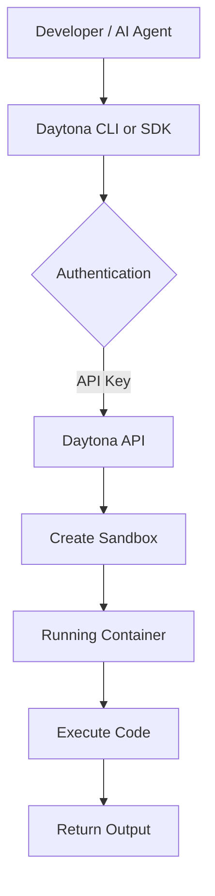

# Chapter 1: Getting Started

Welcome to **Chapter 1: Getting Started**. In this part of **Daytona Tutorial: Secure Sandbox Infrastructure for AI-Generated Code**, you will build an intuitive mental model first, then move into concrete implementation details and practical production tradeoffs.

This chapter sets up the fastest path from account setup to a running sandbox.

## Learning Goals

- install and authenticate the Daytona CLI
- initialize SDK access using API keys
- create a first sandbox and run a code snippet
- establish a repeatable local baseline for later chapters

## Fast Start Loop

1. create an account and API key in the Daytona dashboard
2. install CLI (`brew install daytonaio/cli/daytona` on macOS/Linux)
3. run `daytona login` and verify access
4. create a sandbox through SDK or CLI
5. run a simple `code_run` or `execute_command` call to confirm end-to-end execution

## Source References

- [Getting Started](https://github.com/daytonaio/daytona/blob/main/apps/docs/src/content/docs/en/getting-started.mdx)
- [README](https://github.com/daytonaio/daytona/blob/main/README.md)
- [TypeScript SDK README](https://github.com/daytonaio/daytona/blob/main/libs/sdk-typescript/README.md)
- [Python SDK README](https://github.com/daytonaio/daytona/blob/main/libs/sdk-python/README.md)

## Summary

You now have a working Daytona baseline with authenticated access and first code execution.

Next: [Chapter 2: Sandbox Lifecycle, Resources, and Regions](02-sandbox-lifecycle-resources-and-regions.md)

## How These Components Connect

