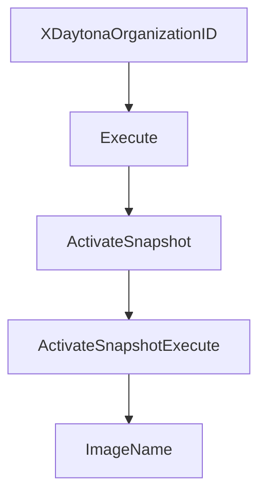

# Chapter 1: Getting Started

Welcome to **Chapter 1: Getting Started**. In this part of **Daytona Tutorial: Secure Sandbox Infrastructure for AI-Generated Code**, you will build an intuitive mental model first, then move into concrete implementation details and practical production tradeoffs.


This chapter sets up the fastest path from account setup to a running sandbox.

## Learning Goals

- install and authenticate the Daytona CLI
- initialize SDK access using API keys
- create a first sandbox and run a code snippet
- establish a repeatable local baseline for later chapters

## Fast Start Loop

1. create an account and API key in the Daytona dashboard
2. install CLI (`brew install daytonaio/cli/daytona` on macOS/Linux)
3. run `daytona login` and verify access
4. create a sandbox through SDK or CLI
5. run a simple `code_run` or `execute_command` call to confirm end-to-end execution

## Source References

- [Getting Started](https://github.com/daytonaio/daytona/blob/main/apps/docs/src/content/docs/en/getting-started.mdx)
- [README](https://github.com/daytonaio/daytona/blob/main/README.md)
- [TypeScript SDK README](https://github.com/daytonaio/daytona/blob/main/libs/sdk-typescript/README.md)
- [Python SDK README](https://github.com/daytonaio/daytona/blob/main/libs/sdk-python/README.md)

## Summary

You now have a working Daytona baseline with authenticated access and first code execution.

Next: [Chapter 2: Sandbox Lifecycle, Resources, and Regions](02-sandbox-lifecycle-resources-and-regions.md)

## Depth Expansion Playbook

## Source Code Walkthrough

### `libs/api-client-go/api_snapshots.go`

The `XDaytonaOrganizationID` function in [`libs/api-client-go/api_snapshots.go`](https://github.com/daytonaio/daytona/blob/HEAD/libs/api-client-go/api_snapshots.go) handles a key part of this chapter's functionality:

```go

// Use with JWT to specify the organization ID
func (r SnapshotsAPIActivateSnapshotRequest) XDaytonaOrganizationID(xDaytonaOrganizationID string) SnapshotsAPIActivateSnapshotRequest {
	r.xDaytonaOrganizationID = &xDaytonaOrganizationID
	return r
}

func (r SnapshotsAPIActivateSnapshotRequest) Execute() (*SnapshotDto, *http.Response, error) {
	return r.ApiService.ActivateSnapshotExecute(r)
}

/*
ActivateSnapshot Activate a snapshot

 @param ctx context.Context - for authentication, logging, cancellation, deadlines, tracing, etc. Passed from http.Request or context.Background().
 @param id Snapshot ID
 @return SnapshotsAPIActivateSnapshotRequest
*/
func (a *SnapshotsAPIService) ActivateSnapshot(ctx context.Context, id string) SnapshotsAPIActivateSnapshotRequest {
	return SnapshotsAPIActivateSnapshotRequest{
		ApiService: a,
		ctx: ctx,
		id: id,
	}
}

// Execute executes the request
//  @return SnapshotDto
func (a *SnapshotsAPIService) ActivateSnapshotExecute(r SnapshotsAPIActivateSnapshotRequest) (*SnapshotDto, *http.Response, error) {
	var (
		localVarHTTPMethod   = http.MethodPost
		localVarPostBody     interface{}
```

This function is important because it defines how Daytona Tutorial: Secure Sandbox Infrastructure for AI-Generated Code implements the patterns covered in this chapter.

### `libs/api-client-go/api_snapshots.go`

The `Execute` function in [`libs/api-client-go/api_snapshots.go`](https://github.com/daytonaio/daytona/blob/HEAD/libs/api-client-go/api_snapshots.go) handles a key part of this chapter's functionality:

```go
	ActivateSnapshot(ctx context.Context, id string) SnapshotsAPIActivateSnapshotRequest

	// ActivateSnapshotExecute executes the request
	//  @return SnapshotDto
	ActivateSnapshotExecute(r SnapshotsAPIActivateSnapshotRequest) (*SnapshotDto, *http.Response, error)

	/*
	CanCleanupImage Check if an image can be cleaned up

	@param ctx context.Context - for authentication, logging, cancellation, deadlines, tracing, etc. Passed from http.Request or context.Background().
	@return SnapshotsAPICanCleanupImageRequest
	*/
	CanCleanupImage(ctx context.Context) SnapshotsAPICanCleanupImageRequest

	// CanCleanupImageExecute executes the request
	//  @return bool
	CanCleanupImageExecute(r SnapshotsAPICanCleanupImageRequest) (bool, *http.Response, error)

	/*
	CreateSnapshot Create a new snapshot

	@param ctx context.Context - for authentication, logging, cancellation, deadlines, tracing, etc. Passed from http.Request or context.Background().
	@return SnapshotsAPICreateSnapshotRequest
	*/
	CreateSnapshot(ctx context.Context) SnapshotsAPICreateSnapshotRequest

	// CreateSnapshotExecute executes the request
	//  @return SnapshotDto
	CreateSnapshotExecute(r SnapshotsAPICreateSnapshotRequest) (*SnapshotDto, *http.Response, error)

	/*
	DeactivateSnapshot Deactivate a snapshot
```

This function is important because it defines how Daytona Tutorial: Secure Sandbox Infrastructure for AI-Generated Code implements the patterns covered in this chapter.

### `libs/api-client-go/api_snapshots.go`

The `ActivateSnapshot` function in [`libs/api-client-go/api_snapshots.go`](https://github.com/daytonaio/daytona/blob/HEAD/libs/api-client-go/api_snapshots.go) handles a key part of this chapter's functionality:

```go

	/*
	ActivateSnapshot Activate a snapshot

	@param ctx context.Context - for authentication, logging, cancellation, deadlines, tracing, etc. Passed from http.Request or context.Background().
	@param id Snapshot ID
	@return SnapshotsAPIActivateSnapshotRequest
	*/
	ActivateSnapshot(ctx context.Context, id string) SnapshotsAPIActivateSnapshotRequest

	// ActivateSnapshotExecute executes the request
	//  @return SnapshotDto
	ActivateSnapshotExecute(r SnapshotsAPIActivateSnapshotRequest) (*SnapshotDto, *http.Response, error)

	/*
	CanCleanupImage Check if an image can be cleaned up

	@param ctx context.Context - for authentication, logging, cancellation, deadlines, tracing, etc. Passed from http.Request or context.Background().
	@return SnapshotsAPICanCleanupImageRequest
	*/
	CanCleanupImage(ctx context.Context) SnapshotsAPICanCleanupImageRequest

	// CanCleanupImageExecute executes the request
	//  @return bool
	CanCleanupImageExecute(r SnapshotsAPICanCleanupImageRequest) (bool, *http.Response, error)

	/*
	CreateSnapshot Create a new snapshot

	@param ctx context.Context - for authentication, logging, cancellation, deadlines, tracing, etc. Passed from http.Request or context.Background().
	@return SnapshotsAPICreateSnapshotRequest
	*/
```

This function is important because it defines how Daytona Tutorial: Secure Sandbox Infrastructure for AI-Generated Code implements the patterns covered in this chapter.

### `libs/api-client-go/api_snapshots.go`

The `ActivateSnapshotExecute` function in [`libs/api-client-go/api_snapshots.go`](https://github.com/daytonaio/daytona/blob/HEAD/libs/api-client-go/api_snapshots.go) handles a key part of this chapter's functionality:

```go
	ActivateSnapshot(ctx context.Context, id string) SnapshotsAPIActivateSnapshotRequest

	// ActivateSnapshotExecute executes the request
	//  @return SnapshotDto
	ActivateSnapshotExecute(r SnapshotsAPIActivateSnapshotRequest) (*SnapshotDto, *http.Response, error)

	/*
	CanCleanupImage Check if an image can be cleaned up

	@param ctx context.Context - for authentication, logging, cancellation, deadlines, tracing, etc. Passed from http.Request or context.Background().
	@return SnapshotsAPICanCleanupImageRequest
	*/
	CanCleanupImage(ctx context.Context) SnapshotsAPICanCleanupImageRequest

	// CanCleanupImageExecute executes the request
	//  @return bool
	CanCleanupImageExecute(r SnapshotsAPICanCleanupImageRequest) (bool, *http.Response, error)

	/*
	CreateSnapshot Create a new snapshot

	@param ctx context.Context - for authentication, logging, cancellation, deadlines, tracing, etc. Passed from http.Request or context.Background().
	@return SnapshotsAPICreateSnapshotRequest
	*/
	CreateSnapshot(ctx context.Context) SnapshotsAPICreateSnapshotRequest

	// CreateSnapshotExecute executes the request
	//  @return SnapshotDto
	CreateSnapshotExecute(r SnapshotsAPICreateSnapshotRequest) (*SnapshotDto, *http.Response, error)

	/*
	DeactivateSnapshot Deactivate a snapshot
```

This function is important because it defines how Daytona Tutorial: Secure Sandbox Infrastructure for AI-Generated Code implements the patterns covered in this chapter.


## How These Components Connect


