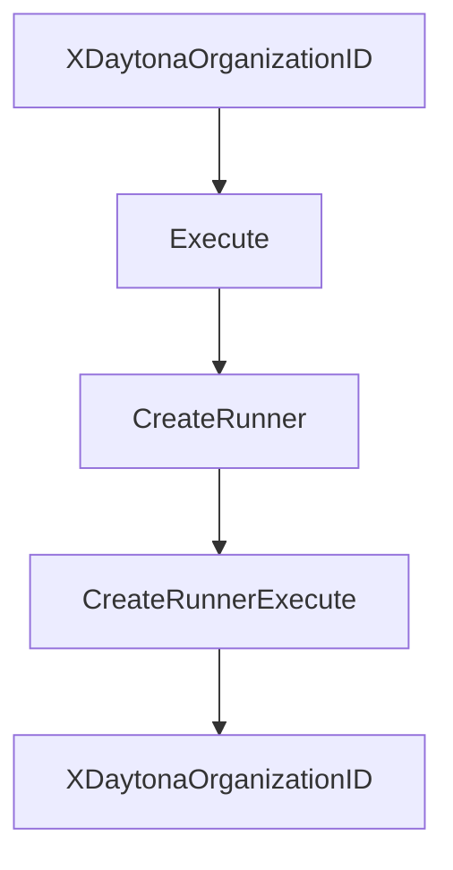

# Chapter 2: Sandbox Lifecycle, Resources, and Regions

Welcome to **Chapter 2: Sandbox Lifecycle, Resources, and Regions**. In this part of **Daytona Tutorial: Secure Sandbox Infrastructure for AI-Generated Code**, you will build an intuitive mental model first, then move into concrete implementation details and practical production tradeoffs.


This chapter explains how Daytona sandboxes transition state and consume organization quotas.

## Learning Goals

- understand sandbox lifecycle states and transitions
- choose resource sizing defaults versus custom settings
- plan region and snapshot usage for predictable startup behavior
- avoid quota waste through lifecycle-aware workflows

## Lifecycle Strategy

Use `running` only for active work, move to `stopped` for idle periods, and archive or delete when retention policy allows. Pair this with resource sizing and region strategy so high-frequency workloads stay responsive without exhausting quotas.

## Source References

- [Sandboxes](https://github.com/daytonaio/daytona/blob/main/apps/docs/src/content/docs/en/sandboxes.mdx)
- [Regions](https://github.com/daytonaio/daytona/blob/main/apps/docs/src/content/docs/en/regions.mdx)
- [Snapshots](https://github.com/daytonaio/daytona/blob/main/apps/docs/src/content/docs/en/snapshots.mdx)
- [Volumes](https://github.com/daytonaio/daytona/blob/main/apps/docs/src/content/docs/en/volumes.mdx)

## Summary

You now understand how to shape sandbox lifecycle and resource policy around real workload behavior.

Next: [Chapter 3: Process and Code Execution Patterns](03-process-and-code-execution-patterns.md)

## Depth Expansion Playbook

## Source Code Walkthrough

### `libs/api-client-go/api_runners.go`

The `XDaytonaOrganizationID` function in [`libs/api-client-go/api_runners.go`](https://github.com/daytonaio/daytona/blob/HEAD/libs/api-client-go/api_runners.go) handles a key part of this chapter's functionality:

```go

// Use with JWT to specify the organization ID
func (r RunnersAPICreateRunnerRequest) XDaytonaOrganizationID(xDaytonaOrganizationID string) RunnersAPICreateRunnerRequest {
	r.xDaytonaOrganizationID = &xDaytonaOrganizationID
	return r
}

func (r RunnersAPICreateRunnerRequest) Execute() (*CreateRunnerResponse, *http.Response, error) {
	return r.ApiService.CreateRunnerExecute(r)
}

/*
CreateRunner Create runner

 @param ctx context.Context - for authentication, logging, cancellation, deadlines, tracing, etc. Passed from http.Request or context.Background().
 @return RunnersAPICreateRunnerRequest
*/
func (a *RunnersAPIService) CreateRunner(ctx context.Context) RunnersAPICreateRunnerRequest {
	return RunnersAPICreateRunnerRequest{
		ApiService: a,
		ctx: ctx,
	}
}

// Execute executes the request
//  @return CreateRunnerResponse
func (a *RunnersAPIService) CreateRunnerExecute(r RunnersAPICreateRunnerRequest) (*CreateRunnerResponse, *http.Response, error) {
	var (
		localVarHTTPMethod   = http.MethodPost
		localVarPostBody     interface{}
		formFiles            []formFile
		localVarReturnValue  *CreateRunnerResponse
```

This function is important because it defines how Daytona Tutorial: Secure Sandbox Infrastructure for AI-Generated Code implements the patterns covered in this chapter.

### `libs/api-client-go/api_runners.go`

The `Execute` function in [`libs/api-client-go/api_runners.go`](https://github.com/daytonaio/daytona/blob/HEAD/libs/api-client-go/api_runners.go) handles a key part of this chapter's functionality:

```go
	CreateRunner(ctx context.Context) RunnersAPICreateRunnerRequest

	// CreateRunnerExecute executes the request
	//  @return CreateRunnerResponse
	CreateRunnerExecute(r RunnersAPICreateRunnerRequest) (*CreateRunnerResponse, *http.Response, error)

	/*
	DeleteRunner Delete runner

	@param ctx context.Context - for authentication, logging, cancellation, deadlines, tracing, etc. Passed from http.Request or context.Background().
	@param id Runner ID
	@return RunnersAPIDeleteRunnerRequest
	*/
	DeleteRunner(ctx context.Context, id string) RunnersAPIDeleteRunnerRequest

	// DeleteRunnerExecute executes the request
	DeleteRunnerExecute(r RunnersAPIDeleteRunnerRequest) (*http.Response, error)

	/*
	GetInfoForAuthenticatedRunner Get info for authenticated runner

	@param ctx context.Context - for authentication, logging, cancellation, deadlines, tracing, etc. Passed from http.Request or context.Background().
	@return RunnersAPIGetInfoForAuthenticatedRunnerRequest
	*/
	GetInfoForAuthenticatedRunner(ctx context.Context) RunnersAPIGetInfoForAuthenticatedRunnerRequest

	// GetInfoForAuthenticatedRunnerExecute executes the request
	//  @return RunnerFull
	GetInfoForAuthenticatedRunnerExecute(r RunnersAPIGetInfoForAuthenticatedRunnerRequest) (*RunnerFull, *http.Response, error)

	/*
	GetRunnerById Get runner by ID
```

This function is important because it defines how Daytona Tutorial: Secure Sandbox Infrastructure for AI-Generated Code implements the patterns covered in this chapter.

### `libs/api-client-go/api_runners.go`

The `CreateRunner` function in [`libs/api-client-go/api_runners.go`](https://github.com/daytonaio/daytona/blob/HEAD/libs/api-client-go/api_runners.go) handles a key part of this chapter's functionality:

```go

	/*
	CreateRunner Create runner

	@param ctx context.Context - for authentication, logging, cancellation, deadlines, tracing, etc. Passed from http.Request or context.Background().
	@return RunnersAPICreateRunnerRequest
	*/
	CreateRunner(ctx context.Context) RunnersAPICreateRunnerRequest

	// CreateRunnerExecute executes the request
	//  @return CreateRunnerResponse
	CreateRunnerExecute(r RunnersAPICreateRunnerRequest) (*CreateRunnerResponse, *http.Response, error)

	/*
	DeleteRunner Delete runner

	@param ctx context.Context - for authentication, logging, cancellation, deadlines, tracing, etc. Passed from http.Request or context.Background().
	@param id Runner ID
	@return RunnersAPIDeleteRunnerRequest
	*/
	DeleteRunner(ctx context.Context, id string) RunnersAPIDeleteRunnerRequest

	// DeleteRunnerExecute executes the request
	DeleteRunnerExecute(r RunnersAPIDeleteRunnerRequest) (*http.Response, error)

	/*
	GetInfoForAuthenticatedRunner Get info for authenticated runner

	@param ctx context.Context - for authentication, logging, cancellation, deadlines, tracing, etc. Passed from http.Request or context.Background().
	@return RunnersAPIGetInfoForAuthenticatedRunnerRequest
	*/
	GetInfoForAuthenticatedRunner(ctx context.Context) RunnersAPIGetInfoForAuthenticatedRunnerRequest
```

This function is important because it defines how Daytona Tutorial: Secure Sandbox Infrastructure for AI-Generated Code implements the patterns covered in this chapter.

### `libs/api-client-go/api_runners.go`

The `CreateRunnerExecute` function in [`libs/api-client-go/api_runners.go`](https://github.com/daytonaio/daytona/blob/HEAD/libs/api-client-go/api_runners.go) handles a key part of this chapter's functionality:

```go
	CreateRunner(ctx context.Context) RunnersAPICreateRunnerRequest

	// CreateRunnerExecute executes the request
	//  @return CreateRunnerResponse
	CreateRunnerExecute(r RunnersAPICreateRunnerRequest) (*CreateRunnerResponse, *http.Response, error)

	/*
	DeleteRunner Delete runner

	@param ctx context.Context - for authentication, logging, cancellation, deadlines, tracing, etc. Passed from http.Request or context.Background().
	@param id Runner ID
	@return RunnersAPIDeleteRunnerRequest
	*/
	DeleteRunner(ctx context.Context, id string) RunnersAPIDeleteRunnerRequest

	// DeleteRunnerExecute executes the request
	DeleteRunnerExecute(r RunnersAPIDeleteRunnerRequest) (*http.Response, error)

	/*
	GetInfoForAuthenticatedRunner Get info for authenticated runner

	@param ctx context.Context - for authentication, logging, cancellation, deadlines, tracing, etc. Passed from http.Request or context.Background().
	@return RunnersAPIGetInfoForAuthenticatedRunnerRequest
	*/
	GetInfoForAuthenticatedRunner(ctx context.Context) RunnersAPIGetInfoForAuthenticatedRunnerRequest

	// GetInfoForAuthenticatedRunnerExecute executes the request
	//  @return RunnerFull
	GetInfoForAuthenticatedRunnerExecute(r RunnersAPIGetInfoForAuthenticatedRunnerRequest) (*RunnerFull, *http.Response, error)

	/*
	GetRunnerById Get runner by ID
```

This function is important because it defines how Daytona Tutorial: Secure Sandbox Infrastructure for AI-Generated Code implements the patterns covered in this chapter.


## How These Components Connect


