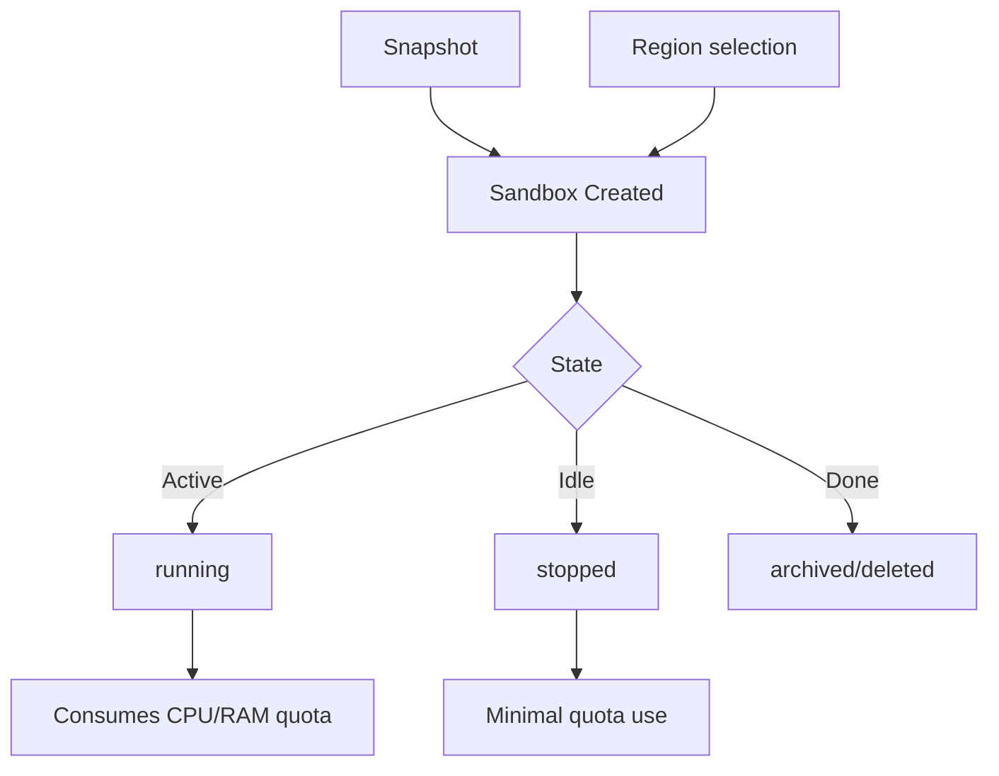

# Chapter 2: Sandbox Lifecycle, Resources, and Regions

Welcome to **Chapter 2: Sandbox Lifecycle, Resources, and Regions**. In this part of **Daytona Tutorial: Secure Sandbox Infrastructure for AI-Generated Code**, you will build an intuitive mental model first, then move into concrete implementation details and practical production tradeoffs.

This chapter explains how Daytona sandboxes transition state and consume organization quotas.

## Learning Goals

- understand sandbox lifecycle states and transitions
- choose resource sizing defaults versus custom settings
- plan region and snapshot usage for predictable startup behavior
- avoid quota waste through lifecycle-aware workflows

## Lifecycle Strategy

Use `running` only for active work, move to `stopped` for idle periods, and archive or delete when retention policy allows. Pair this with resource sizing and region strategy so high-frequency workloads stay responsive without exhausting quotas.

## Source References

- [Sandboxes](https://github.com/daytonaio/daytona/blob/main/apps/docs/src/content/docs/en/sandboxes.mdx)
- [Regions](https://github.com/daytonaio/daytona/blob/main/apps/docs/src/content/docs/en/regions.mdx)
- [Snapshots](https://github.com/daytonaio/daytona/blob/main/apps/docs/src/content/docs/en/snapshots.mdx)
- [Volumes](https://github.com/daytonaio/daytona/blob/main/apps/docs/src/content/docs/en/volumes.mdx)

## Summary

You now understand how to shape sandbox lifecycle and resource policy around real workload behavior.

Next: [Chapter 3: Process and Code Execution Patterns](03-process-and-code-execution-patterns.md)

## How These Components Connect

